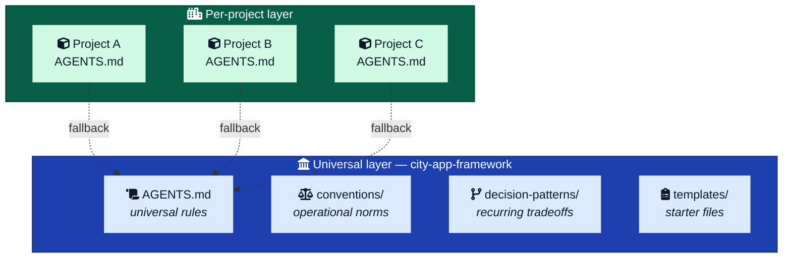
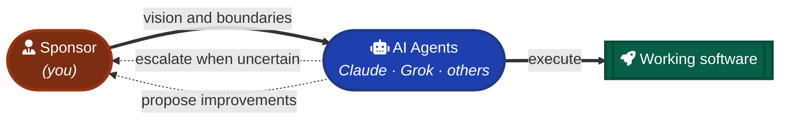
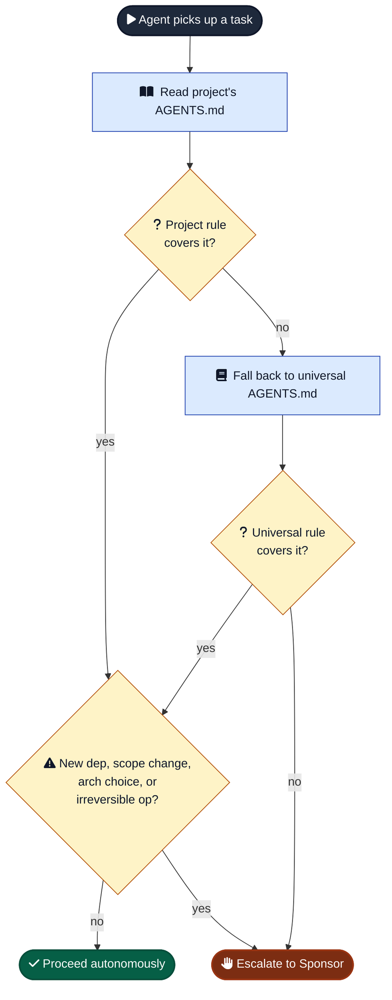

# city-app-framework

A personal development framework for building apps with AI coding agents (Claude, Grok, others). It exists to solve one specific problem: AI agents are stateless, so every project is "first prompt" forever. Without a baked-in answer to "how does John want code structured, named, tested, and reviewed," agents waste tokens making the same arbitrary choices over and over and drift from how I actually build.

## What this is

Two layers, by design:

1. **Universal layer (this repo).** Rules and patterns that apply across all my projects — anti-overengineering, escalation triggers, decision patterns, communication norms.
2. **Per-project layer (each project's own `AGENTS.md`).** Stack, commands, file layout, naming, and footguns specific to that project. See [`jdilig-me-v3`](https://github.com/balbonits/jdilig-me-v3/blob/main/AGENTS.md) for an example of what a project-level `AGENTS.md` looks like.

When an agent opens a project, it reads the project's `AGENTS.md` first; that file points back here for the universal rules.

## How we work

You (the human) are the Sponsor. You set the vision, set the boundaries, and make the final calls. The AI agents — Claude, Grok, others — are autonomous within those boundaries: we execute, we escalate when human judgment is genuinely needed, and we propose improvements after significant work.

This is a high-trust principal-agent relationship, not a democracy. Disagreement is welcome and useful. Final say is yours.

The name comes from an earlier "City 2.0" design exercise that framed development as autonomous city governance: Sponsor sets policy, agents are the council that runs the city day-to-day, and conventions are the city's laws. The current framework is the slim, operational descendant of that idea — same metaphor, less ceremony. Full design preserved in [`docs/design-notes/`](./docs/design-notes/).

## Layout

| Path | Purpose |
|---|---|
| [`AGENTS.md`](./AGENTS.md) | The universal rules. Read first. |
| [`CLAUDE.md`](./CLAUDE.md), [`GROK.md`](./GROK.md) | One-line pointers to `AGENTS.md`. |
| [`conventions/`](./conventions/) | Operational rules with examples (anti-overengineering, escalation, etc.). |
| [`decision-patterns/`](./decision-patterns/) | Recurring tradeoffs with guidance. |
| [`templates/`](./templates/) | Starter `AGENTS.md` / `CLAUDE.md` / `GROK.md` / `README.md` for new projects. |
| [`docs/design-notes/`](./docs/design-notes/) | Earlier "City 2.0" philosophical design. Not loaded by default. Useful for thinking; not for daily execution. |

## How to use

### Starting a new project

1. Copy [`templates/project-AGENTS.md`](./templates/project-AGENTS.md) into the new repo as `AGENTS.md`. Fill in stack/commands/layout/naming.
2. Copy [`templates/project-CLAUDE.md`](./templates/project-CLAUDE.md) and [`templates/project-GROK.md`](./templates/project-GROK.md). They're one-liners.
3. The project's `AGENTS.md` already links to this repo's universal `AGENTS.md` — agents will follow it.

### Working in an existing project

- The project's own `AGENTS.md` is the source of truth for that project.
- This repo's `AGENTS.md` is the default fallback for anything the project doesn't specify.

### How an agent navigates a task

## Status

Early. Extracted from real `AGENTS.md` files in [`jdilig-me-v3`](https://github.com/balbonits/jdilig-me-v3), [`coding-interview-reviewer`](https://github.com/balbonits/coding-interview-reviewer), and [`ai-browser-game-demos`](https://github.com/balbonits/ai-browser-game-demos), plus operational rules from earlier framework iterations. Expected to evolve as patterns prove or fail in real use.

**Demo / whitepaper site:** <https://website-pi-one-3ymijizbxt.vercel.app> (source at [`examples/website/`](./examples/website/)).

## History

- **v1** (Sept 2025, commit [`de9a303`](https://github.com/balbonits/city-app-framework/commit/de9a303a86d596047a9f9310edebbdbd5751d5ac)) — "Mayor + Citizens" model, CLI MVP (`create-city-app`), concrete anti-overengineering rules. Active human role.
- **v2** (April 2026) — "City 2.0" philosophy-first reset: Sponsor + AI Council, 8 Constitutional Principles, 22 docs. Reflected the bet that AI capability had crossed a threshold for autonomous execution. Preserved at [`docs/design-notes/`](./docs/design-notes/).
- **Current (this commit)** — slim universal `AGENTS.md` + operational `conventions/` + recurring `decision-patterns/` + per-project templates. Working version designed to survive contact with real builds.
