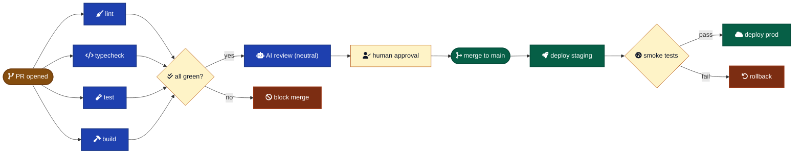

# CI/CD for AI-Driven Projects

How to wire CI/CD when AI agents are producing 30-60 commits per session. Evidence-based, with primary-source citations.

The core observation from GitHub's own engineering blog: weekly compute jumped from 500M minutes in 2023 to 2.1B in a single week of 2026 — "a session that produces 30-60 commits in a few hours, meaning 30-60 builds if your CI/CD pipeline is connected directly to your git repo" ([Context Studios, 2026](https://www.contextstudios.ai/blog/github-is-breaking-under-ai-codings-weight)). Your CI configuration is now a cost-control surface, not just a quality gate.



---

## Baseline — what every project should have

GitHub's `awesome-copilot` CI/CD instructions ([GitHub, 2026](https://github.com/github/awesome-copilot/blob/main/instructions/github-actions-ci-cd-best-practices.instructions.md)) prescribe a minimum floor: **lint**, **typecheck** (or compile), **test**, **build**. Each as a distinct job so they run in parallel and fail independently.

**Workflow file split:**

| File | Triggers | Purpose |
| --- | --- | --- |
| `ci.yml` | `pull_request`, `push: main` | Lint, typecheck, test, build. No secrets, no deploy. |
| `deploy.yml` | `push: main`, `release` | Deploy to staging or prod. Has secrets. |
| `scheduled.yml` | `schedule` (nightly) | Full E2E, dependency audit, license check, link-checker. |
| `release.yml` | `on: release: types: [published]` | Production deploy, changelog, artifact publish. |

**Minimum `ci.yml`:**

```yaml
name: ci
on:
  pull_request:
  push: { branches: [main] }
permissions:
  contents: read
concurrency:
  group: ${{ github.workflow }}-${{ github.head_ref || github.ref }}
  cancel-in-progress: ${{ github.event_name == 'pull_request' }}
jobs:
  lint:      { runs-on: ubuntu-latest, timeout-minutes: 5,  steps: [...] }
  typecheck: { runs-on: ubuntu-latest, timeout-minutes: 5,  steps: [...] }
  test:      { runs-on: ubuntu-latest, timeout-minutes: 15, steps: [...] }
  build:     { runs-on: ubuntu-latest, timeout-minutes: 15, steps: [...] }
```

The `concurrency` block alone saves ~10% of compute spend on active repos ([Blacksmith, 2025](https://www.blacksmith.sh/blog/protect-prod-cut-costs-concurrency-in-github-actions)). `cancel-in-progress` is conditional because you want PR rebases to cancel stale runs but **never** want to cancel a deploy mid-flight.

Real OSS examples: rust-lang/rust splits into ~30 jobs under a parent workflow; Next.js uses `build-and-test.yml` + separate `release.yml` + `canary.yml`; rails/rails uses matrix across Ruby versions plus dedicated `mysql.yml`, `postgresql.yml`.

---

## Caching — real wall-clock savings

Dependency caching is table-stakes; build caching is where the order-of-magnitude wins are.

**For Node:** use `setup-node`'s built-in `cache: 'npm'` rather than rolling your own `actions/cache`. Cache `~/.npm`, not `node_modules` — the latter breaks across Node versions and conflicts with `npm ci` ([GitHub Docs — dependency caching](https://docs.github.com/en/actions/reference/workflows-and-actions/dependency-caching)). Reported hit ratios sit at 70-90% with well-keyed caches ([WarpBuild, 2026](https://www.warpbuild.com/blog/github-actions-cache)); 4-5× build-time reductions when configured properly ([EastonDev, 2026](https://eastondev.com/blog/en/posts/dev/20260407-github-actions-cache-strategy/)).

```yaml
- uses: actions/setup-node@v4
  with:
    node-version: '20'
    cache: 'npm'  # caches ~/.npm, keyed off package-lock.json automatically
```

**For monorepos:** Turborepo remote cache. Mercari's published case study reports ~50% reduction in turbo task duration and ~30% reduction in total job duration ([Mercari Engineering, 2026](https://engineering.mercari.com/en/blog/entry/20260216-turborepo-remote-cache-accelerating-ci-to-move-fast/)). A widely-cited team report: CI wall-clock dropped from 18 min to 5 min on average PRs after Turborepo remote cache integration ([Leapcell, 2026](https://leapcell.io/blog/optimizing-ci-cd-for-full-stack-projects-leveraging-turborepo-s-remote-caching-and-on-demand-builds)).

**Cache key hygiene** ([Drakulavich, 2026](https://dev.to/drakulavich/aggressive-dependency-caching-in-github-actions-3c64)): use `runner.os` + `hashFiles(<lockfile>)`. Never include timestamps, branch names, or wildcards that match too many files — these tank hit rates silently.

---

## Matrix — when overkill

Matrix is built for **legitimate cross-axis testing**: Node versions, OSes, browsers, database versions ([GitHub Docs — variations of jobs](https://docs.github.com/en/actions/writing-workflows/choosing-what-your-workflow-does/running-variations-of-jobs-in-a-workflow)). For a single-target SaaS app deploying to Linux containers, matrix is overkill.

The 2025-era pattern is **dynamic matrices** ([DevOpsDirective, 2025](https://devopsdirective.com/posts/2025/08/advanced-github-actions-matrix/)): an upstream job inspects changed files and emits a matrix as JSON; downstream jobs consume it.

**Rule of thumb:** plain parallel jobs first (lint || typecheck || test), matrix only when you genuinely have cross-axis variation. Don't matrix AI-generated repos that target one Node version and one OS.

---

## Secret management

The hierarchy, worst to best:

1. **Hardcoded** — never. Use `::add-mask::` if a non-secret value needs redacting.
2. **Repo secrets** — fine for low-blast-radius API keys; rotate periodically.
3. **Environment secrets** — better. Scoped per environment (staging/production), supports required-reviewer gates ([GitHub Docs — environments](https://docs.github.com/en/actions/reference/security/secure-use)).
4. **OIDC / Workload Identity Federation** — current best practice for cloud access. AWS ([AWS Security Blog, 2025](https://aws.amazon.com/blogs/security/use-iam-roles-to-connect-github-actions-to-actions-in-aws/)) and GCP ([Firefly, 2026](https://www.firefly.ai/academy/setting-up-workload-identity-federation-between-github-actions-and-google-cloud-platform)) both document configuring an OIDC trust to mint short-lived tokens at runtime — no long-lived keys in GitHub.
5. **GitHub App tokens** for cross-repo automation; prefer over PATs.

**Critical hardening:** the OIDC trust policy must restrict the `sub` claim to a specific repo and ideally a specific branch — wildcards like `repo:org/*` open you up to confused-deputy attacks ([Gitdash, 2026](https://gitdash.dev/blog/github-actions-oidc-security-identity-federation)).

```yaml
permissions:
  id-token: write   # required for OIDC
  contents: read
steps:
  - uses: aws-actions/configure-aws-credentials@v4
    with:
      role-to-assume: arn:aws:iam::123456789012:role/gh-deploy
      aws-region: us-east-1
```

**Never** do `env: SECRETS: ${{ toJson(secrets) }}` — Wiz calls this a critical antipattern ([Wiz, 2026](https://www.wiz.io/blog/github-actions-security-guide)). Pass secrets one-by-one to the step that needs them.

---

## AI-specific CI concerns

### Should AI PRs run a different pipeline?

Anthropic's Claude Code Review ([Anthropic Docs, 2026](https://code.claude.com/docs/en/code-review)) runs as a **GitHub App** that posts inline comments, not as a workflow that gates merges. Its check run "always completes with a neutral conclusion so it never blocks merging." Opinionated read: **don't gate on AI review**, but **do** run a stricter normal pipeline (more linters, mutation testing, coverage thresholds) on PRs from known bot accounts. GitHub's `actor` context (`github.event.pull_request.user.login`) lets you branch on this.

### AI test-smell detection — the gap

As of May 2026, **no major linter ships with rules** like "test has no `expect`" or "test only asserts type equality to itself." Closest official guidance ([GitHub awesome-copilot, 2026](https://github.com/github/awesome-copilot/blob/main/instructions/github-actions-ci-cd-best-practices.instructions.md)) says verify "comprehensive test coverage and reporting" — vague.

**Practical mitigations:**

- Enforce **branch coverage** (not line coverage) thresholds.
- Run **mutation testing** (Stryker, Mutmut) on critical paths. See [`testing.md`](./testing.md).
- Custom `ast-grep` or Semgrep rules to scan tests for missing assertions.

### Cost control — the actively-evolving area

GitHub's own engineering blog ([GitHub Blog, 2026](https://github.blog/ai-and-ml/github-copilot/improving-token-efficiency-in-github-agentic-workflows/)) reports weekly compute jumped from 500M to 2.1B minutes in a single week of 2026, attributing it to AI session bursts. **Concrete mitigations to bake in:**

- `concurrency: cancel-in-progress: true` on PR builds — ~10% savings ([Blacksmith, 2025](https://www.blacksmith.sh/blog/protect-prod-cut-costs-concurrency-in-github-actions)).
- `timeout-minutes` on every job — 5 for lint, 15 for builds, 30 for E2E. No runaway loops.
- `paths` / `paths-ignore` filters so docs-only changes skip CI entirely.
- Anthropic's pricing guidance for Code Review: choose **"Once after PR creation"** over **"After every push"** to bound per-PR cost ([Anthropic Docs, 2026](https://code.claude.com/docs/en/code-review)).

---

## Branch protection — required status checks

Pragmatic set for `main` on a small-team or solo-AI repo ([GitHub Docs — branch protection](https://docs.github.com/en/repositories/configuring-branches-and-merges-in-your-repository/managing-protected-branches/managing-a-branch-protection-rule)):

**Required:**
- All four baseline jobs (lint, typecheck, test, build) pass
- Branches up to date before merging (catches semantic merge conflicts)
- 1 approving review (or for solo: code-owner review, optional)

**Overkill for small repos:**
- Required signed commits — friction for solo work
- Required deployment status — only worth it if staging deploys are fast
- Required linear history — rebase-culture-only

**Gotcha:** checks must run at least once on the target branch within the last 7 days to appear in the picker. Fresh repo: push to main once, let CI run, then enable the requirement.

---

## Preview deployments — when worth it, what breaks

Vercel preview deployments fire on every push to non-production branches with a unique URL and preview-scoped env vars ([Vercel Docs](https://vercel.com/docs/deployments/environments)). PR comment shows the URL; reviewers click to validate.

**When worth it:** visual / UI work, design review, content changes, demos. The framework's `examples/website/` is a textbook fit.

**What breaks:**

1. **Database state.** Preview env vars typically point at staging — multiple PRs hitting the same staging DB cause flaky behavior. Mitigations: per-branch databases (Neon, Supabase branching), seeded read-only fixtures.
2. **Secrets in preview.** You must set sensitive keys for both production AND preview env scopes, or feature branch deploys 500 ([Alloy, 2026](https://alloy.app/library/how-to-use-vercel-preview-deployments)).
3. **Cost.** Vercel Pro defaults to Turbo build machines at $0.126/min. 20 PRs/day × 5min average = ~$378/month in preview costs alone ([Alloy, 2026](https://alloy.app/library/how-to-use-vercel-preview-deployments)). On AI-heavy repos with 30-60 commits/session, scales fast. Mitigations: switch low-priority branches to standard machines, set "ignored build step" scripts that skip docs-only commits, disable auto-deploy on draft PRs.

---

## Workflow security — pin to SHA, not tag

**The tj-actions/changed-files incident (CVE-2025-30066, March 2025)** ([CISA, 2025](https://www.cisa.gov/news-events/alerts/2025/03/18/supply-chain-compromise-third-party-tj-actionschanged-files-cve-2025-30066-and-reviewdogaction); [Wiz, 2025](https://www.wiz.io/blog/github-action-tj-actions-changed-files-supply-chain-attack-cve-2025-30066)) reset the conversation. ~23,000 repos consumed a compromised version that injected a payload to dump runner memory — AWS keys, GitHub PATs, npm tokens, RSA keys leaked into public workflow logs. **The attacker moved existing version tags to point at malicious commits**, so anyone consuming `tj-actions/changed-files@v45` was hit even without changing their workflow.

The lesson, now official GitHub policy ([GitHub Changelog, 2025-08-15](https://github.blog/changelog/2025-08-15-github-actions-policy-now-supports-blocking-and-sha-pinning-actions/)): **pin to full-length commit SHA, not tag**.

```yaml
# Bad — tag is mutable, can be moved
- uses: tj-actions/changed-files@v45

# Good — SHA is immutable
- uses: tj-actions/changed-files@a284dc1814b3d3ab8e6c84e80f4eba9bbe23a8cd  # v46.0.1
```

**Other essential hardening** ([StepSecurity, 2026](https://www.stepsecurity.io/blog/pinning-github-actions-for-enhanced-security-a-complete-guide); [Wiz, 2026](https://www.wiz.io/blog/github-actions-security-guide)):

- **Top-level `permissions: contents: read`** then grant per-job. Default is permissive; explicit `permissions:` sets unspecified scopes to `none`.
- **OIDC over long-lived secrets** for any cloud auth.
- **Never use `pull_request_target` with explicit checkout of PR code** — this is the "pwn request" pattern ([GitHub Security Lab](https://securitylab.github.com/resources/github-actions-preventing-pwn-requests/)). Use `pull_request` (no secrets, no write token) for PR validation; only use `pull_request_target` for metadata operations (labeling, commenting) without checking out the fork.
- **Two-workflow pattern for fork PRs:** untrusted workflow (`pull_request`) builds and uploads artifacts; trusted workflow (`workflow_run`) downloads artifacts and posts comments.
- **Wiz's cooldown recommendation:** delay action updates by 7-14 days; catches 80-90% of supply chain attacks before consumption ([Wiz, 2026](https://www.wiz.io/blog/github-actions-security-guide)). Dependabot supports `cooldown` rules natively now.

---

## Monorepo CI

Path filters first. `dorny/paths-filter`:

```yaml
- uses: dorny/paths-filter@v4
  id: changes
  with:
    filters: |
      api: 'packages/api/**'
      web: 'packages/web/**'
- if: steps.changes.outputs.api == 'true'
  run: pnpm --filter api test
```

For richer dependency graphs, **Nx** ships `nx affected` ([Nx GitHub Action, 2026](https://github.com/marketplace/actions/nrwl-nx)) — only runs targets for projects whose dependency closure changed.

**Turborepo's remote cache** ([Turborepo Docs](https://turborepo.dev/docs/core-concepts/remote-caching)) is the bigger lever. Self-hostable via `ducktors/turborepo-remote-cache` if you don't want Vercel's hosted service.

**Threshold for monorepo CI complexity:** 3+ deployable units sharing 1+ library ([WarpBuild, 2026](https://www.warpbuild.com/blog/github-actions-monorepo-guide)). Below that, path filters alone suffice.

---

## CI in other AI frameworks

The honest finding: **none of the major AI coding tools ship a canonical CI convention doc.** They ship Actions you assemble into your own pipeline.

- **Cursor:** no public CI convention doc. Editor; BYO CI.
- **Aider:** ships an Action and an "Issue → PR" workflow template ([mirrajabi/aider-github-action](https://github.com/mirrajabi/aider-github-action)). Tag an issue `aider`, workflow spawns a branch, runs Aider with the issue body, opens a PR. No prescribed validation pipeline.
- **Cline:** zero-interaction mode for scripting/CI, JSON output, `.clinerules`. No canonical CI workflow shipped.
- **Continue:** standalone CLI for headless CI ([Augment Code comparison, 2026](https://www.augmentcode.com/tools/continue-vs-aider-vs-cline-private-ai-coding-assistants-for-regulated-teams)). BYO pipeline.
- **GitHub Copilot CLI in Actions:** the most documented. Install via `npm i -g @github/copilot-cli`, authenticate with a PAT having "Copilot Requests" permission ([GitHub Docs — automate Copilot CLI with Actions](https://docs.github.com/en/copilot/how-tos/copilot-cli/automate-copilot-cli/automate-with-actions)).
- **Anthropic Claude Code Review** ([Anthropic Docs](https://code.claude.com/docs/en/code-review)): closest thing to an opinionated convention. Multi-agent PR review, posts inline comments, "always completes with a neutral conclusion." Customized via `CLAUDE.md` (general context) or `REVIEW.md` (review-only rules with severity calibration).

The closest published convention is **GitHub's own awesome-copilot CI/CD instructions** ([github/awesome-copilot](https://github.com/github/awesome-copilot/blob/main/instructions/github-actions-ci-cd-best-practices.instructions.md)) — prescribes least-privilege permissions, SHA-pinning, hash-based cache keys, matrix-where-it-pays, environment-gated production deploys. Not AI-specific, but it's the official baseline GitHub trains Copilot on.

---

## Anti-patterns

- **No timeouts.** Every job needs `timeout-minutes`. A runaway agent loop in CI is real money.
- **`actions/cache` over `setup-X cache:`.** Built-in caches are simpler and more correct.
- **Matrix for single-target apps.** Complexity without payoff.
- **Tag-pinned actions.** SHA-pin per the tj-actions incident.
- **AI gating merges.** Anthropic itself ships their reviewer as neutral. Don't escalate AI suggestions to blocking checks.
- **Same workflow runs on every push during AI sessions.** Use `concurrency: cancel-in-progress`, paths filters, and "once-after-PR" review modes.

---

## When to skip

- **Static site / personal blog:** Vercel/Netlify default deploy is enough. Skip CI workflow files.
- **Throwaway prototypes:** Skip CI. Run lint/test locally.
- **Solo CLI scripts:** Skip CI until you have consumers.

---

## Honest gaps (May 2026)

1. **AI test-smell detection in CI** — no shipping tool catches tautological tests or missing assertions out of the box. Research gap; this framework could publish its own ast-grep / Semgrep rules.
2. **Cost guardrails for AI-generated commits** — official guidance is mostly observability. Frameworks can be more opinionated than vendors.
3. **No canonical Mermaid CI/CD diagrams** from GitHub. Templates exist; this framework's diagram above is one.

---

## References

- [Alloy — Vercel Preview Deployments (2026)](https://alloy.app/library/how-to-use-vercel-preview-deployments)
- [Anthropic — Claude Code Review Docs (2026)](https://code.claude.com/docs/en/code-review)
- [AWS Security Blog — IAM Roles for GitHub Actions OIDC (2025)](https://aws.amazon.com/blogs/security/use-iam-roles-to-connect-github-actions-to-actions-in-aws/)
- [Blacksmith — Concurrency for Cost (2025)](https://www.blacksmith.sh/blog/protect-prod-cut-costs-concurrency-in-github-actions)
- [CISA — CVE-2025-30066 Advisory](https://www.cisa.gov/news-events/alerts/2025/03/18/supply-chain-compromise-third-party-tj-actionschanged-files-cve-2025-30066-and-reviewdogaction)
- [Context Studios — GitHub Is Breaking Under AI Coding (2026)](https://www.contextstudios.ai/blog/github-is-breaking-under-ai-codings-weight)
- [DevOpsDirective — Advanced Matrix (2025)](https://devopsdirective.com/posts/2025/08/advanced-github-actions-matrix/)
- [Drakulavich — Aggressive Caching (2026)](https://dev.to/drakulavich/aggressive-dependency-caching-in-github-actions-3c64)
- [Ducktors — Turborepo Remote Cache (self-host)](https://github.com/ducktors/turborepo-remote-cache)
- [EastonDev — Cache Strategy (2026)](https://eastondev.com/blog/en/posts/dev/20260407-github-actions-cache-strategy/)
- [Firefly — WIF Setup (2026)](https://www.firefly.ai/academy/setting-up-workload-identity-federation-between-github-actions-and-google-cloud-platform)
- [Gitdash — OIDC Hardening (2026)](https://gitdash.dev/blog/github-actions-oidc-security-identity-federation)
- [GitHub Blog — Token Efficiency (2026)](https://github.blog/ai-and-ml/github-copilot/improving-token-efficiency-in-github-agentic-workflows/)
- [GitHub Changelog — SHA-pinning Policy (2025-08-15)](https://github.blog/changelog/2025-08-15-github-actions-policy-now-supports-blocking-and-sha-pinning-actions/)
- [GitHub Docs — Branch Protection](https://docs.github.com/en/repositories/configuring-branches-and-merges-in-your-repository/managing-protected-branches/managing-a-branch-protection-rule)
- [GitHub Docs — Copilot CLI with Actions](https://docs.github.com/en/copilot/how-tos/copilot-cli/automate-copilot-cli/automate-with-actions)
- [GitHub Docs — Dependency Caching](https://docs.github.com/en/actions/reference/workflows-and-actions/dependency-caching)
- [GitHub Docs — Job Variations / Matrix](https://docs.github.com/en/actions/writing-workflows/choosing-what-your-workflow-does/running-variations-of-jobs-in-a-workflow)
- [GitHub Docs — Secure Use Reference](https://docs.github.com/en/actions/reference/security/secure-use)
- [GitHub Docs — Workflow Syntax](https://docs.github.com/en/actions/reference/workflows-and-actions/workflow-syntax)
- [GitHub Security Lab — Preventing Pwn Requests](https://securitylab.github.com/resources/github-actions-preventing-pwn-requests/)
- [github/awesome-copilot — CI/CD Best Practices](https://github.com/github/awesome-copilot/blob/main/instructions/github-actions-ci-cd-best-practices.instructions.md)
- [dorny/paths-filter](https://github.com/dorny/paths-filter)
- [Leapcell — Turborepo Remote Caching Case (2026)](https://leapcell.io/blog/optimizing-ci-cd-for-full-stack-projects-leveraging-turborepo-s-remote-caching-and-on-demand-builds)
- [Mercari Engineering — Turborepo Remote Cache (2026)](https://engineering.mercari.com/en/blog/entry/20260216-turborepo-remote-cache-accelerating-ci-to-move-fast/)
- [mirrajabi/aider-github-action](https://github.com/mirrajabi/aider-github-action)
- [Nrwl Nx GitHub Action](https://github.com/marketplace/actions/nrwl-nx)
- [StepSecurity — Pinning Actions Guide (2026)](https://www.stepsecurity.io/blog/pinning-github-actions-for-enhanced-security-a-complete-guide)
- [Turborepo Docs — Remote Caching](https://turborepo.dev/docs/core-concepts/remote-caching)
- [Vercel Docs — Environments](https://vercel.com/docs/deployments/environments)
- [WarpBuild — Cache (2026)](https://www.warpbuild.com/blog/github-actions-cache)
- [WarpBuild — Monorepo Guide (2026)](https://www.warpbuild.com/blog/github-actions-monorepo-guide)
- [Wiz — GitHub Actions Security Guide (2026)](https://www.wiz.io/blog/github-actions-security-guide)
- [Wiz — tj-actions Attack Analysis (2025)](https://www.wiz.io/blog/github-action-tj-actions-changed-files-supply-chain-attack-cve-2025-30066)
