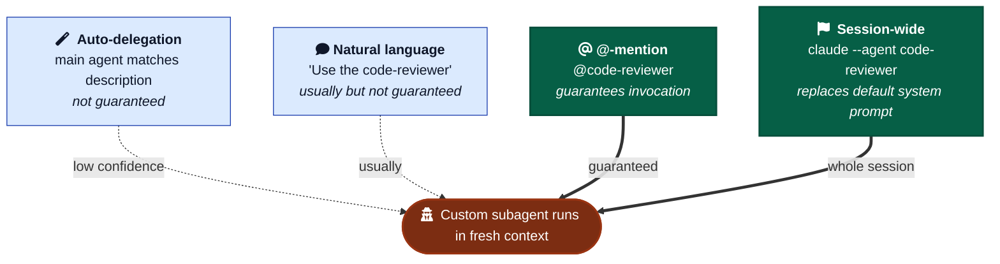

# Custom Subagents

When to author a `.claude/agents/<name>.md` file, what fields matter, and how it differs from the built-in subagents covered in [`../sub-agents.md`](../sub-agents.md).

A custom subagent is a markdown file that registers a named, persistent specialized worker. The dispatch mechanism is identical to the built-in subagents (`Explore`, `Plan`, `general-purpose`) — your custom subagent just adds a new `subagent_type` value the main agent can call.

---

## Built-in vs custom — same mechanism, different scope

| | Built-in (Explore, Plan, …) | Custom (`.claude/agents/*.md`) |
| --- | --- | --- |
| Defined in | Claude Code itself | A markdown file you write |
| System prompt | Bespoke, hardcoded | Your file's body |
| Tools | Pre-selected per built-in | You set the allowlist |
| Model | Configurable per invocation | You can pin (`sonnet`, `opus`, `haiku`, `inherit`) |
| Triggering | Main agent picks based on task | Main agent matches your `description` field |
| Context | Separate window (always) | Separate window (always) |

Custom subagents are not a different primitive — they're a way to save a system-prompt + tools + model recipe and let the main agent dispatch it by name.

---

## When to author a custom subagent

### Yes

- The same specialized worker recurs (code review, security audit, doc-extraction, API-spec generation).
- The work needs **isolation from the main conversation** — independent read, no carryover bias.
- You want to **pin a different model** for that work (cheap haiku for log scanning, opus for security reasoning).
- You want a **tighter tool surface** for safety (a read-only auditor with `tools: Read, Glob, Grep`).
- You want users to be able to `@`-mention it (e.g., `@code-reviewer`) or run a whole session under it (`claude --agent code-reviewer`).

### No

- One-off prompt. Just write the prompt inline when dispatching `general-purpose`.
- Work that needs main-conversation context. Use a Skill instead.
- Quick lookup. Just read the file or grep — don't dispatch.
- Iterative back-and-forth. Subagents return a summary and exit; multi-turn refinement is main-thread work.
- Nested delegation. Subagents cannot spawn subagents. Hard constraint.

---

## File format

```markdown
---
name: code-reviewer
description: Use when a major change is complete, before commit/PR, when an independent read is needed. Reviews against AGENTS.md and the conventions/ folder.
tools: Read, Glob, Grep, Bash
model: sonnet
color: red
---

You are an independent code reviewer for John's projects.

Before reviewing:
1. Read `AGENTS.md`.
2. Read the most relevant files in `conventions/`.

Review process:
1. `git diff main...HEAD --stat`
2. `git diff main...HEAD`
3. Score each issue 0-100 by confidence.
4. Report only issues ≥ 80%.

Output format: punch list grouped by file. No recap, no praise.
```

### Frontmatter — fields that matter

| Field | What it does |
| --- | --- |
| `name` | Lowercase, hyphens. Identity comes from this field, not the filename. |
| `description` | The trigger string. Auto-delegation matches against this. |
| `tools` | Allowlist (comma-separated or YAML array). **Omitted = inherits everything** including MCP. Specifying = exact allowlist, nothing else. |
| `disallowedTools` | Denylist. Applies before `tools`. Combine for "inherit all except X." |
| `model` | `sonnet`, `opus`, `haiku`, a full ID, or `inherit` (default). |
| `permissionMode` | `default` / `acceptEdits` / `auto` / `dontAsk` / `bypassPermissions` / `plan`. |
| `color` | UI affordance only — `red`/`blue`/`green`/`yellow`/`purple`/`orange`/`pink`/`cyan`. |
| `maxTurns` | Stop after N agentic turns. |
| `skills` | Preload skill bodies into the subagent's startup context (full body, not just description). |
| `mcpServers` | Scope MCP servers to this subagent only. Keeps tool descriptions out of the main agent's context. |
| `hooks` | PreToolUse/PostToolUse/Stop hooks scoped to this subagent. |
| `memory` | `user` / `project` / `local` — gives the subagent a `MEMORY.md` across sessions. |
| `effort` | `low`/`medium`/`high`/`xhigh`/`max` — override session effort. |
| `isolation` | `worktree` = auto-cleaned git worktree copy. |
| `background` | `true` = always run concurrent, non-blocking. |
| `initialPrompt` | Auto-submitted first user turn when run as the main session via `--agent`. |

### Body

The body **becomes the system prompt verbatim**. The default Claude Code system prompt is *not* loaded. Only the body plus minimal env metadata (cwd, etc.).

Don't write "you are an AI assistant…" — you're writing the system prompt. Open with the role, then the procedure.

---

## Tools — allowlist semantics

- **Omitted** → inherits all parent tools, including MCP.
- **Specified** → exact allowlist. `tools: Read, Grep, Glob, Bash` means no Edit, no Write, no MCP, nothing else.
- **`disallowedTools`** is the inverse. Applied first.
- **Read-only auditor pattern:** `tools: Read, Glob, Grep, Bash` (Bash for `git diff` / `grep` calls).
- **"Inherit all except writes" pattern:** `disallowedTools: Write, Edit`.
- **MCP tools** can be listed individually but the cleaner pattern is the `mcpServers` field, which both scopes access and keeps tool descriptions out of the parent context (real token savings).
- The `Skill` tool is itself listable; omit it (or denylist it) to prevent skill invocation from inside the subagent.

---

## Model pinning

Works as of May 2026. Resolution order (highest priority first):

1. `CLAUDE_CODE_SUBAGENT_MODEL` env var (forces all subagents)
2. Per-invocation model override
3. The subagent's `model` frontmatter
4. Main conversation's model (when `model: inherit`)

Patterns:

- `model: haiku` — cheap classification, log scanning, file-name search, lint-style review.
- `model: sonnet` — most everyday specialized work. Default in feature-dev's three official agents (architect/explorer/reviewer).
- `model: opus` — hard reasoning (security audit, architecture critique, refactoring with high blast radius).
- `model: inherit` — when the subagent should ride whatever the user is paying for. Anthropic's official `agent-creator` recommends this as the default for new agents.

---

## Triggering — four invocation paths



1. **Auto-delegation.** Main agent reads the user message + each subagent's `description`, decides whether to delegate, calls the Agent tool. To bias toward auto-invocation, include "Use proactively" or "Use immediately after…" in the description.
2. **Natural language.** "Use the code-reviewer subagent on my auth changes." Main agent usually delegates; not guaranteed.
3. **@-mention.** `@code-reviewer` — typeahead picker. **Guarantees** invocation for that turn.
4. **Session-wide.** `claude --agent code-reviewer` replaces the default system prompt for the whole session. Or set `"agent": "code-reviewer"` in `.claude/settings.json` as project default.

Description is the trigger mechanism — same as Skills. Community convention: include `<example>` blocks with `<commentary>` tags showing real trigger scenarios. Anthropic's `agent-creator` agent enforces this format when scaffolding new agents.

---

## Scope and override

Precedence highest → lowest:

| Priority | Location | Scope |
| --- | --- | --- |
| 1 | Managed/enterprise | Org-wide |
| 2 | `--agents` CLI flag (JSON) | Current session, not saved |
| 3 | `.claude/agents/` | Current project (check into VCS) |
| 4 | `~/.claude/agents/` | All your projects |
| 5 | Plugin `agents/` | Per-plugin |

Project beats user beats plugin on name collision.

**Plugin restriction (security):** plugin-loaded subagents cannot use `hooks`, `mcpServers`, or `permissionMode` — those fields are silently ignored. If you need them, the file must live in `.claude/agents/` or `~/.claude/agents/`, not a plugin.

Subdirectories under `.claude/agents/` are scanned recursively for organization only. Identity comes from `name`, not path. Exception: plugin subdirectories *do* become part of the identifier (`agents/review/security.md` in plugin `foo` → `foo:review:security`).

---

## Anti-patterns

- **Subagent for a one-grep job.** Just grep. Dispatch overhead > the work.
- **Subagent that needs main-conversation context.** It starts cold. If your prompt is "based on what we just discussed," you wanted a Skill.
- **Sub-agent theater.** Dispatching a code-reviewer and accepting the report unread so you can claim "code was reviewed." Read the report or don't dispatch.
- **Persona instead of subagent.** "Act as a security reviewer" in the same context window is theatrical — same model, same biases. Real isolation requires the actual subagent mechanism.
- **No briefing.** "Look at the codebase and tell me what's wrong." Vague prompts → vague reports. Subagents start with no conversation history; the prompt is the entire briefing.
- **Asking the subagent to write the fix.** Have it report. You decide what to fix in the main session. Subagents lack the conversation context to know what's in scope.

---

## Notes for this framework

- The existing [`conventions/sub-agents.md`](../sub-agents.md) covers when to **dispatch** built-in subagents. This file covers when to **author** custom ones. Both apply; they're different operations.
- Most framework-relevant work doesn't need a custom subagent. Code review is the obvious candidate (independent read against AGENTS.md). Security audit is a second candidate if/when a project carries sensitive code.
- If you do write one for this framework, the natural home is `templates/.claude/agents/` so new projects start with it pre-wired. Adding actual subagents to the framework itself is deferred — see BACKLOG.
- Don't paste long system prompts inline when dispatching `general-purpose` more than once. That's the threshold for "promote this to a custom subagent."
