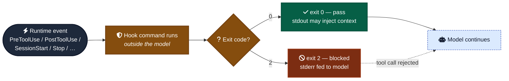

# Hooks

When framework rules should be enforced by a runtime hook vs. left as documentation. Most hooks are theater; a small number are genuinely load-bearing.

Hooks are deterministic event handlers that run outside the model. The harness fires them; Claude doesn't decide whether they run. That's their value — and their limit.



---

## When a hook is load-bearing

### Yes — write a hook

- **Block irreversible operations the model could still do despite documentation.** `Bash(git push --force *)`, `Bash(git commit --no-verify*)`, `Bash(rm -rf *)`. A `PreToolUse` hook returning exit 2 makes the rule physically unviolable.
- **Block writes to protected files.** `.env`, `package-lock.json` (force `npm install`), `AGENTS.md` if you want the framework's own rules immutable in adopting projects.
- **Auto-format / lint on save.** `PostToolUse` matcher on `Edit|Write` running prettier / eslint. Deterministic, zero model context cost.
- **Run tests after edits to related files.** `PostToolUse` with a path matcher.

### No — leave it in documentation

- **"Read AGENTS.md before starting."** Claude Code already auto-loads CLAUDE.md → AGENTS.md as project memory. A SessionStart hook duplicates this.
- **"Don't add features beyond what's asked."** No exit code captures "is this in scope." Document the rule, escalate if violated.
- **"Use conventional commits."** A `PreToolUse` hook matching `Bash(git commit *)` and parsing the message is brittle and gets in the way. Document it; let the human review the commit.
- **"Inject helpful context into the prompt."** UserPromptSubmit context injection makes every turn longer. The model already has CLAUDE.md.

Quick rule: hook for *prevention* of specific dangerous patterns, not for *guidance*. Guidance lives in docs.

---

## Hook events

The full 2026 list has 31 events. The seven you'll actually use:

| Event | Fires when | Common use |
| --- | --- | --- |
| `SessionStart` | Session begins | Load context (usually unnecessary; CLAUDE.md does this). |
| `UserPromptSubmit` | User types a prompt | Inject context, validate prompts. Mostly theater for personal use. |
| `PreToolUse` | About to run a tool | **Block dangerous patterns.** Exit 2 = block. |
| `PostToolUse` | Tool completed successfully | **Auto-format, lint, run tests.** Zero blocking. |
| `Stop` | Claude is about to stop | Enforce completion (e.g., "tests must pass"). Exit 2 = don't stop. |
| `SubagentStop` | A subagent is about to return | Validate the subagent's report. |
| `PreCompact` | Context is about to be summarized | Preserve critical state. |

Other events that exist but rarely matter for a personal framework: `Setup`, `PermissionRequest`/`PermissionDenied`, `PostToolUseFailure`, `PostToolBatch`, `SubagentStart`, `TaskCreated`/`TaskCompleted`, `StopFailure`, `TeammateIdle`, `InstructionsLoaded`, `ConfigChange`, `CwdChanged`, `FileChanged`, `WorktreeCreate`/`WorktreeRemove`, `PostCompact`, `Elicitation`/`ElicitationResult`.

---

## Handler types

Hooks aren't limited to shell commands anymore:

| Type | What it is |
| --- | --- |
| `command` | Shell command. Original primitive. |
| `http` | POST to URL. For org-wide audit / telemetry. |
| `mcp_tool` | Call an MCP tool as the hook. |
| `prompt` | An LLM evaluates the hook condition. Instead of writing bash to detect "is this commit message good," write a prompt. |
| `agent` | A subagent runs as the hook. |

The `prompt` and `agent` types are the big shift since 2024. For a personal framework, stick with `command` — simpler, deterministic, no extra LLM calls.

---

## Hook config — where it lives

Settings resolution highest → lowest:

1. Managed/enterprise
2. `.claude/settings.local.json` (gitignored, personal)
3. `.claude/settings.json` (committed, project)
4. Plugin `hooks/hooks.json`
5. `~/.claude/settings.json` (user defaults)

Project-level hooks in `.claude/settings.json` are committed and apply to anyone working in the repo. **Hooks across these locations merge and run in parallel.** They cannot see each other's output — design for independence.

Plugin hooks use a wrapper format: `{"hooks": {"PreToolUse": [...]}}`. Settings hooks are flat: `{"PreToolUse": [...]}`. Don't confuse the two.

---

## Format

Project-level `.claude/settings.json` example with two load-bearing hooks:

```json
{
  "hooks": {
    "PreToolUse": [
      {
        "matcher": "Bash",
        "if": "Bash(git commit --no-verify*)",
        "hooks": [
          {
            "type": "command",
            "command": "echo 'Refusing --no-verify; fix the underlying issue.' >&2; exit 2"
          }
        ]
      },
      {
        "matcher": "Edit|Write",
        "if": "Edit(.env) || Write(.env)",
        "hooks": [
          {
            "type": "command",
            "command": "echo 'Cannot edit .env from Claude. Update manually.' >&2; exit 2"
          }
        ]
      }
    ]
  }
}
```

### Matchers

- Simple string or `|`-separated list → exact match: `"Bash"`, `"Edit|Write"`.
- Anything containing other characters → JS regex: `"mcp__.*"`, `"mcp__.*__delete.*"`.
- `"*"` matches everything.
- `if` uses permission-rule syntax: `"if": "Bash(git push *)"`.

---

## Exit code semantics

- **`0`** — success. Stdout is parsed as JSON for hooks that support structured output. For `UserPromptSubmit`, `UserPromptExpansion`, and `SessionStart`, stdout is **injected into Claude's context**.
- **`2`** — blocking. Stderr is fed back to Claude as an error message. On `PreToolUse` this blocks the tool call; on `Stop` this prevents stopping; on `UserPromptSubmit` this rejects the prompt.
- **Any other code (including `1`)** — non-blocking error. **`exit 1` does NOT block** — common mistake. Use exit 2 when you mean to block.

Hook handlers should **fail open** — if your hook script errors unexpectedly, exit 0 so it doesn't break the session. Use `systemMessage` (or stderr at exit 0) to surface the error to the user without blocking.

---

## Anti-patterns

- **Exit 1 expecting it to block.** It doesn't. Use exit 2.
- **Hook that hangs.** A hook command that waits for input or sleeps will stall every tool call. Test with a timeout.
- **Hook that re-implements what Claude Code already does.** Auto-loading CLAUDE.md, applying project memory, parsing tool arguments. The harness already handles these.
- **Hook that fails closed.** A buggy hook that errors and blocks everything is worse than no hook. Catch errors, exit 0, log via `systemMessage`.
- **Catch-all matchers in PreToolUse.** A hook that runs on every Bash call adds latency to every Bash call. Scope tightly.
- **Hook as ambient documentation.** "Remind the user to commit on every Stop." That's annoying, not useful. Hooks for prevention, docs for guidance.

---

## Notes for this framework

- **The framework does not currently ship any hooks.** Deliberate — hooks installed via the framework would mutate user projects, which violates the "modify only the project we're directly working in" rule.
- **Recommended pattern:** the framework documents *snippet* hooks users can paste into their own `.claude/settings.json`. Opt-in, per-project.
- **Two snippets worth documenting** (likely BACKLOG items):
  - Block `git commit --no-verify` and `git push --force` to `main`.
  - Block edits to `AGENTS.md`, `CLAUDE.md`, `BACKLOG.md` (if the user wants framework files immutable mid-project — most won't).
- **Don't write hooks that "enforce" the soft rules.** Anti-overengineering, scope discipline, communication style — these are judgment calls the model has to make. A hook that tries to enforce "no premature abstraction" is theater.
