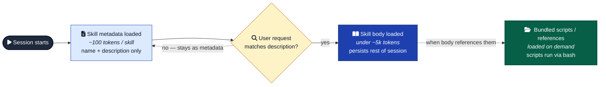

# Skills

When to author a Claude Code Skill, how to write one, and how to tell whether the convention you're tempted to convert is actually skill-shaped.

A Skill is a markdown file (with optional bundled scripts and references) that Claude loads into context when its description matches the current task. Slash commands have been folded into skills — `/deploy` works whether it comes from `.claude/commands/deploy.md` or `.claude/skills/deploy/SKILL.md`. Skills are the preferred form because they can carry a directory of supporting files.



---

## When to write a Skill

### Yes

- The pattern is a **procedure**, not reference. Multi-step. The model should *execute* it, not just *know* it.
- You keep pasting the same instructions, checklist, or workflow into chat.
- A section of `CLAUDE.md` / `AGENTS.md` has grown into a procedure rather than a fact.
- You want the body loaded **only when relevant**, not on every turn. Skills cost ~100 tokens at startup (metadata only) and load the full body on invocation.
- The work needs to **reference the ongoing conversation** — what's been said, what's been done. Skill content gets injected in-place; the current agent runs it.

### No

- It's reference content (the rules in `anti-overengineering.md`, `escalation.md`, the UI design phase rules). Reference belongs in conventions, not skills.
- The work needs **isolation** — review without bias from the current conversation, expensive reasoning you want on a different model. Use a custom subagent instead.
- The work must be **unignorable** (block dangerous commands, enforce formatting). Use a hook instead.
- It's a single-use prompt. Just write the prompt inline; don't formalize a one-shot.

---

## SKILL.md format

Required: `name` and `description`. Everything else optional.

```markdown
---
name: review-pr
description: Review the current PR for adherence to AGENTS.md and the conventions/ folder. Use after a major change is complete, before commit/PR, when an independent read is needed.
---

# Review PR

You are reviewing the current branch's diff against `main`. Before reviewing, read:

- `AGENTS.md` (universal rules)
- The most relevant files in `conventions/` for the changed code

Then:

1. Run `git diff main...HEAD --stat` for shape.
2. Run `git diff main...HEAD` for content.
3. Score each file by AGENTS.md compliance, anti-overengineering, naming.
4. Report only high-confidence issues (≥ 80%). Cite file:line.

Output: a punch list grouped by file, no praise, no recap.
```

### Frontmatter fields

| Field | Required | Purpose |
| --- | :---: | --- |
| `name` | yes | Lowercase, hyphens. Max 64 chars. No reserved words ("anthropic", "claude"). |
| `description` | yes | Primary trigger. Max ~1,536 chars combined with `when_to_use`. |
| `when_to_use` | | Appended to description; same budget. |
| `allowed-tools` | | Pre-approve specific tool calls without prompts: `Bash(git diff *) Bash(git log *)`. |
| `disable-model-invocation` | | `true` = user-only (`/name`). Description not loaded into context. |
| `user-invocable` | | `false` = model-only. Hidden from `/` menu. |
| `model`, `effort` | | Override session model/effort for the turn this skill runs. |
| `context: fork` + `agent` | | Run the skill in a forked subagent (built-in or custom). |
| `argument-hint`, `arguments` | | For `$ARGUMENTS` / `$1` / `$name` substitution in body. |

### Body

Markdown. Keep it under ~500 lines — body persists in the session after first invocation and isn't re-read.

Useful substitutions:

- `$ARGUMENTS` / `$1` / `$name` — user-typed args (when user invokes via `/name arg`)
- `${CLAUDE_SKILL_DIR}` — resolves to the skill's directory. Critical for bundled scripts (`python ${CLAUDE_SKILL_DIR}/scripts/foo.py`).
- `${CLAUDE_SESSION_ID}` / `${CLAUDE_EFFORT}` — current session metadata.
- `` !`<command>` `` — runs the command *before Claude sees the skill*, interpolates stdout. Use sparingly; it's pre-prompt context, not a tool call.

### Bundled resources

```
skill-name/
├── SKILL.md          (required)
├── scripts/          (executable code — runs via bash, output ≠ context)
├── references/       (markdown loaded on demand)
└── assets/           (templates, fonts, fixtures — usually I/O, not read)
```

Scripts don't enter context; only stdout/stderr does. References enter context only when the skill body links to them. Keep references one level deep — Claude partially-reads nested links (it tends to `head -100` instead of reading the whole file).

---

## Writing a good description

The description is the trigger. Most of a skill's effectiveness lives here.

- **Include both what it does and when to use it.** "Reviews a PR" is incomplete; "Reviews the current PR for AGENTS.md adherence, after a major change is complete" is triggerable.
- **Front-load the key use case.** The 1,536-char cap truncates the tail.
- **Lead with trigger terms.** Words the user is likely to say or that match request shapes.
- **Tense:** Anthropic's official guidance says third person ("Reviews PRs"). The community pattern (including Anthropic's own bundled examples) uses imperative ("Use when reviewing a PR"). Imperative empirically triggers better. Pick imperative.
- **Avoid weasel words.** "Helps with reviewing" is weaker than "Reviews."

Example good description:

```
description: Use when implementing any feature or bugfix, before writing implementation code. Walks through requirements clarification, edge cases, and test cases before any production code is written.
```

Example weak description:

```
description: A helper skill for feature development.
```

---

## Anti-patterns

- **Skill as documentation dump.** Skill bodies persist after first load. A 2,000-line skill body costs context for the rest of the session. Long reference material → put in `references/`, link from body.
- **Skill instead of reference doc.** If the content is "things to know" rather than "things to do," it's a convention, not a skill. Don't convert just because Skills are new.
- **Skill that needs isolation.** If you find yourself writing "ignore the previous conversation, only consider X" in the body, you wanted a custom subagent.
- **Skill that should be a hook.** "Don't let me commit with `--no-verify`" — a skill can't enforce this. A `PreToolUse` hook can.
- **Voodoo constants in scripts.** Per Anthropic's best practices: every magic number in a bundled script needs justification. Skills that ship `time.sleep(2.7)` without explanation are flagged.
- **Bare MCP tool names in skill body.** Always use the full prefix (`ServerName:tool_name`). Skills shouldn't reach for MCP tools by short name.

---

## Where skills live and how they're discovered

Precedence highest → lowest:

1. Enterprise/managed
2. Personal: `~/.claude/skills/<name>/SKILL.md`
3. Project: `.claude/skills/<name>/SKILL.md`
4. Plugin: `<plugin>/skills/<name>/SKILL.md` (namespaced as `plugin-name:skill-name`)

Project skills auto-discover from `.claude/skills/` in the current directory and all parents up to repo root, plus on-demand from subpackage directories in a monorepo.

---

## Notes for this framework

- **Most existing `conventions/*.md` files should stay as conventions, not become skills.** They're reference content. Tested in real builds, they apply ambiently, not on-trigger.
- **Candidate procedures that *might* fit the skill shape** (defer until a concrete need surfaces):
  - The escalation flow in [`escalation.md`](../escalation.md) — could be a skill triggered when the agent is about to do something irreversible.
  - The audit-before-redesign pattern from the 2026-05-05 journal entry — a skill triggered on "redesign / refactor X" requests.
  - A `commit` skill that runs the conventional-commit format check + the no-`--no-verify` rule, then commits.
- **Don't write a skill until you've used the underlying pattern at least three times.** Same anti-overengineering rule applies. Skills are abstractions; abstract after 3.
