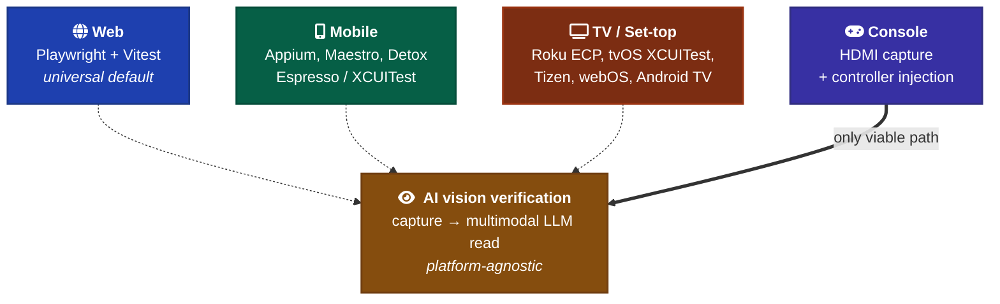
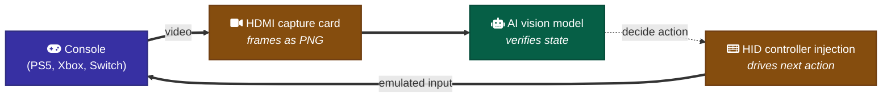

# Cross-Platform Testing

Automated UI testing across web, mobile, TV, and console. Where the universal defaults (Playwright + Vitest) stop being enough, what fills the gap per platform.

The framework's universal defaults assume web. This convention is for projects that target additional platforms — React Native, Capacitor, Tauri, Flutter, native Android/iOS, smart TVs, set-top boxes, consoles. Per-project AGENTS.md still overrides; this doc tells AI agents what to *consider* before writing tests on a non-web platform.



The capture mechanism varies wildly by platform. The AI-vision verification step ([`visual-verification.md`](./visual-verification.md)) is identical across all of them once you have a PNG.

---

## Mobile — Android + iOS

| Tool | Type | When to pick |
| --- | --- | --- |
| **[Appium](https://appium.io/)** | WebDriver-based, cross-platform | Cross-platform parity matters. Mature. Same API drives Android (UiAutomator2) + iOS (XCUITest). |
| **[Maestro](https://maestro.mobile.dev/)** | YAML flows, mobile-only | Rapid setup. Most readable for AI to author and modify. Newer (2022+); less mature than Appium. |
| **[Detox](https://wix.github.io/Detox/)** | Gray-box, React Native | RN apps. Instruments the app rather than driving externally. Fast, deterministic, but RN-only. |
| **[Espresso](https://developer.android.com/training/testing/espresso)** | Android-native | Maximum Android fidelity. No cross-platform code reuse. |
| **[XCUITest](https://developer.apple.com/documentation/xctest)** | iOS-native | Maximum iOS fidelity. No cross-platform code reuse. |
| **[BrowserStack App Live](https://www.browserstack.com/app-live) / [Sauce Labs](https://saucelabs.com/) / [LambdaTest](https://www.lambdatest.com/)** | Hosted device farms | Real devices, pay-as-you-go. Wraps the above. |

**Screenshot-only path** (no test framework needed):

```bash
# iOS Simulator
xcrun simctl io booted screenshot ios-foo.png

# Android Emulator / device via ADB
adb exec-out screencap -p > android-foo.png
```

These work without Appium / Maestro / Detox. For AI-vision verification of a one-off mobile state, this is the lowest-friction path.

**Decision rule for AI agents:** pick **Maestro** for new mobile projects where flows are simple and need to be AI-readable. Pick **Appium** when the test suite already exists or cross-platform code reuse with web E2E matters. Pick **Espresso/XCUITest** only when platform-native test APIs are required (e.g., interacting with system permissions dialogs).

---

## TV / Set-top — the platform-fragmented middle

### Android TV / Google TV / Fire TV

Same stack as Android phones — **Appium**, **Espresso**, **UiAutomator2**. D-pad navigation instead of touch, but the test APIs handle that. Fire TV is Android-based, so all Android tooling works.

### Roku

- **[Roku Automated Channel Testing (RACT)](https://developer.roku.com/docs/developer-program/dev-tools/automated-channel-testing/automated-channel-testing-overview.md)** — Roku's open-source BrightScript-based framework.
- **[ECP (External Control Protocol)](https://developer.roku.com/docs/developer-program/dev-tools/external-control-api.md)** — HTTP endpoints on the Roku device. Screenshot via `POST /query/screenshot`. Remote keypresses via `POST /keypress/<key>`.
- Commercial: Suitest, Headspin.

### tvOS / Apple TV

- **XCUITest** works for tvOS apps. Same Apple stack as iOS but with focus-engine navigation (no touch).
- Limited third-party tooling. Apple's own test infrastructure is the path.

### Tizen (Samsung Smart TV)

- **[Tizen Studio](https://developer.tizen.org/development/tizen-studio/download)** has an emulator with remote-debugging bridge.
- Commercial coverage: Suitest, Headspin, Eggplant.
- Open-source options are sparse.

### webOS (LG)

- **[LG webOS CLI tools](https://webostv.developer.lge.com/develop/getting-started/preparing-lg-webos-cli)** — `ares-launch`, `ares-install`, `ares-inspect`.
- Mostly manual or commercial automation (Suitest, Eggplant).

### The TV automation aggregators

- **[Suitest](https://suite.st/)** — multi-platform TV testing (Roku, Tizen, webOS, Xbox, PlayStation, Vizio, Hisense, etc.). Commercial.
- **[Headspin](https://www.headspin.io/)** — real-device-as-a-service for TV + mobile.
- **[Eggplant (Keysight)](https://www.keysight.com/us/en/products/software/digital-experience-monitoring-software/eggplant-test.html)** — vision-based automation that's TV-friendly; uses image recognition rather than DOM/accessibility-tree access. Pairs naturally with AI-vision verification.

---

## Console — HDMI capture + AI vision

Consoles are locked down. PlayStation, Xbox, Nintendo Switch have no public OS access. Automated testing requires devkits and NDA'd SDK tooling.

**The universal fallback for locked platforms: HDMI capture + vision.** Capture the video output via a capture card, drive input via emulated controller (USB HID injection or Bluetooth). This is the pattern Eggplant uses commercially. It is also the only viable path for an AI agent doing visual verification on a console without devkit access.

**Hardware:** Elgato, Magewell, AVerMedia capture cards. Programmable HID controller emulators (Titan One, MakeyMakey-style hardware).

**Pattern:**



This is heavy infrastructure. Only justified for game-studio or platform-specific certification work.

---

## The unifying pattern

The capture mechanism varies wildly by platform. The verification step doesn't.

| Layer | Web | Mobile | TV | Console |
| --- | --- | --- | --- | --- |
| Drive | Playwright | Appium / Maestro | Platform CLI / ECP | HID injection |
| Capture | `page.screenshot()` | `adb screencap` / `xcrun simctl` / framework | Platform screenshot API / capture card | HDMI capture card |
| Read | **AI multimodal Read** | **AI multimodal Read** | **AI multimodal Read** | **AI multimodal Read** |
| Decide | Same | Same | Same | Same |

This is why the AI-vision verification step ([`visual-verification.md`](./visual-verification.md)) is platform-agnostic. Once the PNG exists, the workflow is identical.

For platforms where DOM / accessibility-tree access is restricted (consoles, locked TVs), vision-based verification isn't just convenient — it's the only feasible approach. This strengthens the case for treating AI-vision as a first-class testing primitive in any cross-platform project.

---

## Recommended stack by platform tier

**Tier 1 — full automation feasible:**

| Platform | Capture | Tool |
| --- | --- | --- |
| Web | Playwright | Playwright Test |
| Android (phone + Android TV + Fire TV) | Appium / Maestro / Espresso | Appium for cross-platform, Maestro for AI readability |
| iOS | XCUITest / Appium | Native if iOS-only |
| React Native | Detox | RN-specific |

**Tier 2 — automation feasible but fragmented:**

| Platform | Capture | Tool |
| --- | --- | --- |
| Roku | ECP `/query/screenshot` | RACT or Suitest |
| tvOS | XCUITest | Native |
| Tizen | Tizen Studio emulator | Suitest / Headspin |
| webOS | webOS CLI | Commercial vendor |

**Tier 3 — vision-based only:**

| Platform | Capture | Verification |
| --- | --- | --- |
| PlayStation / Xbox / Switch | HDMI capture card | AI vision + HID injection (or Eggplant) |
| Smart TVs without dev-mode | HDMI capture card | AI vision + IR/Bluetooth remote injection |

---

## When to skip

- **Web-only projects.** This doc doesn't apply. Use Playwright; see [`testing.md`](./testing.md).
- **Prototypes / internal tools.** Manual testing is fine until you have real users.
- **Single-platform mobile (e.g., iOS-only iOS app).** Skip the cross-platform comparison; use XCUITest directly.
- **You don't have devkit access for a console target.** HDMI capture + AI vision is the only path. Don't write test plans you can't execute.

---

## What this doesn't cover

- **Game engine testing** (Unity, Unreal, Godot). Each has its own test framework. The general AI-vision pattern still applies for visual states.
- **Embedded / IoT / kiosk.** Same logic as console — capture is platform-specific, verification is universal.
- **Voice / audio interfaces.** Not covered here. Voice testing has its own tooling (Bespoken, Dexa).
- **AR / VR.** Apple Vision OS, Meta Quest. Highly specialized; not covered.

---

## Notes for this framework

- **The framework's universal default of "Playwright for E2E" assumes web.** Per-project `AGENTS.md` must override when targeting mobile / TV / console.
- **The AI-vision verification step is the through-line.** [`visual-verification.md`](./visual-verification.md) defines that step; this doc enumerates capture mechanisms feeding into it.
- **For a cross-platform project, the project's `AGENTS.md` should declare which Tiers it operates at.** Tier 1 only? Tier 1 + 2? All three? The declaration shapes which test tooling the agent reaches for first.
- **Don't speculatively configure tools for platforms you don't currently ship to.** A web-only project adding "just in case" Appium config bloats the repo and the agent's mental model. Add per-platform tooling when a platform target ships.

---

## References

### Mobile
- [Appium docs](https://appium.io/docs/en/latest/)
- [Maestro docs](https://maestro.mobile.dev/getting-started/installing-maestro)
- [Detox docs](https://wix.github.io/Detox/docs/introduction/getting-started)
- [Espresso (Android)](https://developer.android.com/training/testing/espresso)
- [XCUITest (Apple)](https://developer.apple.com/documentation/xctest)

### TV / Set-top
- [Roku Automated Channel Testing](https://developer.roku.com/docs/developer-program/dev-tools/automated-channel-testing/automated-channel-testing-overview.md)
- [Roku ECP](https://developer.roku.com/docs/developer-program/dev-tools/external-control-api.md)
- [Tizen Studio](https://developer.tizen.org/development/tizen-studio/download)
- [webOS TV Developer Resources](https://webostv.developer.lge.com/develop/getting-started/preparing-lg-webos-cli)
- [Suitest](https://suite.st/)
- [Headspin](https://www.headspin.io/)
- [Eggplant (Keysight)](https://www.keysight.com/us/en/products/software/digital-experience-monitoring-software/eggplant-test.html)

### Hosted device farms
- [BrowserStack App Live](https://www.browserstack.com/app-live)
- [Sauce Labs](https://saucelabs.com/)
- [LambdaTest](https://www.lambdatest.com/)
