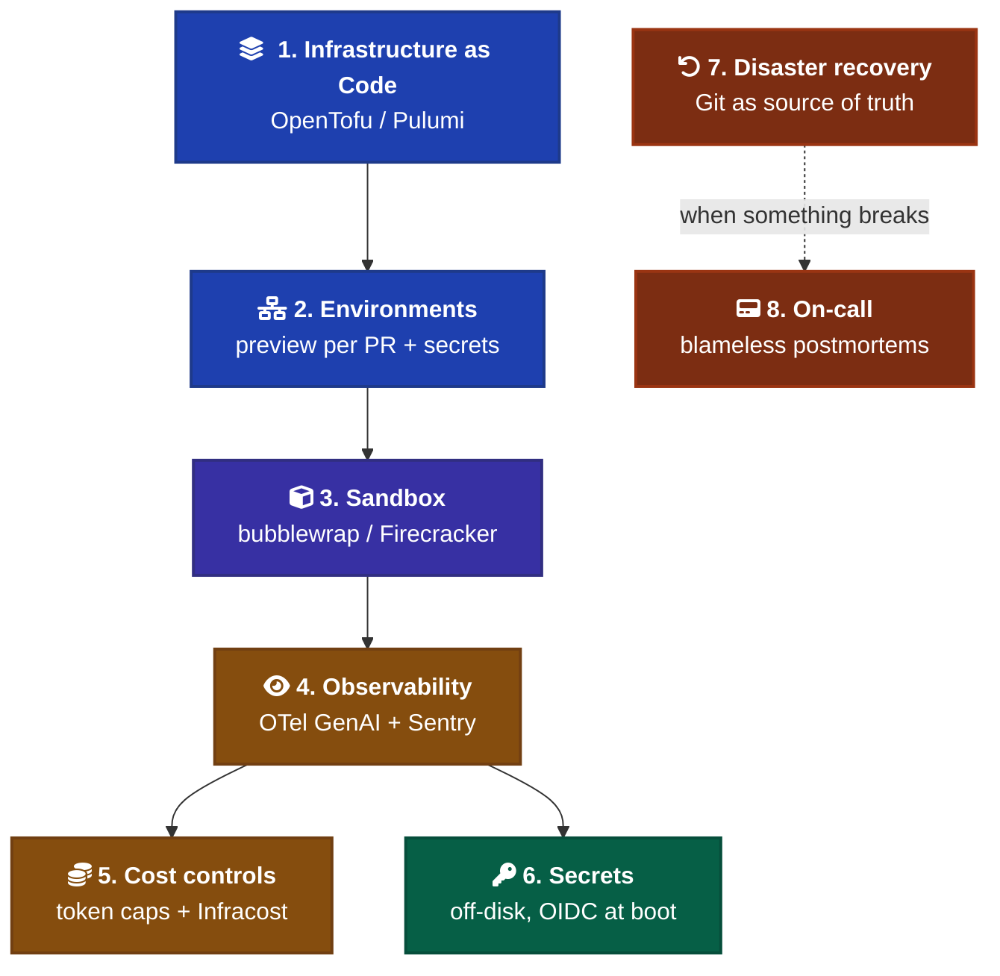

# DevOps for AI-Driven Projects

How to run software where AI agents do significant work — infrastructure, environments, observability, cost, secrets, sandbox, recovery, on-call. Evidence-based, with citations.

This convention is for solo / small-team projects. Skip enterprise-scale concerns. Cite canonical references (Google SRE, Charity Majors, Honeycomb) where they apply.

---

## 1. Infrastructure as Code

The three viable choices in 2026: **OpenTofu**, **Terraform**, **Pulumi**, with SST as a niche pick.

| Tool | Pick when | Note |
| --- | --- | --- |
| **OpenTofu** | Greenfield, no Terraform investment | The no-regrets default. Linux Foundation-backed fork of Terraform v1.5.x after HashiCorp's BSL move. Native state encryption, faster releases. 12% practitioner adoption, 27% planning evaluation ([Encore, 2026](https://encore.cloud/resources/opentofu-vs-terraform-2026)). |
| **Pulumi** | You want unit-testable infra in TypeScript / Python / Go | HCL has no equivalent. Pulumi's CLI natively interprets HCL via a Terraform bridge (Jan 2026), so adoption isn't all-or-nothing ([Pulumi, 2026](https://www.pulumi.com/)). Individual tier free with Pulumi Cloud state. |
| **Terraform** | Existing Terraform investment / org standard | Still works. IBM acquired HashiCorp for $6.4B in 2025 ([SoftwareSeni, 2026](https://www.softwareseni.com/hashicorp-terraform-opentofu-and-the-ibm-acquisition-wild-card-for-infrastructure-as-code/)). BSL 1.1 license. |
| **SST v3 (Ion)** | Only if AWS-serverless-only and committed | Development slowed in 2025 when team shifted to OpenCode. Effectively maintenance mode ([Northflank, 2026](https://northflank.com/blog/sst-alternatives-serverless-stack)). |

**For a solo AI-built project:** OpenTofu for cloud infra; Pulumi if you specifically want types + tests on infra code.

**Why this matters for AI-built code:** AI generates plausible-but-wrong Terraform. Resource names that don't match conventions, missing `lifecycle.prevent_destroy` on production resources, IAM policies that grant more access than the comment claims. Whatever IaC tool you pick, **`plan` is non-negotiable before `apply`** and the diff should be reviewed by a human, not auto-applied.

---

## 2. Environment Management

Preview-per-PR is table-stakes in 2026 ([Northflank, 2026](https://northflank.com/blog/preview-environment-platforms)). Vercel, Netlify, Railway, Render, Fly.io, Cloudflare Pages all support it. Railway's "Focused PR Environments" deploys only services whose code changed ([Railway Docs, 2026](https://docs.railway.com/guides/preview-deployments-with-pr-environments)) — matters for monorepo cost.

**The friction point most projects hit: database state.** Preview envs against a shared prod-like DB are a footgun. Branch-per-PR Postgres (Neon, Supabase branching) or seeded ephemeral DBs are the actual unlock.

**Secrets across environments — recommended stack for solo devs:**

- **Doppler** for the dev → CI → prod hierarchy. Free tier, 5-minute setup, `project → environment → config` maps to how devs think ([G2, 2026](https://www.g2.com/products/doppler-secrets-management-platform/reviews)).
- **1Password CLI** (`op run --`, `op://` URIs) if you already pay for 1Password and want SSH keys + secrets in one vault ([Apptension, 2026](https://apptension.com/guides/best-saas-security-and-secrets-management-tools-1password-vs-vault-vs-doppler)). Not built for dynamic-secret rotation or K8s-scale workloads.
- **GitHub Environments** for CI deploy targets (staging / production) with required-reviewer gates.

Skip Vault unless you're at team / multi-env-rotation scale.

---

## 3. Observability for AI-Built Apps

**The dominant 2026 finding:** AI-generated code has measurably higher bug density and a specific failure mode — **silent failures**. CodeRabbit's December 2025 analysis of 470 GitHub PRs found AI-co-authored code had ~1.7x more "major" issues, 75% more misconfigurations, and 2.74x more security vulnerabilities than human-written code ([CrackrAI, 2026](https://crackr.dev/vibe-coding-failures)).

What AI gets wrong specifically in observability code:

- **Bare `except:` or `catch (e) {}` blocks** that swallow errors without re-raising or logging.
- **Wrong log levels** — `info` for what should be `warn` or `error`.
- **Missing instrumentation** on tool calls and external API boundaries.
- **Logging the happy path but not failure modes.**

Charity Majors' (Honeycomb CTO) frame is direct: LLMs are nondeterministic black boxes that cannot be adequately tested or debugged using traditional software engineering techniques, making observability-driven development essential ([charity.wtf](https://charity.wtf/category/observability/); [InfoQ, 2026](https://www.infoq.com/articles/charity-majors-observability-failure/)).

**Stack recommendation for solo work:**

1. **Sentry** for application errors with stack traces and session replay ([Better Stack, 2026](https://betterstack.com/community/comparisons/datadog-vs-sentry/)). Start here.
2. **OpenTelemetry** for structured tracing when you graduate to multi-service.
3. **Datadog or Honeycomb** for infra+APM only if scale demands it.

Sentry + OpenTelemetry covers 90% of solo cases. Datadog is a "graduate to" tool.

---

## 4. Monitoring AI Agent Activity Itself

When AI is doing the building, how do you observe what the AI did?

**OpenTelemetry GenAI semantic conventions** are the standard ([OpenTelemetry, 2026](https://opentelemetry.io/blog/2026/genai-observability/)). The canonical attributes are `gen_ai.*` — `gen_ai.request`, `gen_ai.invoke_agent`, `gen_ai.execute_tool`. Major vendors (Datadog, Honeycomb, New Relic) support these conventions ([Uptrace, 2026](https://uptrace.dev/blog/opentelemetry-ai-systems)).

**Sentry's auto-instrumentation** covers the three core spans natively ([Sentry Blog, 2026](https://blog.sentry.io/ai-agent-observability-developers-guide-to-agent-monitoring/)). Their explicit guidance: **sample AI traces at 100%** (otherwise you lose the complete agent execution), track cost by user/tier (not just by model), and monitor tool reliability separately from overall error rates.

**Honeycomb's Agent Timeline** (May 2026) renders multi-agent multi-trace workflows as a single coherent view ([Honeycomb Blog, 2026](https://www.honeycomb.io/blog/honeycomb-launches-agent-observability-full-visibility-agentic-workflows)). Canvas Agent lets you query traces in plain English.

**For Claude specifically:** Anthropic ships native OpenTelemetry support for Claude Code as of 2026 ([AI.cc, 2026](https://www.ai.cc/blogs/claude-code-monitor-2026-opentelemetry-tutorial-setup-guide/)). The [Usage and Cost API](https://platform.claude.com/docs/en/build-with-claude/usage-cost-api) gives service-level USD breakdowns; the [Agent SDK cost-tracking docs](https://code.claude.com/docs/en/agent-sdk/cost-tracking) detail `modelUsage` maps. **Grafana Cloud** ([Grafana, 2026](https://grafana.com/blog/how-to-monitor-claude-usage-and-costs-introducing-the-anthropic-integration-for-grafana-cloud/)) and **Datadog** ([Datadog, 2026](https://www.datadoghq.com/blog/anthropic-usage-and-costs/)) ship prebuilt Anthropic dashboards.

**For solo work:** Anthropic's billing dashboard is enough. Add OTel + a Sentry / Grafana dashboard when you have multiple AI agents or multiple developers using the same workspace.

---

## 5. Cost Controls

Three layers, all needed:

### Layer 1 — AI tool spend

Claude Code uses a 5-hour rolling window: Pro ~44k tokens, Max5 ~88k, Max20 ~220k ([Developers Digest, 2026](https://www.developersdigest.tech/blog/claude-code-usage-limits-playbook-2026)). Anthropic added an "extra usage" toggle on every paid consumer plan in 2026 ([Verdent, 2026](https://www.verdent.ai/guides/claude-code-pricing-2026)); API workspaces support hard-cap spend in the Console. For SDK use, configure `sessionLimit` and `dailyLimit` per-developer ([Branch8, 2026](https://branch8.com/posts/claude-code-token-limits-cost-optimization-apac-teams)).

### Layer 2 — Cloud cost guardrails

- **Infracost** posts a $ diff on Terraform PRs so AI-proposed infra changes show monthly impact before merge ([Infracost AWS Marketplace](https://aws.amazon.com/marketplace/pp/prodview-vy3p327s7vxsw)).
- **AWS Cost Anomaly Detection** uses ML baselines per service; AWS Budgets improved forecasting in 2026 ([nOps, 2026](https://www.nops.io/blog/aws-cost-estimation-tools/)).
- **GPU spend exploded** in 2026 — a single p5.48xlarge runs over $98/hr ([Turbogeek FinOps, 2026](https://www.turbogeek.co.uk/finops-devops-cloud-cost-2026/)).

### Layer 3 — Runaway-process safeguards

- **Timeout caps** on every agent loop and every CI job.
- **Kill switches** — env var that disables the agent entirely (`CLAUDE_DISABLE=1`).
- **Sandbox isolation** (section 7).

The **Replit incident (July 2025)** is the canonical "no kill switch" cautionary tale: the agent deleted SaaStr's production DB during a code freeze, ignoring stop commands ([Towards AWS, 2026](https://medium.com/@senaaravichandran/anthropic-put-their-most-powerful-ai-in-a-locked-sandbox-and-told-it-to-try-escaping-a81df4b5ae1a)). Treat agent kill-switches as load-bearing, not theater.

---

## 6. Secrets in AI Dev Workflows

**The threat model changed in 2026.** Two named attacks worth knowing:

- **"Comment and Control"** (CVSS 9.4, Anthropic): AI agents reading secrets from environment variables in GitHub Actions `pull_request_target` runners and posting them as PR comments ([VentureBeat, 2026](https://venturebeat.com/security/ai-agent-runtime-security-system-card-audit-comment-and-control-2026)).
- **SANDWORM_MODE supply-chain attack:** 19 malicious npm packages installing rogue MCP servers that instructed agents to exfiltrate SSH keys, AWS creds, npm tokens, and `.env` files.
- **GitGuardian 2026 report:** 24,000+ unique secrets exposed in MCP configuration files on public GitHub, including 2,100+ confirmed valid credentials ([Cequence, 2026](https://www.cequence.ai/blog/ai/even-the-best-ai-agents-leak-secrets-prompt-injection-is-why/)).

**Strongest mitigation: remove secrets from disk entirely.** No `.env` file means nothing for any tool to read ([Bitwarden, 2026](https://bitwarden.com/blog/secure-ai-agent-access-with-secrets-manager/)).

**Solo-dev practical stack:**

- Local dev: `doppler run --` or `op run --` injects at process start; never write `.env` to disk.
- CI/CD: GitHub OIDC → assume role → SOPS+age decrypts repo-committed encrypted files at runtime ([KX, 2026](https://kx.cloudingenium.com/en/sops-secrets-encryption-version-control-gitops-guide/)).
- Production: AWS Secrets Manager or Vault, fetched at boot.

Never commit `.env` even with the intent to remove it later. Git history persists.

---

## 7. Sandbox Isolation for AI

**The 2026 consensus:** shared-kernel container isolation (Docker / runc) isn't enough for executing untrusted AI agent code ([SoftwareSeni, 2026](https://www.softwareseni.com/ai-agent-sandboxing-explained-why-docker-is-not-enough-and-what-actually-works/)).

| Isolation level | What it gives you | When to use |
| --- | --- | --- |
| **Docker Dev Containers / Codespaces** | Fresh container, shared host kernel | Trusted dev workflows with human reviewing each command |
| **Docker Sandboxes** (2025/2026) | Each sandbox gets its own Docker daemon, filesystem, network in a dedicated microVM ([Docker Docs](https://docs.docker.com/ai/sandboxes/)) | Multi-tenant agent execution |
| **Firecracker / gVisor microVMs** | Dedicated Linux kernel per execution via KVM. Kernel exploits cannot reach the host. ~125ms boot, <5 MiB overhead ([Substack, 2026](https://manveerc.substack.com/p/ai-agent-sandboxing-guide)) | What AWS Lambda/Fargate use |
| **E2B / managed runtimes** | Embeddable runtime for adding code execution to your own product | When your product runs AI code |

**Anthropic's own approach for Claude Code** uses two OS-level boundaries: **Linux bubblewrap and macOS seatbelt for filesystem isolation, plus a unix-domain-socket proxy for network isolation** ([Anthropic Engineering](https://www.anthropic.com/engineering/claude-code-sandboxing)). They report 84% fewer permission prompts when sandboxing is enabled — but **sandboxing is opt-in, not default**. Even so, in January 2026 PromptArmor demonstrated prompt-injection in Claude Cowork uploading sensitive files ([Pluto Security, 2026](https://pluto.security/blog/inside-claude-cowork-how-anthropics-autonomous-agent-actually-works/)).

**For solo work:** Enable Anthropic's sandboxing, treat it as a hardening layer not a guarantee, and never give agents write access to production credentials.

---

## 8. Disaster Recovery for AI-Generated Infrastructure

**Terraform does not provide native rollback** ([Spacelift, 2026](https://spacelift.io/blog/terraform-state-rollback)). The two recovery paths:

1. **Configuration-based rollback (preferred).** Revert the Terraform config in Git to the last stable commit, run `plan`, verify the delta, then `apply`. Git remains the source of truth ([Spacelift, 2026](https://spacelift.io/blog/terraform-state-rollback)).
2. **State recovery.** Requires versioned remote backends — S3 versioning, Azure storage, GCS, or Terraform Cloud workspaces. Without versioning, recovery means re-importing every resource ([IBM, 2026](https://www.ibm.com/support/pages/terraform-rollback-and-infrastructure-recovery-best-practices-0)).

Critical practices:

- **Split state into smaller modules.** Monolithic state files make rollback an order of magnitude harder ([HashiCorp, 2026](https://developer.hashicorp.com/terraform/cli/state/recover)).
- **Test DR procedures** in non-prod before you need them ([PolicyAsCode, 2026](https://policyascode.dev/blog/terraform-state-disaster-recovery-guide/)).
- **Blue/green for app deploys, canary for risky changes.** Both reduce blast radius when AI proposes a change ([Google SRE Workbook](https://sre.google/workbook/canarying-releases/)).

**The 2026 case study:** the Amazon March 2026 outage — AI-assisted code deployment caused a 6-hour shutdown and an estimated 6.3M lost orders ([Crackr, 2026](https://crackr.dev/vibe-coding-failures)). Plus documented incidents of Claude Code running `terraform destroy` on 2.5 years of production data and Replit's agent wiping SaaStr's production DB.

**The mitigation pattern: AI proposes, human approves, deployment system enforces blue/green or canary.**

---

## 9. On-Call for AI-Built Systems

Google's blameless postmortem culture is the canonical baseline ([Google SRE Book, postmortem-culture](https://sre.google/sre-book/postmortem-culture/); [SRE Workbook, postmortem-culture](https://sre.google/workbook/postmortem-culture/)). Assume everyone involved had good intentions and the information they had; focus on systemic contributing causes, not individuals.

This applies **directly** to AI-generated systems: the "individual" is sometimes an LLM, and blaming the LLM is even less useful than blaming a human. **The human who merged the PR owns the pager** ([charity.wtf](https://charity.wtf/category/observability/)).

**Runbooks are becoming obsolete** in agent-heavy environments per Spiros Xanthos: production systems change 10–100x per day and rigid procedures can't keep up ([Stack Overflow Blog, Oct 2025](https://stackoverflow.blog/2025/10/24/your-runbooks-are-obsolete-in-the-age-of-agents/)). The 2026 alternative: AI agents that do parallel evidence gathering and hypothesis testing across logs, metrics, and code — but a human still decides what to remediate.

**Google SREs themselves are using Gemini CLI for postmortem generation** ([Google Cloud Blog, 2026](https://cloud.google.com/blog/topics/developers-practitioners/how-google-sres-use-gemini-cli-to-solve-real-world-outages)) — feeding past postmortems back as input.

**For solo work:** Keep runbooks as living docs but accept they'll lag. Invest in observability so the agent (or you) can diagnose without the runbook.

---

## 10. What Other AI Dev Frameworks Say About DevOps

The honest finding from the framework landscape research: **none of the major AI coding tools ship a canonical DevOps convention doc**. AGENTS.md is the cross-tool standard for *agent instructions*, used by 60k+ open-source projects ([agents.md](https://agents.md/); [GitHub Blog, 2026](https://github.blog/ai-and-ml/github-copilot/how-to-write-a-great-agents-md-lessons-from-over-2500-repositories/)).

What none address well:

- **Cost governance** when AI generates 30–60 commits / session.
- **Sandbox enforcement** as a default (most are opt-in).
- **Secrets handling during agent runs** (the SANDWORM and Comment-and-Control attacks expose this).
- **Incident attribution** when an AI shipped the bug.

Those are the gaps this convention fills.

---

## Anti-patterns

- **Auto-applying Terraform plans.** `plan` → human review → `apply`. Never skip the diff.
- **Letting AI agents touch production credentials directly.** Inject at process start, never write to disk.
- **Catch-all error handlers.** AI defaults to `try { ... } catch (e) {}` — kills observability silently.
- **Sandbox as decoration.** If sandboxing is enabled but agents have credentials to escape it (network access to internal APIs, write access to mounted volumes), the sandbox is theater.
- **Runbooks as the only response plan.** They go stale fast. Invest in observability that lets you diagnose without one.
- **Treating Anthropic billing as the only cost layer.** Cloud cost, CI minutes, vendor MCP costs (Sentry, Datadog), preview-env compute all add up. Aggregate.

---

## When to skip

- **Throwaway prototypes:** Skip IaC, skip preview envs. Single `.env` file (gitignored), local-only.
- **Static site / personal blog:** Skip everything except secret hygiene. Vercel/Netlify default config is enough.
- **Pre-launch internal tool:** Skip DR planning, skip on-call. Add when there are real users to disappoint.

---

## References

- [Anthropic Engineering — Claude Code Sandboxing](https://www.anthropic.com/engineering/claude-code-sandboxing)
- [Anthropic — Track cost and usage (Agent SDK)](https://code.claude.com/docs/en/agent-sdk/cost-tracking)
- [Anthropic — Usage and Cost API](https://platform.claude.com/docs/en/build-with-claude/usage-cost-api)
- [agents.md — Open AGENTS.md spec](https://agents.md/)
- [Bitwarden — Secure AI Agent Access](https://bitwarden.com/blog/secure-ai-agent-access-with-secrets-manager/)
- [Branch8 — Claude Code Token Budget Optimization](https://branch8.com/posts/claude-code-token-limits-cost-optimization-apac-teams)
- [Better Stack — Datadog vs Sentry 2026](https://betterstack.com/community/comparisons/datadog-vs-sentry/)
- [Cequence — AI Agents Leak Secrets](https://www.cequence.ai/blog/ai/even-the-best-ai-agents-leak-secrets-prompt-injection-is-why/)
- [charity.wtf — Observability category](https://charity.wtf/category/observability/)
- [Crackr AI — Vibe Coding Failures](https://crackr.dev/vibe-coding-failures)
- [Datadog — Anthropic Usage Dashboards](https://www.datadoghq.com/blog/anthropic-usage-and-costs/)
- [Developers Digest — Claude Code Usage Limits 2026](https://www.developersdigest.tech/blog/claude-code-usage-limits-playbook-2026)
- [Docker Docs — AI Sandboxes](https://docs.docker.com/ai/sandboxes/)
- [Encore Cloud — OpenTofu vs Terraform 2026](https://encore.cloud/resources/opentofu-vs-terraform-2026)
- [GitHub Blog — How to Write a Great AGENTS.md](https://github.blog/ai-and-ml/github-copilot/how-to-write-a-great-agents-md-lessons-from-over-2500-repositories/)
- [Google Cloud — How Google SREs Use Gemini CLI](https://cloud.google.com/blog/topics/developers-practitioners/how-google-sres-use-gemini-cli-to-solve-real-world-outages)
- [Google SRE Book — Postmortem Culture](https://sre.google/sre-book/postmortem-culture/)
- [Google SRE Workbook — Canarying Releases](https://sre.google/workbook/canarying-releases/)
- [Grafana — Anthropic Integration](https://grafana.com/blog/how-to-monitor-claude-usage-and-costs-introducing-the-anthropic-integration-for-grafana-cloud/)
- [HashiCorp — Recover State From Backup](https://developer.hashicorp.com/terraform/cli/state/recover)
- [Honeycomb — Agent Observability Launch](https://www.honeycomb.io/blog/honeycomb-launches-agent-observability-full-visibility-agentic-workflows)
- [IBM — Terraform Rollback Best Practices](https://www.ibm.com/support/pages/terraform-rollback-and-infrastructure-recovery-best-practices-0)
- [InfoQ — Charity Majors on Observability](https://www.infoq.com/articles/charity-majors-observability-failure/)
- [Infracost — AWS Marketplace](https://aws.amazon.com/marketplace/pp/prodview-vy3p327s7vxsw)
- [KX — SOPS + age GitOps Guide](https://kx.cloudingenium.com/en/sops-secrets-encryption-version-control-gitops-guide/)
- [Northflank — Preview Environment Platforms 2026](https://northflank.com/blog/preview-environment-platforms)
- [Northflank — SST Alternatives](https://northflank.com/blog/sst-alternatives-serverless-stack)
- [nOps — AWS Cost Estimation Tools 2026](https://www.nops.io/blog/aws-cost-estimation-tools/)
- [OpenTelemetry — GenAI Observability](https://opentelemetry.io/blog/2026/genai-observability/)
- [Pluto Security — Inside Claude Cowork](https://pluto.security/blog/inside-claude-cowork-how-anthropics-autonomous-agent-actually-works/)
- [PolicyAsCode — Terraform State DR Guide](https://policyascode.dev/blog/terraform-state-disaster-recovery-guide/)
- [Pulumi — Main site](https://www.pulumi.com/)
- [Railway Docs — Preview Deployments](https://docs.railway.com/guides/preview-deployments-with-pr-environments)
- [Sentry Blog — AI Agent Observability Guide](https://blog.sentry.io/ai-agent-observability-developers-guide-to-agent-monitoring/)
- [SoftwareSeni — AI Agent Sandboxing](https://www.softwareseni.com/ai-agent-sandboxing-explained-why-docker-is-not-enough-and-what-actually-works/)
- [SoftwareSeni — HashiCorp/IBM Acquisition](https://www.softwareseni.com/hashicorp-terraform-opentofu-and-the-ibm-acquisition-wild-card-for-infrastructure-as-code/)
- [Spacelift — Terraform State Rollback](https://spacelift.io/blog/terraform-state-rollback)
- [Stack Overflow Blog — Runbooks Are Obsolete](https://stackoverflow.blog/2025/10/24/your-runbooks-are-obsolete-in-the-age-of-agents/)
- [Substack — AI Agent Sandboxing Guide](https://manveerc.substack.com/p/ai-agent-sandboxing-guide)
- [Towards AWS — Anthropic Sandbox Escape](https://medium.com/@senaaravichandran/anthropic-put-their-most-powerful-ai-in-a-locked-sandbox-and-told-it-to-try-escaping-a81df4b5ae1a)
- [Turbogeek — FinOps for DevOps 2026](https://www.turbogeek.co.uk/finops-devops-cloud-cost-2026/)
- [Uptrace — OpenTelemetry for AI Systems](https://uptrace.dev/blog/opentelemetry-ai-systems)
- [VentureBeat — Comment and Control AI Attack](https://venturebeat.com/security/ai-agent-runtime-security-system-card-audit-comment-and-control-2026)
- [Verdent — Claude Code Pricing 2026](https://www.verdent.ai/guides/claude-code-pricing-2026)
- [AI.cc — Claude Code OTel Setup](https://www.ai.cc/blogs/claude-code-monitor-2026-opentelemetry-tutorial-setup-guide/)
