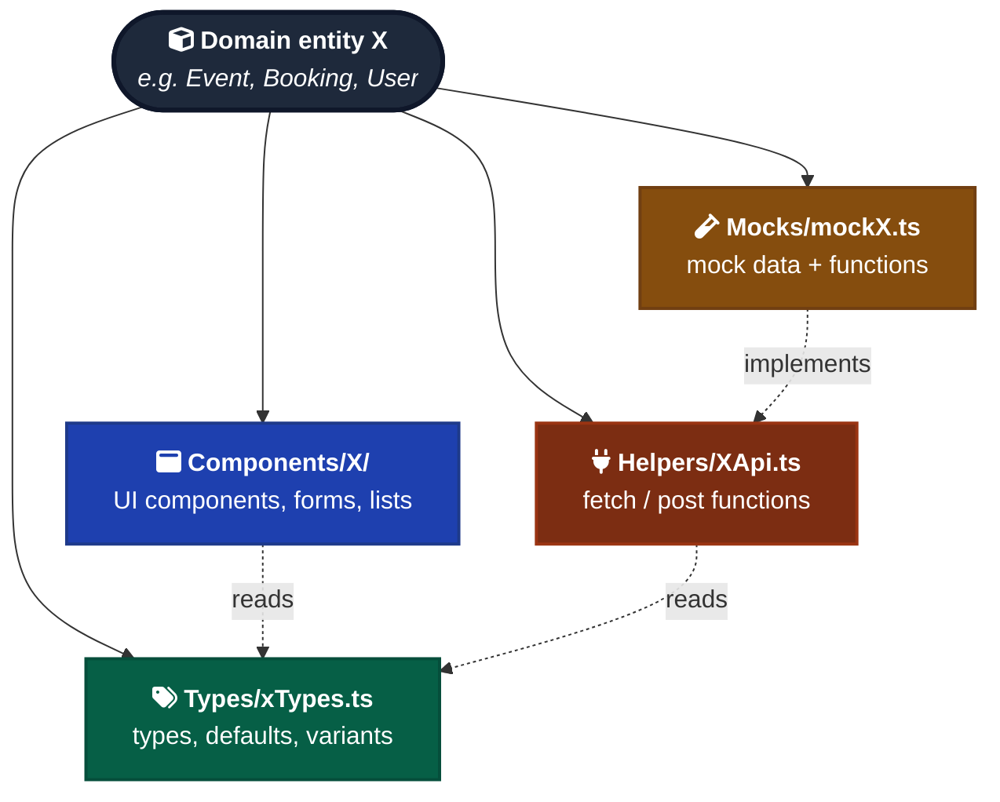

# Domain Quartet

When a project has multiple domain entities (Event, Venue, User, etc.), give each one matching files across infrastructure layers — components, API helpers, mocks, types.

---

## The pattern

For each domain `X`, a project has:

```text
Components/X/        # UI: feature components, forms, lists, detail views
Helpers/XApi.ts      # API: fetch / post functions for the entity
Mocks/mockX.ts       # Mock data + mock API functions
Types/xTypes.ts      # Type definitions, default values, variants
```



Adding a new domain entity is a four-file checklist. Removing one means deleting the matching set.

Cross-cutting infrastructure (UI atoms in `Components/UI/`, layouts, contexts, routes) does *not* get a quartet — only domain entities.

---

## Why

- **Predictable.** "Where does X live?" has a four-line answer instead of a tour.
- **Symmetric.** Adding or removing a domain is one concept across the codebase, not five locations to remember.
- **AI-navigable.** "Look at how `Event` is wired" gives an agent four files in known locations rather than a hunt across the tree.
- **Mock/real parity falls out naturally.** With `Mocks/mockX.ts` always paired with `Helpers/XApi.ts` of the same shape, swapping one for the other is one-for-one. See `conventions/mock-api.md` if you adopt that pattern.

---

## Example

For an `Event` domain entity:

```text
Components/Event/
  EventCard.tsx
  EventDetail.tsx
  EventForms/
    SelectEventType.tsx
    EventInfo.tsx
    Confirm.tsx
Helpers/EventApi.ts          # getEvent, listEvents, createEvent, ...
Mocks/mockEvents.ts          # mockEvents array + MockAPI.Events.* fns
Types/eventTypes.ts          # Event, EventWithPopulated, defaultEvent
```

A new `Booking` domain mirrors the structure exactly: `Components/Booking/`, `Helpers/BookingApi.ts`, `Mocks/mockBookings.ts`, `Types/bookingTypes.ts`.

---

## When to skip

- **Single-domain apps.** If everything is one entity, the quartet is theater.
- **Throwaway prototypes.** Speed Run Mode skips it.
- **Pre-domain projects.** If the domain entities aren't known yet, don't pre-allocate folders.
- **Tiny domains.** A "Tag" entity that's a single string field doesn't need its own quartet — it can live as a sub-type of whatever domain owns it.

---

## When to extend

If a domain needs more layers (workers, schemas, state slices, route bundles), add them — but apply the new layer to *all* domains, not just one. Asymmetric expansion erodes the predictability that's the entire point of the pattern.

---

## What this is not

- **Not a framework requirement.** It's a file-organization pattern. Stack-agnostic — works in React, Vue, Svelte, even non-frontend code with the right rename.
- **Not a microservice boundary.** This is in-repo, not deploy/runtime separation.
- **Not "all domains are equal."** Domains can vary in size; the quartet just guarantees a minimum surface area for each.
