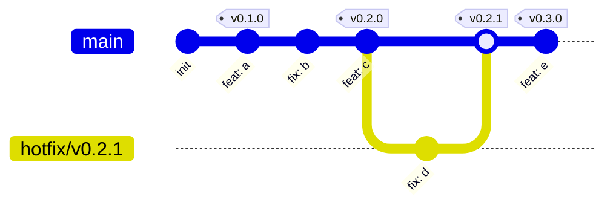
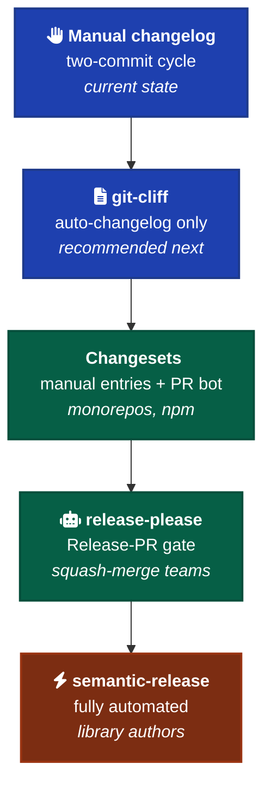

# Releases & Versioning

When to tag a release, how to version, how to roll back, and how to handle AI-authorship attribution. Evidence-based, with primary-source citations.

This convention extends [`changelog.md`](./changelog.md). The framework already uses Conventional Commits and Keep-a-Changelog with the two-commit cycle. This doc covers what comes after that: version numbers, release tools, attribution.



---

## Versioning — Semver vs CalVer vs ZeroVer

**SemVer** ([semver.org](https://semver.org), Tom Preston-Werner). `MAJOR.MINOR.PATCH`. MAJOR = incompatible API change, MINOR = backward-compatible feature, PATCH = backward-compatible fix. Pre-releases: `-alpha`, `-beta`, `-rc.1`. **Critical clause:** "Major version zero (0.y.z) is for initial development. Anything MAY change at any time." Once you tag `1.0.0`, you're contractually obligated to bump MAJOR on every breaking change.

**CalVer** ([calver.org](https://calver.org)). Version *is* the release date — `YY.MM.MICRO` (Ubuntu 24.04), `YYYY.MINOR.MICRO` (PyCharm, Unity). Fits when scope is unbounded, releases are time-driven not feature-driven, "stable API" isn't a meaningful concept (frameworks, OSes, IDEs). Conveys recency, not just precedence.

**ZeroVer** ([0ver.org](https://0ver.org), satirical but pointed). "Your software's major version should never exceed zero." Catalogs how many production-critical libraries (FastAPI, three.js, esbuild, Excalidraw) never leave 0.x. The serious point: SemVer's "0.x means unstable" clause is widely ignored, so the major-version signal is already broken.

**Hynek Schlawack — the iron-on-iron view** ([Schlawack, 2025](https://hynek.me/articles/semver-will-not-save-you/)): "Relying on updates not breaking if the maintainer doesn't intend it, means relying on software being bug-free." SemVer is *intent*, not *guarantee*. His recommendation: pin exact versions, test on update, repeat. Version numbers should be read as ordering, not contract.

**Recommendation for this framework:** SemVer as a communication device, but treat the 0.x → 1.0 jump as social. When other humans / agents start consuming the API, ship 1.0. Before that, ZeroVer (in practice) is honest. The framework itself is currently un-versioned; if/when it earns external consumers, start at 0.1.0.

---

## Conventional Commits

The 1.0.0 spec ([conventionalcommits.org](https://www.conventionalcommits.org/en/v1.0.0/)) is stable; no churn since.

```
<type>[optional scope][!]: <description>

[optional body]

[optional footer(s)]
```

`fix:` → PATCH, `feat:` → MINOR, `!` or `BREAKING CHANGE:` footer → MAJOR. Footers follow git-trailer format (`Token: value`).

**Composes with `Co-Authored-By:`** — a git trailer pre-dating Conventional Commits. Every automated release tool (release-please, semantic-release, knope, git-cliff) keys off these prefixes. Switching from manual changelogs to any of them is a config change, not a rewrite, as long as the commit log is clean.

---

## Release tooling — comparison



| Tool | Philosophy | Best fit |
| --- | --- | --- |
| [**Changesets**](https://github.com/changesets/changesets) (Atlassian) | Manual changeset *files* per change; bot reminds in PRs. Decouples version bump from commit message. | Monorepos, npm packages, projects where authors want editorial control over what becomes a minor |
| [**release-please**](https://github.com/googleapis/release-please) (Google) | Reads Conventional Commits. Opens perpetually-updating "Release PR". Merge → tag + release. | Single-package or monorepo, squash-merge workflow, conventional commits already in use. 20+ ecosystems |
| [**semantic-release**](https://github.com/semantic-release/semantic-release) | Fully automated. CI → analyze commits → version → publish → done. | Library authors, zero-touch publishing, npm provenance. ~2.5M weekly downloads |
| [**git-cliff**](https://github.com/orhun/git-cliff) | Rust binary; only generates the changelog. TOML config. No version logic, no publish | You want a CHANGELOG.md, not a CI pipeline. Language-agnostic |
| [**knope**](https://github.com/knope-dev/knope) | Combines Conventional Commits + changeset files. Imperative workflow | Both auto-detection and changeset escape hatch |
| [**changie**](https://changie.dev/) | File-based entries, language-agnostic Go binary. Decouples changelog from commits | Heterogeneous monorepos |

**Solo-developer reality:** semantic-release publishes on every push containing `feat:`. For a personal framework, this is a foot-gun. release-please's "Release PR" gate is better-shaped — you still control when to release.

**Recommended next step for this framework: git-cliff.** Single binary, no Node/Python runtime dependency, TOML config, no GitHub-Actions lock-in. Generates the changelog *from* commits but doesn't tag, publish, or open PRs — leaves human in control. Composable with the existing two-commit cycle: cliff generates the draft, you edit it, then commit the doc entry referencing the work commit.

Minimal `cliff.toml`:

```toml
[changelog]
header = "# Changelog\n\nAll notable changes to this project.\n"
body = """
\
## [{{ version | trim_start_matches(pat="v") }}] - {{ timestamp | date(format="%Y-%m-%d") }}
\
## [Unreleased]
\

### {{ group | upper_first }}

- {{ commit.message | upper_first }} ([{{ commit.id | truncate(length=7, end="") }}](commit/{{ commit.id }}))


"""
trim = true

[git]
conventional_commits = true
filter_unconventional = true
commit_parsers = [
  { message = "^feat", group = "Added" },
  { message = "^fix", group = "Fixed" },
  { message = "^refactor", group = "Changed" },
  { message = "^perf", group = "Changed" },
  { message = "^docs", skip = true },
  { message = "^chore", skip = true },
  { message = "^test", skip = true },
  { body = ".*BREAKING CHANGE", group = "Changed" },
]
filter_commits = true
tag_pattern = "v[0-9]+.[0-9]+.[0-9]+"
```

Usage: `git cliff --unreleased --prepend CHANGELOG.md` generates the new entry; you edit for tone; you commit the doc as the second commit of the two-commit cycle. No CI, no tag automation, no surprise publishes.

---

## Changelogs — manual vs auto

Surveying canonical repos:

| Project | Approach | Tell |
| --- | --- | --- |
| [React CHANGELOG.md](https://github.com/facebook/react/blob/main/CHANGELOG.md) | Manual | Editorial summaries; narrative sections like "Notable Changes"; inconsistent PR-reference formatting |
| [Vue (vuejs/core)](https://github.com/vuejs/core/blob/main/CHANGELOG.md) | Auto (`conventional-changelog`) | Hundreds of entries, identical structure, every line carries PR + SHA |
| [Tailwind](https://github.com/tailwindlabs/tailwindcss/blob/main/CHANGELOG.md) | Auto-assisted + hand-edited | Keep-a-Changelog format, `Added`/`Changed`/`Fixed`, `Unreleased` at top, PR-linked entries |
| [Next.js releases](https://github.com/vercel/next.js/releases) | Auto with human top-summary | `@next-js-bot` generates; important releases get human-written summary on top |

**The pattern is consistent: auto-generate the manifest, hand-write the highlights.** Keep-a-Changelog [1.1.0 spec](https://keepachangelog.com/en/1.1.0/) leads with: "Changelogs are *for humans*, not machines."

---

## Release notes for humans

Worth modeling:

- **[Stripe Changelog](https://stripe.com/changelog)** — grouped by month, product-category tagged (Payments, Billing, Tax), 1-3 sentence entries, every entry links to docs. Optimized for "did anything change in *my* area?"
- **[Linear Changelog](https://linear.app/changelog)** — hero imagery for big features, then Fixes / Improvements / API subsections. User-focused: "Code Intelligence gives Linear Agent controlled access to your codebase..." — describes capability, not implementation.
- **[GitHub CLI Releases](https://github.com/cli/cli/releases)** — cleanest hybrid: human-written **Highlights** at the top, auto-generated **Features / Fixes / Docs & Chores / Dependencies** below, **New Contributors** footer.

**Takeaway across all three:** release notes ≠ commit log. The commit log answers "what happened?" Release notes answer "what should I do about it?" If an entry has no answer to the second question, it doesn't belong.

Spam comes from collapsing the two: dumping every `chore:` and `refactor:` into release notes treats the reader as a build system.

---

## Branching for releases — trunk-based

**Trunk-based development** ([trunkbaseddevelopment.com](https://trunkbaseddevelopment.com/), Paul Hammant; popularized by Humble & Farley's *Continuous Delivery*). Single long-lived branch (`main`). Feature branches short-lived (hours-days). Release branches are just-in-time, hardened, then deleted. Feature flags handle in-progress work that can't ship.

**Dave Farley** ([davefarley.net](https://www.davefarley.net/?p=269)): trunk-based "is still the practice he gets the most push back on" but is "the default branching model for high-performing engineering teams." Recent industry data: **main-branch success rates have dropped to 70.8%, a five-year low** because AI tooling has outpaced integration discipline ([State of Software Delivery 2026](https://www.coderabbit.ai/blog/2025-was-the-year-of-ai-speed-2026-will-be-the-year-of-ai-quality)).

**GitFlow** (long-lived `develop`, `release/*`, `hotfix/*`) is widely considered overhead. The original author retracted it in 2020 ([nvie.com, 2020](https://nvie.com/posts/a-successful-git-branching-model/)): "a model that's out of place for modern web development."

**For a solo AI framework:** trunk-only. Tag releases on `main` with `v1.2.0`. No release branches until you have a paying user or a downstream consumer who needs a fix backported.

---

## Pre-release versions

Per [SemVer §9](https://semver.org/#spec-item-9): pre-release IDs after a hyphen, dot-separated, alphanumeric.

Precedence: `1.0.0-alpha < 1.0.0-alpha.1 < 1.0.0-beta < 1.0.0-rc.1 < 1.0.0`.

| Phase | Stability |
| --- | --- |
| `-alpha` | Internal, expect breakage, no stability promise |
| `-beta` | Feature-complete-ish, want external testing, API may still wiggle |
| `-rc.1` | Release candidate, no expected changes unless a blocker is found |

**npm dist-tags** ([npm docs](https://docs.npmjs.com/cli/v10/commands/npm-dist-tag)) decouple channel from version: `npm publish --tag next` installs as `npm install pkg@next` without polluting `latest`. Right tool for "publish without making it the default."

---

## Rollback procedures

**Atomic deploys** (Vercel, Netlify) are the gold standard. Each deploy is an immutable artifact at a unique URL; rollback is a pointer flip, not a redeploy.

- **[Netlify](https://docs.netlify.com/deploy/manage-deploys/manage-deploys-overview/):** "No changes go live on your site's public URL before all changes have been uploaded... Atomic deploys guarantee that your site is always consistent." Rollback = Publish Deploy on any prior successful build, instantaneous.
- **[Vercel](https://vercel.com/docs/deployments/managing-deployments):** every deployment retained per the retention policy; **Instant Rollback** promotes a prior deployment to production. Deleting a deployment "prevents you from using instant rollback on it."

**npm rollback is not a thing.** Per [npm unpublish policy](https://docs.npmjs.com/policies/unpublish): 72-hour window only if nothing depends on you. After that, **deprecate, don't unpublish**:

```
npm deprecate pkg@1.2.3 "use 1.2.4, contains regression"
```

"Once a package version is used, that exact version number cannot be reused — even after unpublishing." Bumping to `1.2.4` is the only forward path.

**Blue/green and canary** ([AWS overview](https://docs.aws.amazon.com/whitepapers/latest/overview-deployment-options/bluegreen-deployments.html)) are heavier patterns — relevant for stateful services, not for a personal framework's static site or CLI.

**Solo-developer default:** atomic deploys + version-pinning your own consumers. Have a documented "to roll back: revert commit X, retag, push" runbook. That's enough.

---

## AI-specific release concerns

### Commit attribution — should AI work be marked?

**The recent VS Code episode is the cautionary tale.** In April–May 2026, VS Code 1.118 silently flipped `git.addAICoAuthor` to `"all"` by default, stamping `Co-Authored-By: Copilot` on every commit including ones where Copilot wasn't invoked. PR #310226 collected 372 thumbs-down. Microsoft reverted to opt-in in [VS Code 1.119 on May 3, 2026](https://winbuzzer.com/2026/05/03/vs-code-1-118-copilot-co-author-default-commits-xcxwbn/).

**Lesson: attribution must be accurate or it's worse than nothing** — it corrupts blame, contaminates the audit trail, and erodes contributor credit.

**Anthropic's Claude Code convention** uses:

```
Co-Authored-By: Claude Opus 4.7 (1M context) <noreply@anthropic.com>
```

Consistent with [git trailer format](https://git.kernel.org/pub/scm/git/git.git/tree/Documentation/git-interpret-trailers.txt) and GitHub's display logic for co-authors. Accurate (only when Claude actually authored), specific (model + variant), reversible (a trailer, not a content rewrite).

**Recommended position for this framework: mark AI commits, but only when the AI actually wrote substantive code.** Code the human wrote and the AI reviewed is *not* AI-authored; mixing that signal up makes the trailer useless.

### Auto-changelogs when AI did the work

The entry describes user-visible change in the user's frame, **not "the agent did X."** If AI wrote the code, the changelog still says "added login form," not "Claude added login form." The `Co-Authored-By` trailer in the commit captures provenance; the changelog is for users.

### Extra release gates for AI-generated code?

The 2026 evidence ([State of Software Delivery 2026](https://www.coderabbit.ai/blog/2025-was-the-year-of-ai-speed-2026-will-be-the-year-of-ai-quality)) shows main-branch success rates at a five-year low specifically because AI velocity outpaces integration testing. The emerging convention: **AI-generated PRs get the same gates as human ones, but the test suite must actually exist and run.** The risk isn't AI code being worse — it's AI code being *more* code without proportionally more test coverage.

**For a solo framework: don't add ceremony per agent. Add ceremony per blast radius.** A doc edit by Claude is fine to ship. A change to the release tooling itself deserves a re-read and a manual smoke test regardless of author.

### What other AI frameworks do

- **Cursor** ([docs.cursor.com](https://docs.cursor.com/more/ai-commit-message)): AI commit feature imitates the user's existing commit style; does **not** auto-add attribution by default. Left to the developer.
- **GitHub's Copilot best-practices** ([docs.github.com](https://docs.github.com/en/copilot/using-github-copilot/best-practices-for-using-github-copilot)): silent on commit attribution.
- **Anthropic's Claude Code docs** ([code.claude.com](https://code.claude.com/docs/en/overview)): describes capability ("write release notes", "create commits") but doesn't prescribe a release procedure.

The de facto convention emerging from the VS Code 1.118/1.119 episode: **opt-in attribution, accurate attribution, never silent.**

---

## Anti-patterns

- **Auto-attribute every commit.** VS Code 1.118 episode. Don't do it.
- **Tag floating** (`v1`, `latest`) for consumers. Tags can be moved; SHAs can't. Pin consumers to immutable SHAs or specific patch versions.
- **Releasing on every push.** semantic-release on a personal framework = surprise publishes. Use release-please or git-cliff instead.
- **Changelog as commit log.** Spam. Release notes describe user-visible change in user's frame.
- **Long-lived release branches.** GitFlow overhead. Cut release branches just-in-time, delete after.
- **No rollback runbook.** "We'll figure it out" doesn't work at 2 AM. Document the revert flow ahead of time.

---

## When to skip

- **Pre-launch / no consumers:** Skip the version-bump ceremony. Git log is the changelog. Adopt SemVer when you have a downstream consumer.
- **Throwaway prototypes:** Skip everything except useful commit messages.
- **Internal-only tools:** Conventional Commits + manual changelog (the two-commit cycle from [`changelog.md`](./changelog.md)) is enough.

---

## References

- [AWS — Blue/Green Deployments](https://docs.aws.amazon.com/whitepapers/latest/overview-deployment-options/bluegreen-deployments.html)
- [Brian Schiller — Changesets vs Semantic Release (2023)](https://brianschiller.com/blog/2023/09/18/changesets-vs-semantic-release/)
- [Calendar Versioning — calver.org](https://calver.org)
- [Changesets (Atlassian/Thinkmill)](https://github.com/changesets/changesets)
- [Changie](https://changie.dev/)
- [Claude Code Overview](https://code.claude.com/docs/en/overview)
- [Conventional Commits 1.0.0](https://www.conventionalcommits.org/en/v1.0.0/)
- [Cursor — AI Commit Message](https://docs.cursor.com/more/ai-commit-message)
- [Dave Farley — Trunk-Based Pushback (2024)](https://www.davefarley.net/?p=269)
- [git-cliff](https://github.com/orhun/git-cliff)
- [GitHub Copilot Best Practices](https://docs.github.com/en/copilot/using-github-copilot/best-practices-for-using-github-copilot)
- [GitHub CLI Releases](https://github.com/cli/cli/releases)
- [GitFlow Retraction (nvie, 2020)](https://nvie.com/posts/a-successful-git-branching-model/)
- [Hynek Schlawack — Semantic Versioning Will Not Save You](https://hynek.me/articles/semver-will-not-save-you/)
- [Keep a Changelog 1.1.0](https://keepachangelog.com/en/1.1.0/)
- [Knope](https://github.com/knope-dev/knope)
- [Linear Changelog](https://linear.app/changelog)
- [Martin Fowler — Branching Patterns](https://martinfowler.com/articles/branching-patterns.html)
- [Mermaid GitGraph Syntax](https://mermaid.js.org/syntax/gitgraph.html)
- [Netlify — Manage Deploys](https://docs.netlify.com/deploy/manage-deploys/manage-deploys-overview/)
- [Next.js Releases](https://github.com/vercel/next.js/releases)
- [npm — Unpublish Policy](https://docs.npmjs.com/policies/unpublish)
- [npm dist-tag CLI](https://docs.npmjs.com/cli/v10/commands/npm-dist-tag)
- [React CHANGELOG.md](https://github.com/facebook/react/blob/main/CHANGELOG.md)
- [release-please (Google)](https://github.com/googleapis/release-please)
- [Semantic Versioning 2.0.0](https://semver.org)
- [semantic-release](https://github.com/semantic-release/semantic-release)
- [State of Software Delivery 2026 — CodeRabbit](https://www.coderabbit.ai/blog/2025-was-the-year-of-ai-speed-2026-will-be-the-year-of-ai-quality)
- [Stripe Changelog](https://stripe.com/changelog)
- [Tailwind CHANGELOG.md](https://github.com/tailwindlabs/tailwindcss/blob/main/CHANGELOG.md)
- [Trunk-Based Development](https://trunkbaseddevelopment.com/)
- [Vercel — Managing Deployments](https://vercel.com/docs/deployments/managing-deployments)
- [Vue (vuejs/core) CHANGELOG.md](https://github.com/vuejs/core/blob/main/CHANGELOG.md)
- [VS Code Copilot Co-Author Reversal — WinBuzzer](https://winbuzzer.com/2026/05/03/vs-code-1-118-copilot-co-author-default-commits-xcxwbn/)
- [ZeroVer — 0ver.org](https://0ver.org)
