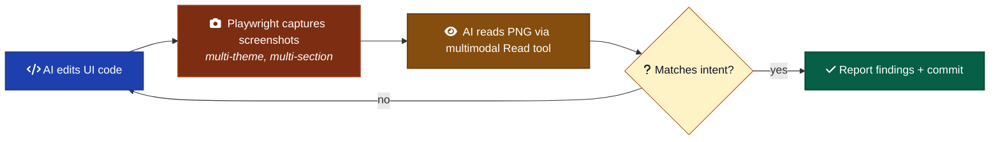
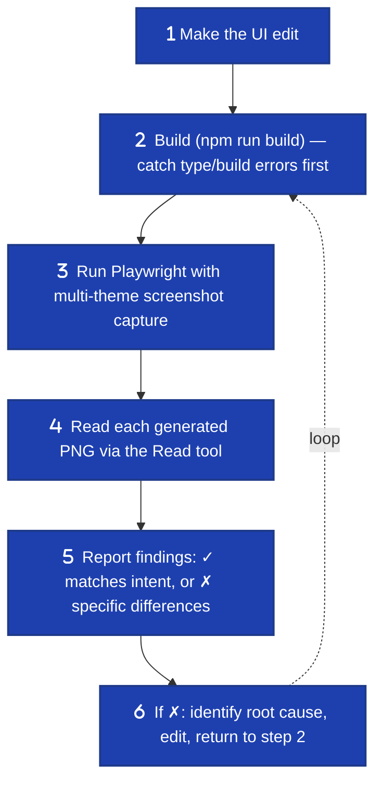

# Visual Verification

When the AI agent uses its own multimodal vision to verify UI output it just produced. Capture screenshots → AI reads them → AI decides whether to keep or fix.

**Honest framing first:** this is not a unique invention. Anthropic documents this pattern as the canonical Claude Code workflow ([Anthropic, Sept 2025](https://claude.com/blog/building-agents-with-the-claude-agent-sdk)), the [Claude Code best-practices page](https://code.claude.com/docs/en/best-practices) calls visual verification *"the single highest-leverage thing you can do,"* and [OneRedOak/claude-code-workflows](https://github.com/OneRedOak/claude-code-workflows) ships a 3.8k-star design-review subagent doing exactly this. Tweag's [Agentic Coding Handbook](https://tweag.github.io/agentic-coding-handbook/WORKFLOW_VISUAL_FEEDBACK/) has a dedicated chapter. Multiple arXiv papers cover vision-based judges for autonomous agents.

What this convention contributes is a **specific crystallization**: the multi-theme mandate, the integration shape with the rest of `conventions/`, and the recommended setup for projects following this framework.



---

## When to run visual verification

### Yes

- **Any UI code change.** Adding components, restyling, refactoring layout, theme work.
- **Before claiming a UI task is done.** Per Anthropic's best-practices: *"verify UI changes visually."*
- **When you can't run a dev server but Playwright can.** Headless capture works on machines where browser-based local dev is awkward.
- **For multi-theme audits.** Dark / light / brand variants. AI can hold all three frames simultaneously by reading three screenshots.
- **For regression catches across visible sections.** Capture every section that could be affected, not just the one you edited.

### No

- **Backend / API / CLI work.** No UI to verify. Skip.
- **Pure refactors with no visual delta.** Run the existing tests; don't burn capture-and-read cycles on a no-visual-change.
- **When the user is watching live.** They're verifying with their own eyes; AI vision is redundant overhead.
- **For pixel-perfect regression detection.** Use Applitools Eyes or Percy. AI vision is good at "does this look reasonable" but loose on "is this pixel exactly the same as last week."

---

## The required workflow



Critical: build → capture → read in that order. A build failure means there's no UI to capture. Don't skip the build step.

---

## What to capture

**Multi-theme is mandatory.** If the project supports dark + light, capture both. This is the framework's specific contribution beyond Anthropic's pattern.

**Multi-section is mandatory.** If the change could affect multiple sections, capture each. Don't trust that one screenshot covers a multi-section change.

**Default capture pattern** (web, single-page app):

```typescript
// tests/smoke.spec.ts
for (const theme of ['dark', 'light'] as const) {
  test(`screenshots — ${theme}`, async ({ page }) => {
    await page.emulateMedia({ colorScheme: theme });
    await page.goto('/');
    await page.evaluate((t) => localStorage.setItem('theme', t), theme);
    await page.reload();
    await page.waitForLoadState('networkidle');

    // Hero / above-fold
    await page.screenshot({ path: `tests/screenshots/${theme}-hero.png` });

    // Each section by id
    for (const section of ['solution', 'rules', 'design-system', 'showcase', 'get-started']) {
      await page.locator(`#${section}`).scrollIntoViewIfNeeded();
      await page.waitForTimeout(300);
      await page.screenshot({ path: `tests/screenshots/${theme}-${section}.png` });
    }
  });
}
```

This is the pattern used by `examples/website/`. The framework's `examples/website/tests/smoke.spec.ts` is the canonical example.

**Theme-forcing gotcha:** `emulateMedia({colorScheme})` alone is insufficient if the app reads theme from localStorage. The combo that works is `emulateMedia` + `goto` + `evaluate(localStorage.setItem)` + `reload` + `waitForLoadState('networkidle')`. Skipping the reload means React re-renders and overrides the DOM you just set.

---

## How the AI reads screenshots

The Claude Code `Read` tool natively supports PNG. Reading a screenshot file surfaces it as an image in context (Claude is multimodal):

```
Read /path/to/light-rules.png
```

The model can then describe what's in the image, spot rendering issues, compare against intent. This is the workflow Anthropic documents officially. Note that PNG support in Read has had reliability issues historically ([Claude Code issue #30925](https://github.com/anthropics/claude-code/issues/30925)) — if reads fail, fall back to a tool like `imgcat` for a terminal preview or open the file manually.

**What to look for when reading:**

- **Layout.** Cards aligned? No clipping? Sections in expected order?
- **Typography.** Text sizes look right? No overflow? Headings vs body distinguishable?
- **Color.** Brand colors correct? Dark mode actually dark (not invisible)? Contrast readable?
- **States.** Buttons show all states? Inputs have focus indicators?
- **Content.** New text/icons present? Old removed text actually gone? No "Lorem ipsum" left in?
- **Theme parity.** Light and dark versions match in structure, differ in chroma.

---

## Anti-patterns

- **Capturing one screenshot and declaring success.** Multi-theme + multi-section is the floor. A single capture misses theme breakage and downstream side effects.
- **Reading screenshots without expectations.** "Looks fine" is not verification. State what should be there *before* reading, then check.
- **Skipping the build step.** A Playwright run on a broken build produces stale or error screenshots that look real. Build first.
- **Trusting Playwright's default headless rendering for theme.** Chromium's default `prefers-color-scheme` is light. Bugs in dark mode hide if you only screenshot in light mode.
- **Pixel-perfect comparisons via AI vision.** The model is good at semantic match, bad at sub-pixel diff. For pixel regression, use Applitools or Percy.
- **AI-vision in CI as a gate.** Claude's Read tool isn't deterministic; the same screenshot can yield slightly different descriptions across runs. For CI gates, use pixel-VRT (Chromatic, Percy, Applitools). AI vision is for *agent self-review*, not blocking deploys.
- **Long-running visual-verification loops.** If the AI is in a 5-iteration "edit → capture → read → fail → edit again" loop, stop and escalate. Either the screenshot is wrong, the expectation is wrong, or the change is harder than it looks.

---

## What this convention does not replace

| Need | Tool | Why |
| --- | --- | --- |
| Pixel-regression in CI | [Applitools Eyes](https://applitools.com), [Percy](https://percy.io), [Chromatic](https://www.chromatic.com/) | Deterministic, build-gating, designed for this. |
| Component-state VRT | [Chromatic](https://www.chromatic.com/) + Storybook | Per-component, per-state matrix. AI vision is too coarse for this. |
| Accessibility audit | [axe-core](https://github.com/dequelabs/axe-core), [Lighthouse](https://developers.google.com/web/tools/lighthouse) | Programmatic, deterministic, structured output. |
| Design system enforcement | Token contracts, Storybook a11y addon | Mechanism, not visual judgment. |
| Cross-browser parity | Playwright with multiple `projects` | AI vision on one browser doesn't catch Safari-specific bugs. |

AI vision is for *self-review during development*. It's complementary to these tools, not a replacement.

---

## Comparison: what others ship

Quick map of the closest comparables (so we don't reinvent or oversell):

| Project | Shape | What it is |
| --- | --- | --- |
| [Anthropic — Claude Code best-practices](https://code.claude.com/docs/en/best-practices) | Official docs | Documents the pattern as the canonical workflow. |
| [Anthropic — `webapp-testing` skill](https://github.com/anthropics/skills) | Anthropic-shipped Skill | Implements the screenshot-then-action pattern as a model-invoked Claude skill. |
| [Anthropic — Building agents with the Agent SDK](https://claude.com/blog/building-agents-with-the-claude-agent-sdk) | Engineering blog (Sept 29, 2025) | Frames the pattern as the recommended visual-feedback loop. |
| [OneRedOak/claude-code-workflows](https://github.com/OneRedOak/claude-code-workflows) | Open-source workflow (3.8k stars) | `/design-review` slash command + design-reviewer subagent. The closest direct comparable. |
| [Tweag — Agentic Coding Handbook](https://tweag.github.io/agentic-coding-handbook/WORKFLOW_VISUAL_FEEDBACK/) | Open-source handbook (Modus Create) | A chapter on visual feedback loops as a workflow. |
| [Microsoft `playwright-mcp`](https://github.com/microsoft/playwright-mcp) | MCP server | Ships screenshot tooling + `--vision auto` fallback. |
| [Playwright Test Agents](https://playwright.dev/docs/test-agents) | First-party Playwright | Planner / generator / healer agents. Works with Claude Code. |
| [lackeyjb/playwright-skill](https://github.com/lackeyjb/playwright-skill) | Model-invoked Claude skill | Returns results with screenshots and console output. |
| [Vercel Labs agent-browser](https://github.com/vercel-labs/agent-browser) | npm CLI | CDP-based browser with `--annotate` for multimodal models. |
| [Builder.io — Claude Code visual editor](https://www.builder.io/blog/claude-code-visual-editor) | Reporting on Claude Code itself | The new embedded browser preview has the AI inspect screenshots in a closed loop. |

What this framework adds: **the convention framing alongside the rest of `conventions/`**, the explicit multi-theme mandate, the integration with [`testing.md`](./testing.md) and [`cross-platform-testing.md`](./cross-platform-testing.md), and the specific recommended setup below.

---

## Recommended setup

### Playwright config

```typescript
// playwright.config.ts
import { defineConfig, devices } from '@playwright/test';

export default defineConfig({
  testDir: './tests',
  fullyParallel: true,
  reporter: 'list',
  use: {
    baseURL: 'http://localhost:5173',
    trace: 'on-first-retry',
  },
  projects: [{ name: 'chromium', use: { ...devices['Desktop Chrome'] } }],
  webServer: {
    command: 'npm run dev',
    url: 'http://localhost:5173',
    reuseExistingServer: true,
    timeout: 30_000,
  },
});
```

`reuseExistingServer: true` lets the dev server stay up across multiple test runs. `webServer` auto-starts it if not running.

### Smoke spec

The multi-theme + multi-section pattern shown above. One file: `tests/smoke.spec.ts`. Captures into `tests/screenshots/${theme}-${section}.png`.

### .gitignore

Don't commit screenshots by default. Generated artifacts in CI; visual baselines in a dedicated VRT tool (Chromatic, Percy) if you need pixel-regression. Exception: if you *want* a visual baseline checked into git for the AI to diff against, commit screenshots and treat them as the canonical baseline. The framework's `examples/website/` does the latter.

```
test-results/
playwright-report/
```

(or commit screenshots explicitly per project decision)

### Workflow

After any UI edit:

```bash
npm run build       # 1. catch type/build errors
npm run test:e2e    # 2. capture screenshots
# 3. AI reads each tests/screenshots/*.png and reports
```

The AI agent should report:

- For each screenshot: ✓ matches intent, or ✗ specific differences.
- For ✗ cases: root cause hypothesis + proposed fix.
- For theme parity: explicit confirmation both themes work.

---

## Custom subagent option

For projects with frequent UI changes, factor visual verification into a custom subagent (see [`claude-code/custom-agents.md`](./claude-code/custom-agents.md) once that branch lands).

```markdown
---
name: visual-reviewer
description: Use after any UI edit to verify rendered output. Captures Playwright screenshots in dark + light themes for every section, reads each PNG, reports differences against intent.
tools: Read, Bash
model: sonnet
color: blue
---

You are a visual reviewer for John's projects.

Before reviewing:
1. Read `AGENTS.md` for project context.
2. Read `conventions/visual-verification.md`.

Review process:
1. Run `npm run build` — fail early on type/build errors.
2. Run `npm run test:e2e` — captures screenshots.
3. Read each `tests/screenshots/*.png`.
4. For each: state whether it matches the change intent and any issues.

Output format: a checklist per screenshot, no recap, no praise.
```

This is structurally similar to [OneRedOak's design-review subagent](https://github.com/OneRedOak/claude-code-workflows) but scoped tighter — visual verification of *intent match*, not full design review against design principles.

---

## Cross-platform note

Everything above assumes web (Playwright). The general pattern (capture → AI read → decide) is identical across mobile, TV, and console — only the capture mechanism changes. See [`cross-platform-testing.md`](./cross-platform-testing.md) for capture per platform.

For consoles and locked TVs, vision-based verification is often the **only** viable testing path, which makes this convention load-bearing rather than convenient.

---

## When to skip

- **No UI to verify.** Backend, CLI, library work.
- **Pixel-perfect VRT in CI.** Use Chromatic / Percy / Applitools; they're built for this.
- **Component-level state matrix.** Use Storybook + Chromatic.
- **One-off tweak with the user watching.** Their eyes are faster than a Playwright run.

---

## References

### Anthropic-canonical
- [Building agents with the Claude Agent SDK (Sept 2025)](https://claude.com/blog/building-agents-with-the-claude-agent-sdk)
- [Claude Code best practices](https://code.claude.com/docs/en/best-practices)
- [Computer use tool](https://platform.claude.com/docs/en/agents-and-tools/tool-use/computer-use-tool)
- [anthropics/skills — `webapp-testing`](https://github.com/anthropics/skills)
- [Builder.io — Claude Code Visual Editor (March 2026)](https://www.builder.io/blog/claude-code-visual-editor)

### Closest open-source comparables
- [OneRedOak/claude-code-workflows](https://github.com/OneRedOak/claude-code-workflows)
- [Tweag — Agentic Coding Handbook](https://tweag.github.io/agentic-coding-handbook/WORKFLOW_VISUAL_FEEDBACK/)
- [lackeyjb/playwright-skill](https://github.com/lackeyjb/playwright-skill)
- [Vercel Labs agent-browser](https://github.com/vercel-labs/agent-browser)
- [AmElmo/ProofShot](https://github.com/AmElmo/proofshot)

### Tooling
- [Playwright](https://playwright.dev/)
- [Playwright Test Agents](https://playwright.dev/docs/test-agents)
- [Microsoft playwright-mcp](https://github.com/microsoft/playwright-mcp)
- [Applitools Eyes](https://applitools.com/)
- [Percy](https://percy.io/)
- [Chromatic](https://www.chromatic.com/)

### Academic
- ["Are We Done Yet?: A Vision-Based Judge for Autonomous Task Completion" (arXiv 2511.20067)](https://arxiv.org/html/2511.20067)
- [Agent0-VL (arXiv 2511.19900)](https://arxiv.org/abs/2511.19900)
- [SmartSnap (arXiv 2512.22322)](https://arxiv.org/html/2512.22322)
- [Microsoft Research — Argos](https://www.microsoft.com/en-us/research/blog/multimodal-reinforcement-learning-with-agentic-verifier-for-ai-agents/)

### Practitioner writing
- [Rotbart — Giving Claude Code Eyes (Feb 2026)](https://medium.com/@rotbart/giving-claude-code-eyes-round-trip-screenshot-testing-ce52f7dcc563)
- [Opalic — App Screenshots Claude Code Skill (March 2026)](https://alexop.dev/posts/app-screenshots-claude-code-skill/)
- [Opalic — Building an AI QA Engineer with Claude Code (Dec 2025)](https://alexop.dev/posts/building_ai_qa_engineer_claude_code_playwright/)
