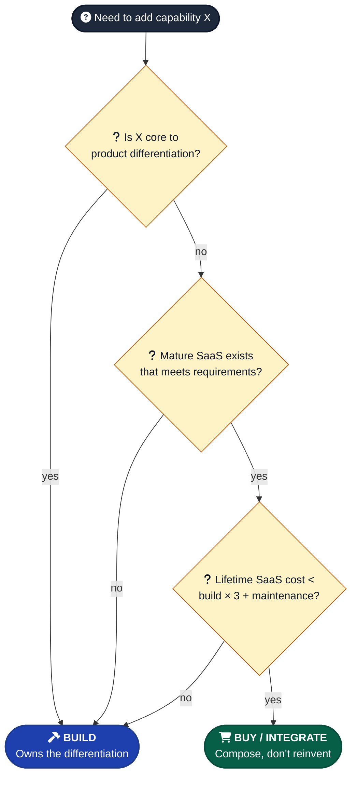

# Build vs Buy / Integrate

When should you build a feature yourself vs use a library or service?

---

## Build when

- The feature is core to the product's differentiation
- Existing solutions don't meet requirements (truly — not just "I'd do it slightly differently")
- You need full control over the implementation
- You're learning the domain (deliberate growth choice)
- The "buy" option locks you in painfully

---

## Buy / integrate when

- The feature is not core (auth, payments, analytics, email, search)
- Time to market matters
- The third-party solution is mature and well-supported
- The build cost would dwarf the integration cost over the lifetime
- The maintenance cost (security patches, edge cases, compliance) is higher than the SaaS fee

---

## Defaults for common categories

| Category | Default |
|---|---|
| Auth | Buy — Clerk, Supabase Auth, NextAuth |
| Payments | Buy — Stripe |
| Email sending | Buy — Resend, Postmark |
| Analytics | Buy — Plausible, PostHog |
| Search (non-trivial) | Buy — Algolia, Meilisearch |
| File storage | Buy — S3, Supabase Storage, Cloudinary |
| Rate limiting | Build (it's easy) or buy (Upstash) |
| UI primitives | Buy — Radix, Headless UI |
| UI composition | Build (the differentiation lives here) |
| Custom business logic | Build |
| Database | Buy — Postgres via Supabase / Neon / RDS |
| Background jobs | Buy — Inngest, Trigger.dev — unless trivial |
| Logging | Buy — Sentry, Logtail |

---

## The hidden cost of "build"

- Initial development is the smallest cost.
- Every future maintenance round (security patches, edge cases, library updates, compliance shifts) for the next decade.
- Onboarding cost when someone else has to understand your custom thing.
- Opportunity cost of not building the differentiating thing.

A reasonable mental model: estimate the build cost, multiply by 3, that's the lifetime cost. Compare to SaaS fee × expected years.

---

## Watch out for

- **Building auth from scratch** because it seems easy. The edge cases (password reset, MFA, session management, OAuth flows, account recovery) accumulate fast. Default to buying (Clerk, Supabase Auth, Auth0, NextAuth) unless you have a strong reason not to.
- **Building "lite" versions of mature SaaS** when the SaaS feels overkill. The light version often grows back into the heavyweight one — minus the years of edge cases the SaaS has already solved.
- **Buying when the thing is core to your product.** If your product IS a search experience, don't buy Algolia and call it done — build the differentiation on top.
- **Vendor lock-in.** Some "buy" decisions are sticky (data shape, API surface, identity model). Cheap-to-leave matters; weigh it in the decision.
