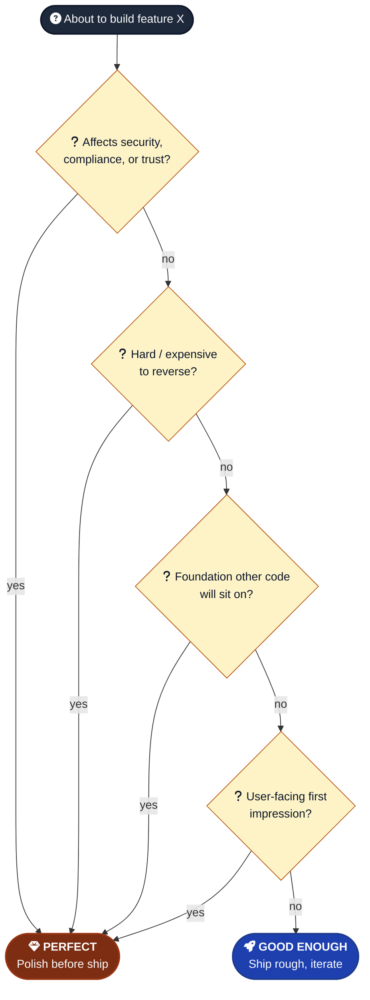

# Good Enough vs Perfect

When is "ship the rough version" right vs "polish first"?

---

## Good enough wins when

- The perfect solution is 3x more effort for marginal user benefit
- The decision is easily reversible
- Time-to-market matters
- You're still learning what users actually want
- Internal tools that only you use
- Prototypes meant to be replaced

Examples:
- A loading spinner instead of skeleton UI for a v1 dashboard
- Inline `if` validation instead of a Zod schema for a single internal form
- A sorted array instead of indexed Map for 50 items
- Hardcoded test data instead of a fixture system

---

## Perfect wins when

- The decision affects security, compliance, or core trust
- The decision is hard or expensive to reverse
- "Good enough" creates significant tech debt that compounds
- Users will see the rough edges and form a permanent first impression
- It's the foundation other code will sit on (data model, auth, public API shape)
- You're committing to something users depend on (data shapes, public URLs)

Examples:
- Auth flow — get it right
- Data model for the core entity — get it right
- Public API endpoints that external code will call — get it right
- Anything stored in a database without a clear migration story — get it right

---

## Default

- Personal tools and prototypes → good enough.
- Production user-facing features → perfect, or close to it.
- Internal tools you alone use → good enough (you tolerate your own bugs).

When in doubt, ship good enough, get feedback, then perfect what matters. Don't perfect everything.

---

## Watch out for

- **"Good enough" used as cover for laziness.** "Good enough" is a deliberate choice you can defend. "I didn't bother" is a different thing.
- **"Perfect" used as procrastination.** If you've spent two days perfecting something users haven't seen, you're avoiding shipping.
- **Mixing modes inside one feature.** Good-enough auth with perfect logging is bizarre. Pick one frame per feature.
- **Promoting "good enough" to "shipped"** without remembering it's good enough. Note the rough edges in `BACKLOG.md`.
