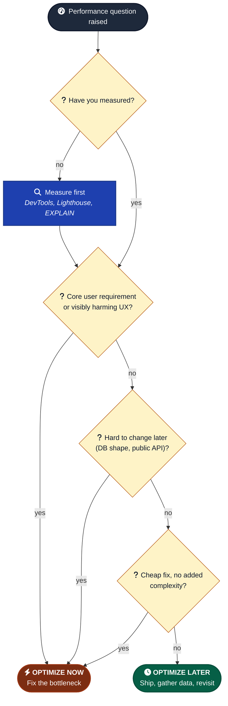

# Optimize Now vs Later

When should you spend cycles on performance vs ship and revisit?

---

## Optimize now when

- Performance is a core user requirement (games, video, real-time, anything claiming to be "fast")
- The optimization is cheap and doesn't add complexity
- Current performance is actively harming UX (visible jank, slow first paint, dropped frames)
- You'll be measured on it (LCP for SEO, frame rate for games, time-to-interactive for landing pages)
- The data shape will get harder to change later (DB indexing, denormalization decisions)

---

## Optimize later when

- The optimization adds significant complexity
- Current performance is "good enough" for target users
- The feature isn't yet validated as worth keeping
- The optimization requires guesses about what's slow (measure first)
- You don't have real usage data yet

---

## Rules

- **Measure before optimizing.** "It feels slow" is not a measurement. Open DevTools, record a trace, find the actual bottleneck.
- **Set targets.** "Under 100ms interaction latency on a 2024 mid-range phone" is a target. "Fast" is not.
- **Optimize the bottleneck, not the easy thing.** Most code doesn't matter for performance. The 5% that does matters a lot.
- **Cache the answer to "is this slow?" with profiler output, not vibes.**
- **Watch for premature memoization.** `useMemo` and `useCallback` have their own cost. Profile before adding.
- **Don't optimize generic code that runs once.** Optimize hot loops.

---

## Specific patterns

- **Renders too often** → React DevTools profiler → find the parent that re-renders, fix at the source.
- **Big list janks** → virtualization (react-window, TanStack Virtual). Don't try to memoize 5000 rows.
- **Bundle too big** → analyze with `vite build --analyze` or webpack-bundle-analyzer. Code-split routes. Lazy-load heavy deps.
- **Slow first paint** → measure with Lighthouse. Often it's a single render-blocking script or font.
- **Slow query** → `EXPLAIN ANALYZE`. Add index. Don't rewrite the ORM call.
- **Frame drops in a game** → record with browser Performance tab. Often it's allocations triggering GC. Pool objects.

---

## Watch out for

- **Optimizing the demo path** while the real user path stays slow.
- **Adding "performance" deps that themselves cost more than they save** (bundle size from a heavy state lib used to "memoize" is net-negative).
- **Optimizing with no baseline.** If you can't show "before X ms, after Y ms," you don't know if you helped.
- **Spending a day shaving 50ms off a flow nobody uses.**
