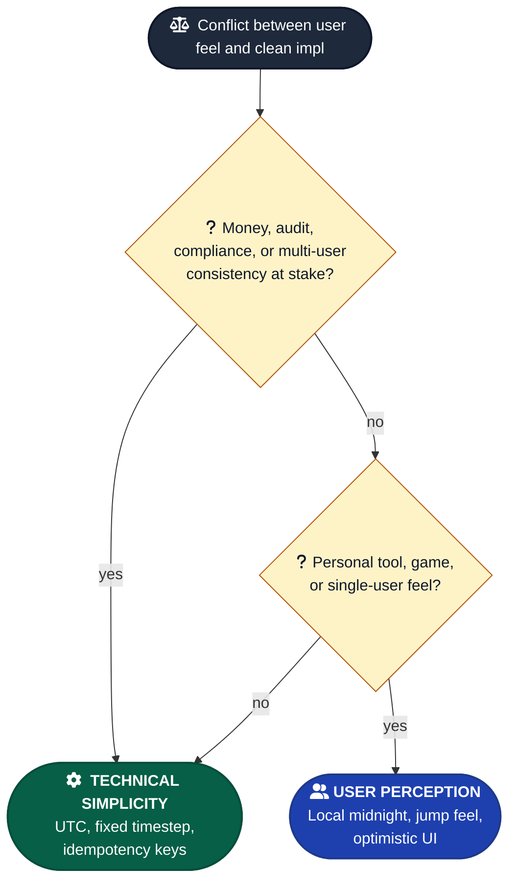

# User Perception vs Technical Simplicity

A recurring decision: when user-facing behavior conflicts with the technically clean implementation, which wins?

---

## Bias toward user perception when

- Personal tools where the user's mental model matters more than technical correctness
- Games where "feel" determines whether the player keeps playing
- Anything where the user's intuition will fight the "correct" implementation

Examples:
- **Timezone in a habit tracker** — local midnight feels right, even though UTC is simpler. User checking in at 11:30pm should count toward "today," not yesterday.
- **Game jump arc** — what *feels* good > mathematically perfect physics. Real gravity makes platformers feel awful.
- **Streak resets** — at user's local midnight, not server's. The user's day, not the database's.
- **"Yesterday" in activity feeds** — show "Yesterday" up to ~36 hours, not exactly 24. Matches how people think.
- **Optimistic UI updates** — show the action complete immediately even though the server hasn't confirmed. Users tolerate eventual consistency better than apparent lag.

---

## Bias toward technical simplicity when

- Backend systems, data pipelines, anywhere correctness > perception
- Multi-user systems where consistent server behavior matters
- Audit, billing, compliance — anything where being able to defend the implementation matters

Examples:
- **UTC for all server-side timestamps** — store UTC, render in user's TZ.
- **Fixed timestep for networked game physics** — determinism beats feel when multiplayer state has to converge.
- **Audit logs in a single timezone** — investigation is easier when everything is in one frame.
- **Database-level constraints** — enforce in the schema, not in the application layer.
- **Idempotency keys for payments** — "feel" doesn't matter; double-charges do.

---

## Rule of thumb

- Personal tools and games → user perception.
- Infrastructure, multi-user, money — technical simplicity.

When you're not sure: ask. The right answer here usually surfaces in retrospect, not upfront. Worth a 60-second escalation rather than a future reversal.

---

## Watch out for

- **Picking "user perception" because it's the easy story** when the real issue is you don't want to deal with timezone math. Both options should genuinely be on the table before you choose.
- **Picking "technical simplicity" because the spec calls for it** when the spec was written without user testing. The spec might be wrong.
- **Mixing the two within one feature.** Pick a frame for the feature and stick to it. UTC streaks with local-midnight check-ins is the worst of both worlds.
