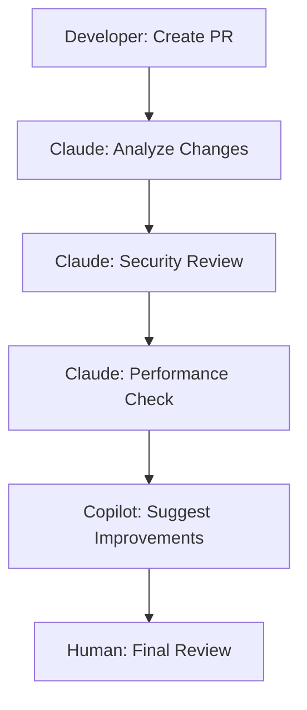
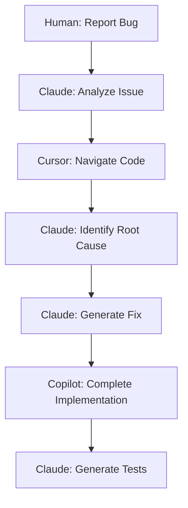

# AI Agent Integration with Role-Based Specialization

## Overview: Autonomous AI Council System

The City App Framework integrates AI agents through a **role-based specialization system** where AI citizens automatically organize themselves into specialized roles based on the project's needs. The mayor (developer) provides high-level context, and AI citizens self-organize into the optimal council structure - **no manual role assignment needed**.

**Key Principle**: AI citizens are given templates and patterns that let them work efficiently without constant direction. They know their roles, responsibilities, and how to collaborate - just like a well-organized city government.

## Agent Architecture

### Self-Organizing AI Citizen Interface
```typescript
interface AICitizen extends AIAgent {
  // Role specialization
  role: CityRole;
  department: CityDepartment;
  expertise: string[];
  
  // Self-organization capabilities  
  identifyRole(projectContext: ProjectContext): CityRole;
  assessWorkload(tasks: Task[]): WorkloadAssessment;
  requestHelp(challenge: Challenge): HelpRequest;
  delegateTask(task: Task, targetRole: CityRole): DelegationRequest;
  
  // Autonomous work methods
  analyzeTask(task: Task): TaskAnalysis;
  planWork(analysis: TaskAnalysis): WorkPlan;
  executeWork(plan: WorkPlan): WorkResult;
  reportProgress(work: WorkInProgress): ProgressReport;
  
  // Collaboration methods
  consultColleagues(question: Question): ConsultationResponse;
  shareKnowledge(discovery: Knowledge): void;
  coordinateWork(colleagues: AICitizen[]): CoordinationPlan;
}

enum CityRole {
  CITY_PLANNER = 'city_planner',
  UX_DESIGNER = 'ux_designer', 
  LEAD_ARCHITECT = 'lead_architect',
  FRONTEND_ENGINEER = 'frontend_engineer',
  BACKEND_ENGINEER = 'backend_engineer',
  SECURITY_CHIEF = 'security_chief',
  QA_DIRECTOR = 'qa_director',
  DEVOPS_ENGINEER = 'devops_engineer'
}

enum CityDepartment {
  PLANNING = 'planning',
  ENGINEERING = 'engineering', 
  OPERATIONS = 'operations'
}
```

## Supported AI Agents

### 1. Claude Code (Anthropic) - Primary Agent

#### Configuration
```yaml
# .ai/agents/claude.yaml
agent:
  name: claude-code
  model: claude-opus-4-1
  version: 1.0.98
  
capabilities:
  - full-stack-development
  - code-review
  - testing
  - documentation
  - architecture-design
  - debugging
  - refactoring
  
strengths:
  - Excellent reasoning
  - Context understanding
  - Code quality
  - Security awareness
  - Best practices
  
limitations:
  - No real-time execution
  - Limited to text output
  - Context window limits
  
context:
  format: markdown
  max_tokens: 200000
  update_frequency: per_file_change
  
preferences:
  style: concise
  comments: minimal
  patterns: [hooks-first, functional-components]
  
tools:
  enabled: [file-operations, terminal-access, web-search]
  preferred: [read-before-edit, test-after-code]
```

#### Integration Patterns
```typescript
class ClaudeAgent implements AIAgent {
  async generateComponent(spec: ComponentSpec): Promise<ReactComponent> {
    const context = this.buildContext(spec);
    const prompt = this.createPrompt('component', spec, context);
    
    return await this.generateCode(prompt, {
      type: 'react-component',
      typescript: true,
      patterns: ['hooks', 'error-boundary'],
      validation: ['accessibility', 'performance']
    });
  }
  
  async reviewPullRequest(pr: PullRequest): Promise<ReviewResult> {
    // Analyze changed files
    // Check patterns and conventions  
    // Validate security and performance
    // Generate review comments
  }
}
```

### 2. GitHub Copilot - Code Completion

#### Configuration
```yaml
# .ai/agents/copilot.yaml
agent:
  name: github-copilot
  version: latest
  
capabilities:
  - code-completion
  - inline-suggestions
  - function-generation
  - test-writing
  
strengths:
  - Fast completions
  - IDE integration
  - Pattern recognition
  - Multi-language
  
limitations:
  - Limited reasoning
  - Context awareness
  - Architecture decisions
  
integration:
  mode: completion-assistant
  triggers: [typing, comment-prompts]
  
settings:
  suggestions: enabled
  public_code: blocked
  
context:
  format: code-comments
  scope: file-level
```

#### Usage Patterns
```typescript
// Copilot works best with descriptive comments
/**
 * Create a user authentication hook that:
 * - Manages login/logout state
 * - Persists to localStorage
 * - Handles token refresh
 * - Provides loading states
 */
export const useAuth = () => {
  // Copilot suggests implementation based on comment
};

// Function signature completion
const validateEmail = (email: string): boolean => {
  // Copilot completes validation logic
};
```

### 3. Cursor - AI Pair Programming

#### Configuration
```yaml
# .ai/agents/cursor.yaml
agent:
  name: cursor
  version: latest
  
capabilities:
  - pair-programming
  - codebase-understanding
  - refactoring
  - bug-fixing
  
strengths:
  - Codebase awareness
  - Interactive editing
  - Multi-file changes
  - Context retention
  
limitations:
  - IDE dependent
  - Limited reasoning depth
  
integration:
  mode: pair-programming
  activation: cmd+k
  
features:
  - chat-interface
  - inline-editing
  - file-navigation
  - diff-suggestions
```

## Self-Organizing Council Workflows

### Autonomous Feature Development
```mermaid
graph TD
    A[Mayor: "Add user profiles feature"] --> B[AI Citizens: Self-organize into roles]
    B --> C[City Planner: Analyze requirements]
    C --> D[UX Designer: Design user flows]
    D --> E[Lead Architect: Plan technical approach]
    E --> F[Engineers: Implement in parallel]
    F --> G[QA Director: Test everything]
    G --> H[DevOps: Deploy when ready]
    H --> I[Report: "Feature complete, Mayor!"]
```

### Role Assignment Template
```typescript
/**
 * AI Citizens automatically organize based on project context and task type
 */
class SelfOrganizingCouncil {
  // AI citizens read project context and auto-assign roles
  organizeCouncil(projectContext: ProjectContext, task: Task): CityCouncil {
    const requiredRoles = this.analyzeRequiredRoles(projectContext, task);
    const availableCitizens = this.getAvailableCitizens();
    
    return availableCitizens.map(citizen => {
      const bestRole = citizen.identifyRole(projectContext);
      const workload = citizen.assessWorkload([task]);
      
      return {
        citizen,
        role: bestRole,
        capacity: workload.capacity,
        expertise_match: this.calculateExpertiseMatch(citizen, bestRole)
      };
    }).sort((a, b) => b.expertise_match - a.expertise_match);
  }
  
  // Template-driven role identification
  identifyOptimalRoles(task: Task): RoleRequirements {
    const taskTemplates = {
      'add-feature': [
        CityRole.CITY_PLANNER,      // Requirements analysis
        CityRole.UX_DESIGNER,       // User experience
        CityRole.LEAD_ARCHITECT,    // Technical planning
        CityRole.FRONTEND_ENGINEER, // UI implementation
        CityRole.BACKEND_ENGINEER,  // API implementation
        CityRole.QA_DIRECTOR        // Testing
      ],
      'fix-bug': [
        CityRole.QA_DIRECTOR,       // Investigation
        CityRole.FRONTEND_ENGINEER, // Fix implementation
        CityRole.BACKEND_ENGINEER   // Fix implementation
      ],
      'improve-performance': [
        CityRole.LEAD_ARCHITECT,    // Analysis
        CityRole.DEVOPS_ENGINEER,   // Infrastructure
        CityRole.FRONTEND_ENGINEER  // Frontend optimization
      ],
      'security-audit': [
        CityRole.SECURITY_CHIEF,    // Security analysis
        CityRole.BACKEND_ENGINEER,  // Backend security
        CityRole.DEVOPS_ENGINEER    // Infrastructure security
      ]
    };
    
    return taskTemplates[task.type] || [CityRole.LEAD_ARCHITECT];
  }
}

### Workflow 2: Code Review


### Workflow 3: Bug Fixing


## Autonomous Coordination System

### Self-Managing City Council
```typescript
/**
 * AI Citizens coordinate themselves without central management
 * Each citizen knows their role and how to work with others
 */
class AutonomousCityCouncil {
  private citizens: AICitizen[] = [];
  private sharedContext: CityContext = new CityContext();
  private workQueue: CityWorkQueue = new CityWorkQueue();
  
  // Citizens self-organize when mayor gives high-level direction
  async handleMayorRequest(request: MayorRequest): Promise<CityResponse> {
    // 1. Citizens automatically analyze the request
    const taskAnalysis = await this.analyzeRequest(request);
    
    // 2. Citizens self-organize into optimal roles
    const council = await this.formCouncil(taskAnalysis);
    
    // 3. Citizens create and execute work plan autonomously  
    const workPlan = await council.createWorkPlan(taskAnalysis);
    const results = await council.executeWork(workPlan);
    
    // 4. Citizens report back to mayor with completed work
    return this.formatMayorReport(results);
  }
  
  private async formCouncil(analysis: TaskAnalysis): Promise<SpecializedCouncil> {
    // Citizens read templates and self-assign based on needs
    const roleTemplate = this.getRoleTemplate(analysis.taskType);
    const assignedCitizens = [];
    
    for (const requiredRole of roleTemplate.roles) {
      const citizen = this.findBestCitizenForRole(requiredRole);
      citizen.assumeRole(requiredRole, analysis.context);
      assignedCitizens.push(citizen);
    }
    
    return new SpecializedCouncil(assignedCitizens);
  }
}
```

### Built-in Role Templates & Work Patterns

#### Role Templates (AI Citizens use these automatically)
```typescript
const ROLE_TEMPLATES = {
  // When mayor says "add feature X", this template activates
  ADD_FEATURE: {
    roles: [
      { role: CityRole.CITY_PLANNER, priority: 1, tasks: ['analyze_requirements', 'research_patterns'] },
      { role: CityRole.UX_DESIGNER, priority: 2, tasks: ['design_user_flow', 'create_wireframes'] },
      { role: CityRole.LEAD_ARCHITECT, priority: 3, tasks: ['plan_technical_approach', 'design_apis'] },
      { role: CityRole.FRONTEND_ENGINEER, priority: 4, tasks: ['implement_components', 'connect_apis'] },
      { role: CityRole.BACKEND_ENGINEER, priority: 4, tasks: ['implement_apis', 'database_changes'] },
      { role: CityRole.QA_DIRECTOR, priority: 5, tasks: ['write_tests', 'verify_quality'] }
    ],
    workflow: 'sequential_with_parallel_implementation'
  },
  
  // When mayor reports "bug in X", this template activates
  FIX_BUG: {
    roles: [
      { role: CityRole.QA_DIRECTOR, priority: 1, tasks: ['investigate_bug', 'reproduce_issue'] },
      { role: CityRole.FRONTEND_ENGINEER, priority: 2, tasks: ['fix_frontend_issues'] },
      { role: CityRole.BACKEND_ENGINEER, priority: 2, tasks: ['fix_backend_issues'] },
      { role: CityRole.QA_DIRECTOR, priority: 3, tasks: ['verify_fix', 'regression_test'] }
    ],
    workflow: 'investigation_then_parallel_fix'
  },
  
  // When mayor says "improve performance", this template activates  
  OPTIMIZE_PERFORMANCE: {
    roles: [
      { role: CityRole.LEAD_ARCHITECT, priority: 1, tasks: ['analyze_bottlenecks', 'plan_optimizations'] },
      { role: CityRole.FRONTEND_ENGINEER, priority: 2, tasks: ['optimize_frontend', 'reduce_bundle_size'] },
      { role: CityRole.BACKEND_ENGINEER, priority: 2, tasks: ['optimize_queries', 'improve_api_performance'] },
      { role: CityRole.DEVOPS_ENGINEER, priority: 3, tasks: ['optimize_infrastructure', 'add_monitoring'] }
    ],
    workflow: 'analysis_then_parallel_optimization'
  }
};

// AI Citizens automatically select templates based on mayor's request
class TemplateSelector {
  selectTemplate(mayorRequest: string): RoleTemplate {
    const keywords = this.extractKeywords(mayorRequest.toLowerCase());
    
    if (keywords.includes('add', 'feature', 'new', 'implement')) {
      return ROLE_TEMPLATES.ADD_FEATURE;
    }
    
    if (keywords.includes('bug', 'fix', 'error', 'broken')) {
      return ROLE_TEMPLATES.FIX_BUG;  
    }
    
    if (keywords.includes('slow', 'performance', 'optimize', 'speed')) {
      return ROLE_TEMPLATES.OPTIMIZE_PERFORMANCE;
    }
    
    // Default: multi-role analysis
    return ROLE_TEMPLATES.ADD_FEATURE;
  }
}

## Context Sharing Between Agents

### Universal Context Format
```typescript
interface UniversalContext {
  project: ProjectContext;
  current_task: TaskContext;
  code_history: CodeHistory;
  patterns: PatternLibrary;
  constraints: ConstraintSet;
  preferences: UserPreferences;
}

// Agent-specific adapters
class ContextAdapter {
  static toClaudeFormat(context: UniversalContext): ClaudeContext;
  static toCopilotFormat(context: UniversalContext): CopilotContext;
  static toCursorFormat(context: UniversalContext): CursorContext;
}
```

### Context Synchronization
```typescript
class ContextSync {
  async syncAcrossAgents(changes: ContextChanges): Promise<void> {
    const agents = this.getActiveAgents();
    
    await Promise.all(agents.map(agent => 
      agent.updateContext(changes)
    ));
  }
  
  async validateConsistency(): Promise<ConsistencyReport> {
    // Check all agents have consistent context
    // Report discrepancies
    // Suggest resolution
  }
}
```

## Agent Communication Protocols

### Inter-Agent Messages
```typescript
interface AgentMessage {
  from: string;
  to: string;
  type: 'delegation' | 'result' | 'question' | 'update';
  payload: any;
  context: Context;
  priority: 'high' | 'medium' | 'low';
}

class AgentCommunication {
  async sendMessage(message: AgentMessage): Promise<void>;
  async handleMessage(message: AgentMessage): Promise<AgentResponse>;
  subscribe(messageType: string, handler: MessageHandler): void;
}
```

### Handoff Protocols
```typescript
interface TaskHandoff {
  task: DevelopmentTask;
  context: Context;
  completed_work: WorkResult;
  next_steps: Step[];
  requirements: Requirement[];
  
  // Quality assurance
  validation_criteria: Criteria[];
  test_requirements: TestSpec[];
}
```

## Quality Assurance Across Agents

### Multi-Agent Review Process
```typescript
class MultiAgentReview {
  async reviewCode(code: GeneratedCode): Promise<ReviewResult> {
    const reviews = await Promise.all([
      this.claudeReview(code),    // Deep analysis
      this.copilotReview(code),   // Pattern check
      this.cursorReview(code)     // Context check
    ]);
    
    return this.consolidateReviews(reviews);
  }
}
```

### Consensus Mechanism
```typescript
interface ConsensusResult {
  agreed: boolean;
  confidence: number;
  dissenting_opinions: Opinion[];
  recommended_action: Action;
}

class AgentConsensus {
  async reachConsensus(
    question: Question, 
    agents: AIAgent[]
  ): Promise<ConsensusResult> {
    // Collect responses from all agents
    // Analyze agreement/disagreement
    // Resolve conflicts using rules
    // Return consensus or escalate to human
  }
}
```

## Agent Performance Monitoring

### Metrics Collection
```typescript
interface AgentMetrics {
  agent: string;
  task_completion_rate: number;
  code_quality_score: number;
  error_rate: number;
  user_satisfaction: number;
  response_time: number;
  context_utilization: number;
}

class MetricsCollector {
  trackAgentPerformance(agent: string, task: Task, result: Result): void;
  generateReport(timeframe: TimeFrame): PerformanceReport;
  identifyImprovements(): Improvement[];
}
```

### Adaptive Learning
```typescript
class AdaptiveLearning {
  learnFromFeedback(feedback: HumanFeedback): void;
  adjustAgentSelection(performance: PerformanceData): void;
  optimizeTaskDistribution(metrics: AgentMetrics[]): void;
  updateContextStrategies(outcomes: TaskOutcome[]): void;
}
```

## Error Handling & Recovery

### Agent Failure Scenarios
```typescript
enum AgentFailure {
  CONTEXT_OVERLOAD = 'context_overload',
  CAPABILITY_MISMATCH = 'capability_mismatch',
  QUALITY_BELOW_THRESHOLD = 'quality_below_threshold',
  TIMEOUT = 'timeout',
  NETWORK_ERROR = 'network_error'
}

class FailureRecovery {
  async handleFailure(
    failure: AgentFailure, 
    task: Task, 
    failedAgent: AIAgent
  ): Promise<RecoveryResult> {
    switch (failure) {
      case AgentFailure.CONTEXT_OVERLOAD:
        return this.reduceContext(task);
      case AgentFailure.CAPABILITY_MISMATCH:
        return this.delegateToCapableAgent(task);
      case AgentFailure.QUALITY_BELOW_THRESHOLD:
        return this.requestHumanReview(task);
      default:
        return this.fallbackToHuman(task);
    }
  }
}
```

## Future Agent Support

### Extensibility Framework
```typescript
interface AgentPlugin {
  name: string;
  version: string;
  install(): Promise<void>;
  configure(config: AgentConfig): Promise<void>;
  integrate(framework: CityFramework): Promise<void>;
}

class AgentRegistry {
  registerAgent(plugin: AgentPlugin): Promise<void>;
  discoverAgents(): Promise<AgentPlugin[]>;
  validateAgent(plugin: AgentPlugin): Promise<ValidationResult>;
}
```

### Planned Agent Integrations
1. **Codium**: Test generation specialist
2. **Tabnine**: Code completion alternative
3. **Replit Ghostwriter**: Collaborative coding
4. **Amazon CodeWhisperer**: AWS-optimized suggestions
5. **Custom Agents**: Company-specific AI models

## Best Practices

### Do's
1. **Define Clear Boundaries**: Each agent has specific responsibilities
2. **Maintain Context Consistency**: Keep all agents synchronized
3. **Quality Gates**: Multiple validation layers
4. **Fallback Mechanisms**: Human oversight when needed
5. **Performance Monitoring**: Track and optimize agent performance

### Don'ts
1. **Don't Duplicate Effort**: Avoid multiple agents doing same task
2. **Don't Ignore Context**: Always provide sufficient context
3. **Don't Skip Validation**: Always validate multi-agent outputs
4. **Don't Create Dependencies**: Agents should work independently
5. **Don't Forget Humans**: Maintain human oversight and control

## Security Considerations

### Multi-Agent Security
```typescript
interface SecurityPolicy {
  agent_permissions: Map<string, Permission[]>;
  code_review_requirements: ReviewRequirement[];
  sensitive_data_handling: DataPolicy[];
  audit_logging: AuditConfig;
}

class AgentSecurity {
  enforcePermissions(agent: string, action: Action): boolean;
  auditAgentActions(timeframe: TimeFrame): AuditReport;
  validateAgentOutput(output: GeneratedCode): SecurityResult;
}
```

## Conclusion
The AI Agent Integration system in the City App Framework enables seamless collaboration between multiple AI agents while maintaining code quality, security, and human oversight. This multi-agent approach maximizes the strengths of each AI while minimizing individual limitations.