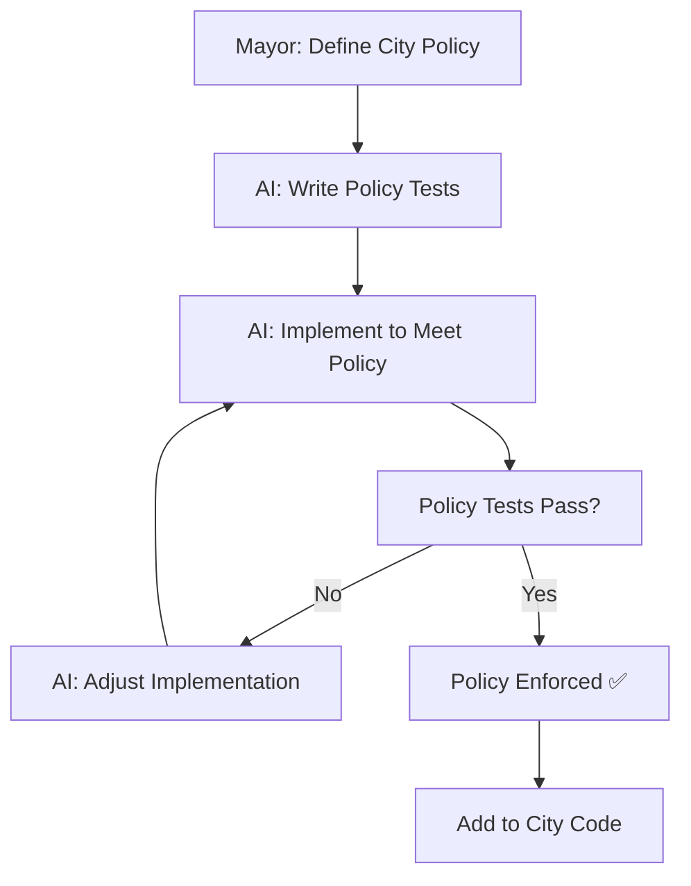

# AI Context System Design

## Overview: The City's Knowledge Infrastructure

The AI Context System is the **comprehensive knowledge infrastructure** of your digital city. Just as a real city has zoning laws, building codes, utility maps, and citizen records, your digital city has structured context that guides AI citizens in building, maintaining, and evolving your application.

**The Mayor (Developer)** provides the vision and policies, while **AI Citizens** use this context infrastructure to make informed decisions about every aspect of city development - from individual function implementations to large-scale architectural decisions.

## Context Architecture

### Hierarchical Context Structure (City Planning Hierarchy)
```
🌍 CITY FRAMEWORK (Global Infrastructure)
  └── 🏛️ CITY HALL (Mayor's Vision & Policies)
      └── 🏘️ DISTRICTS (Feature Areas)
          └── 🏢 BUILDINGS (Components)
              └── 🔧 UTILITIES (Functions & Logic)
```

### City Context Layers
- **🌍 City Framework**: Universal patterns, conventions, and AI agent protocols
- **🏛️ City Hall**: Project vision, business goals, user personas, technical constraints
- **🏘️ Districts**: Feature domains (Auth, Dashboard, Analytics, etc.) with specific rules
- **🏢 Buildings**: Component specifications, props, behavior, and testing requirements  
- **🔧 Utilities**: Function-level context, algorithms, validation rules, and edge cases

## Context File Structure

### City Hall Records (.ai/ Directory)
```
.ai/                           # City Hall - All city planning documents
├── city-charter.md           # Mayor's vision, goals, and policies (replaces context.md)
├── citizen-instructions.md   # How AI citizens should work (replaces instructions.md)
├── blueprints/              # Building templates for AI citizens
│   ├── component-templates/  # Pre-designed component patterns
│   ├── api-templates/       # API endpoint patterns
│   ├── test-templates/      # Testing patterns
│   └── story-templates/     # Storybook story patterns
├── citizens/                # AI citizen (agent) configurations
│   ├── claude.yaml         # Claude Code citizen config
│   ├── copilot.yaml        # Copilot citizen config
│   └── cursor.yaml         # Cursor citizen config
├── city-knowledge/         # Accumulated city wisdom
│   ├── business/           # Business domain knowledge
│   ├── technical/          # Technical architecture knowledge
│   ├── patterns/           # Proven code patterns
│   └── integrations/       # Third-party service knowledge
├── city-archives/          # Historical records
│   ├── decisions/          # Why decisions were made
│   ├── construction-log/   # What was built when
│   ├── mayor-feedback/     # Human feedback to AI citizens
│   └── performance/        # How well the city runs
├── city-standards/         # Quality and compliance standards
│   ├── security-code.md    # Security requirements and standards
│   ├── performance-standards.md # Performance requirements
│   ├── accessibility-code.md # Accessibility standards (WCAG)
│   ├── testing-standards.md # Testing requirements and standards
│   └── code-quality.md     # Code quality and review standards
├── district-plans/         # District-specific planning documents
│   ├── auth-district.md    # Authentication district specifications
│   ├── dashboard-district.md # Dashboard district specifications
│   └── api-district.md     # API district specifications
└── context-builder/        # Tools for building and maintaining context
    ├── domain-templates/   # Industry-specific templates
    ├── question-flows/     # Interactive context building
    └── validation-rules/   # Context quality validation
```

## City Policies: Tests as Governance

### The Role of Tests as City Policies

In the City App Framework, **tests are the policies that govern how the city works**. Just as real cities have building codes, zoning laws, and safety regulations, your digital city has tests that define:

- **How districts should function** (integration tests)
- **How buildings should be constructed** (component tests)  
- **How utilities should operate** (unit tests)
- **How citizens should interact** (E2E tests)
- **How the city should look** (visual tests)

These policy-tests give **form to the functions** by outlining expected behavior, constraints, and quality standards. AI citizens use these policies to understand not just *what* to build, but *how* it should work.

### Test Policies as City Governance
```typescript
/**
 * @city-policy: Authentication District
 * These tests define how citizen authentication works in our city
 */
describe('Authentication District Policies', () => {
  // Policy: Citizens must provide valid credentials
  it('should allow entry with valid citizenship papers', () => {
    const citizen = authenticateUser('valid@email.com', 'strongPassword123');
    expect(citizen.hasAccess).toBe(true);
    expect(citizen.district).toBe('authenticated');
  });
  
  // Policy: Invalid citizens are redirected to registration
  it('should redirect non-citizens to immigration office', () => {
    const result = authenticateUser('invalid@email.com', 'wrongPassword');
    expect(result.redirectTo).toBe('/register');
    expect(result.message).toContain('Please register for citizenship');
  });
  
  // Policy: Citizens can safely log out and return
  it('should preserve citizen data after logout and re-entry', () => {
    const citizen = authenticateUser('returning@citizen.com', 'password');
    logout(citizen);
    const returningCitizen = authenticateUser('returning@citizen.com', 'password');
    expect(returningCitizen.profile).toEqual(citizen.profile);
  });
});
```

### How AI Citizens Use Test Policies

1. **Understanding Expected Behavior**: Tests show AI exactly how features should work
2. **Boundary Conditions**: Edge case tests define limits and error handling  
3. **Integration Requirements**: Tests show how different parts must work together
4. **Quality Standards**: Test coverage and quality gates define acceptable standards
5. **Regression Prevention**: Tests ensure changes don't break existing policies

### Policy-Driven Development Workflow


## Context File Formats

### 1. City Charter (`.ai/city-charter.md`)
```markdown
# City Charter: ${cityName}

## Mayor's Vision Statement
"${visionStatement}"

## City Overview
- Name: ${cityName}  
- Type: ${cityType} (E-commerce, SaaS, Fitness, etc.)
- Platform: ${platform}
- Population (Users): ${targetUsers}
- Established: ${dateCreated}

## City Purpose & Mission
${cityPurpose}

## Citizen Demographics (User Personas)
### Primary Citizens: ${primaryUsers}
- Age: ${ageRange}
- Goals: ${userGoals}
- Pain Points: ${userPainPoints}
- Usage Patterns: ${usagePatterns}

### Secondary Citizens: ${secondaryUsers}
- ${secondaryUserDetails}

## City Districts (Core Features)
1. **${district1}**: ${districtDescription1}
2. **${district2}**: ${districtDescription2}  
3. **${district3}**: ${districtDescription3}

## City Policies (Test-Driven Governance)
### Security Policies
- All citizen data must be encrypted at rest
- HTTPS-only city infrastructure
- Regular security audits and penetration testing
- **Policy Tests**: Security test suite validates encryption, HTTPS, input sanitization

### Performance Policies  
- City must load in under ${loadTime} seconds
- Bundle size cannot exceed ${bundleSize}
- Core features must work offline
- **Policy Tests**: Performance test suite validates load times, bundle size, offline functionality

### Accessibility Policies
- WCAG 2.1 AA compliance for all districts
- Screen reader support mandatory
- Keyboard navigation for all features
- **Policy Tests**: Accessibility test suite validates ARIA labels, keyboard navigation, color contrast

### Quality Policies
- ${testCoverage}% test coverage minimum
- All features must have Storybook documentation
- Code reviews required for all construction
- **Policy Tests**: Coverage reports, linting rules, review automation

## City Infrastructure (Technical Architecture)
- **Foundation**: ${framework} (React/Next.js)
- **Styling System**: ${stylingFramework} (Tailwind/MUI/Bootstrap)
- **State Management**: ${stateManagement} (Context/Redux/Zustand)
- **Database**: ${database} (if applicable)
- **Hosting**: ${hosting} (Vercel/Netlify/AWS)

## AI Citizen Instructions
### What AI Citizens Should Always Do:
- Follow the test policies as absolute governance rules
- Prioritize ${primaryValue} in all decisions
- Generate comprehensive test coverage for new features
- Maintain consistency with existing city patterns
- Document all construction in Storybook when applicable

### What AI Citizens Should Never Do:
- Build features without corresponding policy tests
- Compromise on ${criticalConstraint}
- Use deprecated or insecure patterns
- Skip accessibility considerations
- Ignore performance budgets

### Special AI Citizen Guidelines:
- **For ${specificDomain}**: ${domainSpecificGuidelines}
- **For Mobile Citizens**: Prioritize touch interactions and offline functionality  
- **For Security Citizens**: Apply principle of least privilege and validate all inputs
```

### 2. Component Context (Embedded)
```typescript
/**
 * @ai-context
 * Component: UserProfile
 * Purpose: Display and edit user profile information
 * 
 * Dependencies:
 * - useAuth: Authentication hook
 * - useUser: User data hook
 * - Button: UI component
 * 
 * State:
 * - isEditing: boolean
 * - formData: UserFormData
 * - errors: ValidationErrors
 * 
 * Patterns:
 * - Controlled form inputs
 * - Optimistic updates
 * - Error boundary wrapped
 * 
 * Constraints:
 * - Must be accessible (WCAG 2.1 AA)
 * - Mobile responsive
 * - Max 200KB bundle contribution
 * 
 * AI-Instructions:
 * - Use Tailwind classes for styling
 * - Implement proper form validation
 * - Include loading states
 * - Handle edge cases (network errors, etc.)
 */
export const UserProfile: React.FC<UserProfileProps> = ({ userId }) => {
  // Implementation
};
```

### 3. API Context
```typescript
/**
 * @ai-context
 * API: User Management
 * Base: /api/users
 * 
 * Endpoints:
 * - GET /api/users/:id - Get user by ID
 * - PUT /api/users/:id - Update user
 * - DELETE /api/users/:id - Delete user
 * 
 * Authentication: Bearer token required
 * Rate Limit: 100 requests/minute
 * 
 * Response Format:
 * {
 *   success: boolean,
 *   data?: T,
 *   error?: { code: string, message: string }
 * }
 * 
 * AI-Instructions:
 * - Always sanitize inputs
 * - Include proper error handling
 * - Log security-relevant events
 * - Validate against schema
 */
```

## Dynamic Context Generation

### Context Builder Utilities
```typescript
// utils/ai/contextBuilder.ts

interface ContextBuilder {
  generateProjectContext(): ProjectContext;
  generateComponentContext(component: ComponentInfo): ComponentContext;
  generateAPIContext(endpoint: APIEndpoint): APIContext;
  generateTestContext(testSuite: TestSuite): TestContext;
}

class CityContextBuilder implements ContextBuilder {
  generateProjectContext(): ProjectContext {
    return {
      framework: this.detectFramework(),
      dependencies: this.analyzeDependencies(),
      patterns: this.identifyPatterns(),
      conventions: this.extractConventions(),
      constraints: this.gatherConstraints()
    };
  }
  
  // Auto-generate context from code analysis
  analyzeCodebase(): Analysis {
    return {
      componentCount: this.countComponents(),
      avgComplexity: this.calculateComplexity(),
      testCoverage: this.getTestCoverage(),
      techDebt: this.assessTechDebt()
    };
  }
}
```

### Context Injection Hooks
```typescript
// hooks/useAIContext.ts

export function useAIContext() {
  const projectContext = useProjectContext();
  const componentContext = useComponentContext();
  const userPreferences = useUserPreferences();
  
  return {
    getContext: (level: ContextLevel) => {
      // Return appropriate context level
    },
    updateContext: (updates: ContextUpdate) => {
      // Update context and notify AI
    },
    validateContext: () => {
      // Ensure context is complete and valid
    }
  };
}
```

## AI Agent Integration

### Claude Code Integration
```yaml
# .ai/agents/claude.yaml
agent:
  name: claude-code
  model: claude-opus-4-1
  
context:
  format: markdown
  maxTokens: 200000
  updateFrequency: per-file-change
  
instructions:
  style:
    - Be concise and direct
    - Minimize comments
    - Prefer functional patterns
  
  patterns:
    - Use hooks for logic
    - Implement error boundaries
    - Include TypeScript types
  
  forbidden:
    - No console.log in production
    - No any types
    - No inline styles
  
tools:
  enabled:
    - file_operations
    - terminal_access
    - web_search
  
  preferred:
    - Read before Edit
    - Test after Implementation
    - Review before Commit
```

### Context for Different AI Agents
```typescript
interface AIAgentAdapter {
  name: string;
  formatContext(context: UniversalContext): AgentSpecificContext;
  parseResponse(response: AgentResponse): UniversalResponse;
  validateOutput(output: GeneratedCode): ValidationResult;
}

// Adapters for different AI agents
class ClaudeAdapter implements AIAgentAdapter { }
class CopilotAdapter implements AIAgentAdapter { }
class CursorAdapter implements AIAgentAdapter { }
```

## Context Templates

### Feature Development Template
```markdown
# Feature: ${featureName}

## Requirements
- User Story: ${userStory}
- Acceptance Criteria: ${criteria}
- Technical Requirements: ${techRequirements}

## Implementation Plan
1. ${step1}
2. ${step2}
3. ${step3}

## AI Tasks
- [ ] Generate component structure
- [ ] Implement business logic
- [ ] Add error handling
- [ ] Write tests
- [ ] Update documentation

## Context Updates Needed
- [ ] Update project context
- [ ] Add component contexts
- [ ] Document API changes
- [ ] Update test contexts
```

### Bug Fix Template
```markdown
# Bug: ${bugTitle}

## Issue
- Description: ${description}
- Steps to Reproduce: ${steps}
- Expected Behavior: ${expected}
- Actual Behavior: ${actual}

## Investigation
- Affected Components: ${components}
- Root Cause: ${rootCause}
- Impact: ${impact}

## Fix Plan
1. ${fixStep1}
2. ${fixStep2}
3. ${fixStep3}

## AI Instructions
- Preserve existing functionality
- Add regression tests
- Update relevant contexts
- Document the fix
```

## Context Validation

### Validation Rules
```typescript
interface ContextValidation {
  rules: {
    completeness: {
      required: string[];
      optional: string[];
    };
    consistency: {
      naming: RegExp;
      structure: Schema;
    };
    quality: {
      minDocumentation: number;
      maxComplexity: number;
    };
  };
}

// Automated validation
function validateContext(context: Context): ValidationResult {
  return {
    isValid: checkCompleteness(context) && 
             checkConsistency(context) && 
             checkQuality(context),
    errors: [...],
    warnings: [...],
    suggestions: [...]
  };
}
```

## Context Evolution

### Learning from Interactions
```typescript
interface ContextLearning {
  captureDecision(decision: AIDecision): void;
  analyzePatter(pattern: CodePattern): void;
  updatePreferences(feedback: HumanFeedback): void;
  optimizePrompts(performance: PerformanceMetrics): void;
}

class AdaptiveContext implements ContextLearning {
  learn() {
    // Analyze successful patterns
    // Update context based on feedback
    // Optimize for better results
  }
}
```

## Context Security

### Sensitive Information Handling
```typescript
interface SecureContext {
  // Never include in context
  forbidden: [
    'passwords',
    'api_keys',
    'secrets',
    'personal_data'
  ];
  
  // Sanitize before including
  sanitize: [
    'email_addresses',
    'phone_numbers',
    'urls_with_tokens'
  ];
  
  // Redact in logs
  redact: [
    'user_inputs',
    'response_data'
  ];
}
```

## Context Metrics

### Measuring Context Effectiveness
```typescript
interface ContextMetrics {
  accuracy: number;        // How accurate is AI output
  completeness: number;    // How complete is the context
  relevance: number;       // How relevant is the context
  efficiency: number;      // Token usage efficiency
  satisfaction: number;    // Developer satisfaction
}

// Track and improve
function trackContextMetrics(): ContextMetrics {
  return {
    accuracy: measureCodeQuality(),
    completeness: assessContextCoverage(),
    relevance: calculateRelevanceScore(),
    efficiency: analyzeTokenUsage(),
    satisfaction: getUserFeedback()
  };
}
```

## Best Practices

### Do's
1. **Keep Context Updated**: Update context files when code changes
2. **Be Specific**: Provide concrete examples and patterns
3. **Layer Context**: Use hierarchy for different detail levels
4. **Version Context**: Track context changes with code
5. **Validate Regularly**: Ensure context remains accurate

### Don'ts
1. **Don't Over-Context**: Avoid redundant information
2. **Don't Include Secrets**: Never put sensitive data in context
3. **Don't Assume Knowledge**: Be explicit about requirements
4. **Don't Ignore Feedback**: Learn from AI mistakes
5. **Don't Set and Forget**: Context needs maintenance

## Future Enhancements

### Planned Features
1. **Auto-Context Generation**: Analyze code to generate context
2. **Context Diffing**: Track context changes over time
3. **Multi-Agent Collaboration**: Share context between agents
4. **Context Marketplace**: Share context templates
5. **AI Context Optimization**: ML-based context improvement

### Research Areas
1. **Semantic Context**: Understanding code meaning
2. **Visual Context**: Diagrams and flowcharts for AI
3. **Behavioral Context**: Runtime behavior patterns
4. **Cultural Context**: Team and company practices
5. **Domain Context**: Industry-specific knowledge

## Conclusion
The AI Context System is the foundation of effective AI-driven development in the City App Framework. By providing rich, structured, and maintained context, we enable AI agents to generate high-quality, consistent, and correct code that aligns with project goals and constraints.