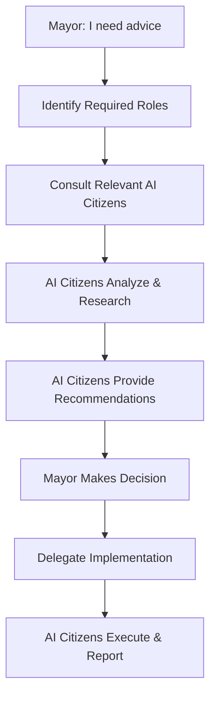

# AI Roles System: Your Digital City Council

## Overview: The Mayor's Council of AI Advisors

In the City App Framework, **specialized AI roles** act as your expert council - each with deep domain expertise to advise and implement specific aspects of your digital city. Just like a real mayor has a cabinet of specialists (city planner, chief engineer, police chief, etc.), you have AI citizens who fill specialized roles and work together under your governance.

## The City Council Structure

### 🏛️ **The Mayor's Cabinet**
```
                    👨‍💼 MAYOR (Developer)
                           |
    ┌──────────────────────┼──────────────────────┐
    |                      |                      |
🏗️ PLANNING DEPT     🔧 ENGINEERING DEPT    🛡️ OPERATIONS DEPT
├─ City Planner      ├─ Lead Architect      ├─ Security Chief
├─ UX Designer       ├─ Frontend Engineer   ├─ DevOps Engineer  
└─ Product Manager   ├─ Backend Engineer    ├─ QA Director
                     ├─ Database Architect  ├─ Performance Analyst
                     └─ API Designer        └─ Audit Director
```

## AI Role Definitions

### 🏗️ **Planning Department**

#### **City Planner** 
- **Primary Role**: Strategic planning and feature roadmapping
- **Expertise**: Business analysis, user research, competitive analysis
- **Responsibilities**:
  - Analyze requirements and create feature specifications
  - Research industry best practices and patterns
  - Plan development phases and milestones  
  - Identify potential risks and constraints
  - Recommend technology choices

```typescript
/**
 * @ai-role: City Planner
 * @specialization: Strategic planning, requirements analysis
 */
interface CityPlannerRole {
  analyzeBusiness(requirements: BusinessRequirements): FeatureSpecification[];
  researchCompetitors(domain: string): CompetitiveAnalysis;
  planRoadmap(features: Feature[], constraints: Constraint[]): DevelopmentRoadmap;
  assessRisks(plan: ProjectPlan): RiskAssessment;
  recommendTechStack(requirements: Requirements): TechStackRecommendation;
}

// Example interaction
const cityPlanner = new CityPlannerRole();

// Mayor asks for advice
await cityPlanner.askMayor({
  question: "I want to add social features to our fitness app. What should we consider?",
  context: "Users are asking for ways to share workouts and challenge friends",
  constraints: ["Limited development time", "Privacy concerns", "Mobile-first"]
});

// City Planner responds with comprehensive analysis
const socialFeaturesAnalysis = {
  recommendations: [
    "Start with basic workout sharing to gauge user interest",
    "Implement privacy controls from day one", 
    "Consider gamification with challenges and leaderboards"
  ],
  implementation_phases: [
    "Phase 1: Basic sharing and privacy controls",
    "Phase 2: Friend connections and private challenges",
    "Phase 3: Public leaderboards and community features"
  ],
  risk_mitigation: [
    "Privacy: Implement granular sharing controls",
    "Moderation: Plan for content moderation tools",
    "Performance: Optimize social queries for mobile"
  ],
  tech_requirements: [
    "Social database schema design",
    "Real-time notification system", 
    "Content moderation APIs",
    "Privacy compliance features"
  ]
};
```

#### **UX Designer**
- **Primary Role**: User experience and interface design
- **Expertise**: UI/UX patterns, accessibility, mobile design
- **Responsibilities**:
  - Design user flows and wireframes
  - Ensure accessibility compliance
  - Optimize for mobile-first experiences
  - Create design system guidelines

```typescript
/**
 * @ai-role: UX Designer  
 * @specialization: User experience, interface design, accessibility
 */
interface UXDesignerRole {
  designUserFlow(feature: Feature, personas: UserPersona[]): UserFlow;
  createWireframes(flow: UserFlow): Wireframe[];
  auditAccessibility(component: Component): AccessibilityAudit;
  optimizeForMobile(design: Design): MobileOptimization;
  buildDesignSystem(brand: BrandGuidelines): DesignSystem;
}

// Mayor consultation  
await uxDesigner.askMayor({
  question: "Users find our workout logging process too slow. How can we streamline it?",
  current_flow: "Navigate → Select workout → Add exercises → Enter sets/reps → Save",
  user_feedback: "Takes too long to log simple workouts at the gym"
});

// UX Designer's comprehensive response
const uxImprovement = {
  flow_analysis: {
    current_steps: 8,
    target_steps: 3,
    pain_points: ["Too many taps", "No quick templates", "Hard to use with sweaty hands"]
  },
  proposed_solutions: [
    "Quick-add buttons for common exercises",
    "Workout templates (Push day, Pull day, Legs)", 
    "Voice input for hands-free logging",
    "Smart suggestions based on history"
  ],
  wireframes: [
    "Quick log overlay with common exercises",
    "Template selection with one-tap logging",
    "Voice recording interface with confirmation"
  ],
  accessibility_considerations: [
    "Large touch targets for gym use",
    "High contrast for bright environments", 
    "Voice feedback for screen reader users"
  ]
};
```

#### **Product Manager**
- **Primary Role**: Feature prioritization and stakeholder coordination
- **Expertise**: Product strategy, user feedback analysis, market research
- **Responsibilities**:
  - Prioritize features based on user value
  - Analyze user feedback and usage data
  - Coordinate between different AI roles
  - Manage scope and timeline expectations

### 🔧 **Engineering Department**

#### **Lead Architect**
- **Primary Role**: System architecture and technical leadership
- **Expertise**: Software architecture, scalability, integration patterns
- **Responsibilities**:
  - Design system architecture and data flow
  - Ensure code quality and consistency
  - Plan for scalability and performance
  - Coordinate technical decisions across roles

```typescript
/**
 * @ai-role: Lead Architect
 * @specialization: System architecture, technical leadership, scalability
 */
interface LeadArchitectRole {
  designArchitecture(requirements: TechnicalRequirements): SystemArchitecture;
  reviewCodeQuality(codebase: Codebase): QualityAssessment; 
  planScalability(currentLoad: LoadMetrics, growth: GrowthProjection): ScalabilityPlan;
  integrateServices(services: ExternalService[]): IntegrationStrategy;
  establishStandards(team: DevelopmentTeam): CodingStandards;
}

// Mayor seeks technical guidance
await leadArchitect.askMayor({
  question: "We're expecting 10x user growth. How should we prepare our architecture?",
  current_metrics: "500 DAU, 50 req/min, 2GB database",
  projected_growth: "5000 DAU in 6 months",
  budget_constraints: "Limited infrastructure budget"
});

// Lead Architect's strategic response
const scalabilityPlan = {
  current_assessment: {
    bottlenecks: ["Single database instance", "No caching layer", "Monolithic API"],
    capacity: "Current setup can handle ~1000 DAU before issues"
  },
  scaling_strategy: [
    "Phase 1: Add Redis caching for frequently accessed data",
    "Phase 2: Database read replicas for query optimization",
    "Phase 3: Microservices for high-traffic features (auth, workouts)",
    "Phase 4: CDN for static assets and API responses"
  ],
  implementation_priority: [
    "HIGH: Redis caching (quick win, low cost)",
    "MEDIUM: Database optimization (moderate complexity)",
    "LOW: Microservices (high complexity, plan for future)"
  ],
  monitoring_requirements: [
    "Performance monitoring dashboard",
    "Database query analysis",
    "User behavior tracking for capacity planning"
  ]
};
```

#### **Frontend Engineer**
- **Primary Role**: User interface implementation
- **Expertise**: React, state management, responsive design, performance
- **Responsibilities**:
  - Implement UI components and features
  - Optimize for performance and accessibility  
  - Integrate with backend APIs
  - Maintain component library and stories

#### **Backend Engineer** 
- **Primary Role**: Server-side implementation
- **Expertise**: APIs, databases, authentication, integrations
- **Responsibilities**:
  - Build REST/GraphQL APIs
  - Design database schemas
  - Implement authentication and authorization
  - Integrate with third-party services

#### **Database Architect**
- **Primary Role**: Data modeling and optimization
- **Expertise**: Database design, query optimization, data migrations
- **Responsibilities**:
  - Design efficient database schemas
  - Optimize queries for performance
  - Plan data migrations and backups
  - Ensure data integrity and security

### 🛡️ **Operations Department**

#### **Security Chief**
- **Primary Role**: Application security and compliance  
- **Expertise**: Security best practices, compliance (GDPR, HIPAA), threat assessment
- **Responsibilities**:
  - Audit code for security vulnerabilities
  - Implement authentication and authorization
  - Ensure compliance with regulations
  - Plan security testing and monitoring

```typescript
/**
 * @ai-role: Security Chief
 * @specialization: Application security, compliance, threat assessment
 */
interface SecurityChiefRole {
  auditSecurity(codebase: Codebase): SecurityAudit;
  assessThreats(application: Application): ThreatAssessment;
  ensureCompliance(requirements: ComplianceRequirements): CompliancePlan;
  implementAuth(userTypes: UserType[]): AuthenticationStrategy;
  monitorSecurity(metrics: SecurityMetrics): SecurityReport;
}

// Mayor requests security consultation
await securityChief.askMayor({
  question: "We're adding payment processing. What security measures do we need?",
  context: "Premium subscriptions for advanced fitness plans",
  compliance_needs: ["PCI DSS", "GDPR for EU users"],
  user_data: "Personal info, payment details, health data"
});

// Security Chief's comprehensive security plan
const paymentSecurityPlan = {
  threat_analysis: [
    "HIGH: Payment card data exposure",
    "MEDIUM: Account takeover attacks", 
    "MEDIUM: Man-in-the-middle attacks",
    "LOW: SQL injection via payment forms"
  ],
  security_requirements: [
    "PCI DSS Level 1 compliance for card processing",
    "End-to-end encryption for sensitive data",
    "Multi-factor authentication for admin accounts",
    "Regular security audits and penetration testing"
  ],
  implementation_strategy: [
    "Use Stripe/PayPal for PCI compliance (don't handle cards directly)",
    "Implement proper session management and CSRF protection",
    "Add rate limiting to prevent brute force attacks",
    "Set up security monitoring and alerting"
  ],
  compliance_checklist: [
    "GDPR: Explicit consent for payment processing",
    "PCI DSS: Secure card data transmission",
    "CCPA: Data deletion procedures for CA users",
    "HIPAA: Health data encryption (if applicable)"
  ]
};
```

#### **DevOps Engineer**
- **Primary Role**: Deployment, infrastructure, and automation
- **Expertise**: CI/CD, cloud platforms, monitoring, automation
- **Responsibilities**:
  - Set up deployment pipelines
  - Configure hosting and infrastructure
  - Implement monitoring and alerting
  - Automate testing and quality gates

#### **QA Director**
- **Primary Role**: Quality assurance and testing strategy
- **Expertise**: Test automation, quality metrics, bug prevention  
- **Responsibilities**:
  - Design comprehensive testing strategies
  - Implement automated testing pipelines
  - Monitor quality metrics and coverage
  - Coordinate testing across all roles

#### **Performance Analyst**
- **Primary Role**: Application performance optimization
- **Expertise**: Performance monitoring, optimization, scalability
- **Responsibilities**:
  - Monitor performance metrics  
  - Identify and fix performance bottlenecks
  - Plan for traffic scaling
  - Optimize user experience metrics

#### **Audit Director**
- **Primary Role**: Comprehensive application health monitoring and reporting
- **Expertise**: Performance auditing, test coverage analysis, web vitals, accessibility compliance
- **Responsibilities**:
  - Run automated audit suites using Lighthouse, Rollup analysis, and Web Vitals
  - Generate comprehensive health reports covering performance, accessibility, SEO, and best practices
  - Monitor test coverage across unit, integration, and E2E tests
  - Track bundle size optimization and dependency health
  - Provide actionable recommendations for improving app health scores
  - Schedule regular audits and trend analysis over time
  - Integrate audit results into CI/CD pipelines for quality gates

```typescript
/**
 * @ai-role: Audit Director
 * @specialization: Application health monitoring, performance auditing
 */
interface AuditDirectorRole {
  runLighthouseAudit(url: string): LighthouseReport;
  analyzeBundleSize(buildOutput: string): BundleSizeReport;
  checkWebVitals(pages: string[]): WebVitalsReport;
  generateCoverageReport(testResults: TestResults): CoverageReport;
  createHealthDashboard(auditResults: AuditResult[]): HealthDashboard;
  recommendOptimizations(reports: AuditReport[]): OptimizationPlan;
  scheduleAudits(frequency: AuditFrequency): AuditSchedule;
}

// Example audit suite configuration
const auditSuite = {
  lighthouse: {
    categories: ['performance', 'accessibility', 'best-practices', 'seo'],
    devices: ['mobile', 'desktop'],
    throttling: '4G'
  },
  webVitals: ['LCP', 'FID', 'CLS', 'TTFB', 'INP'],
  coverage: {
    thresholds: { statements: 80, branches: 75, functions: 80, lines: 80 }
  },
  bundleSize: {
    maxSize: '250kb',
    warnings: { js: '200kb', css: '50kb' }
  }
};
```

## Role Interaction Patterns

### **Consultation Workflow**


### **Multi-Role Collaboration**
```typescript
// Example: Adding a new feature requires multiple roles
const addSocialFeatures = async () => {
  // 1. City Planner analyzes requirements
  const featureSpec = await cityPlanner.analyzeFeatureRequest({
    request: "Add social sharing for workouts",
    constraints: ["Mobile-first", "Privacy-focused", "Quick development"]
  });
  
  // 2. UX Designer creates user experience
  const userFlow = await uxDesigner.designFeature({
    specification: featureSpec,
    designPrinciples: ["Minimal friction", "Privacy by default"]
  });
  
  // 3. Lead Architect plans technical approach  
  const techPlan = await leadArchitect.planImplementation({
    feature: featureSpec,
    userFlow: userFlow,
    constraints: ["Existing database", "Current API structure"]
  });
  
  // 4. Security Chief reviews security implications
  const securityReview = await securityChief.assessSecurity({
    feature: featureSpec,
    techPlan: techPlan,
    dataFlow: userFlow.dataRequirements
  });
  
  // 5. Mayor reviews and approves
  const mayorDecision = await mayor.review({
    recommendations: [featureSpec, userFlow, techPlan, securityReview],
    timeline: "2 weeks",
    priority: "HIGH"
  });
  
  // 6. Implementation team executes
  if (mayorDecision.approved) {
    await Promise.all([
      backendEngineer.buildAPI(techPlan.apiRequirements),
      frontendEngineer.buildUI(userFlow.components),
      qaDirector.createTests(featureSpec.testRequirements)
    ]);
  }
};
```

## Role Assignment & Delegation

### **Dynamic Role Assignment**
```typescript
class RoleManager {
  // Automatically assign roles based on task type
  assignRoles(task: DevelopmentTask): AIRole[] {
    const taskType = this.classifyTask(task);
    
    switch (taskType) {
      case 'new-feature':
        return [
          this.roles.cityPlanner,      // Requirements analysis
          this.roles.uxDesigner,       // User experience design
          this.roles.leadArchitect,    // Technical planning
          this.roles.frontendEngineer, // UI implementation
          this.roles.backendEngineer,  // API implementation
          this.roles.qaDirector        // Testing strategy
        ];
        
      case 'performance-issue':
        return [
          this.roles.performanceAnalyst, // Issue analysis
          this.roles.leadArchitect,      // Solution architecture
          this.roles.devopsEngineer      // Infrastructure optimization
        ];
        
      case 'security-concern':
        return [
          this.roles.securityChief,     // Security assessment
          this.roles.backendEngineer,   // Security implementation
          this.roles.qaDirector         // Security testing
        ];
        
      case 'bug-fix':
        return [
          this.roles.qaDirector,        // Bug analysis
          this.roles.frontendEngineer,  // Frontend fixes
          this.roles.backendEngineer    // Backend fixes
        ];
    }
  }
  
  // Route questions to appropriate roles
  routeQuestion(question: MayorQuestion): AIRole[] {
    const keywords = this.extractKeywords(question);
    const relevantRoles = this.matchRolesToKeywords(keywords);
    return relevantRoles;
  }
}
```

### **Role-Specific Communication**
```typescript
interface RoleChat {
  role: AIRole;
  askQuestion(question: string, context?: any): Promise<RoleResponse>;
  requestImplementation(task: Task): Promise<ImplementationPlan>;
  seekApproval(proposal: Proposal): Promise<MayorDecision>;
  reportProgress(update: ProgressUpdate): Promise<void>;
}

// Each role has specialized communication patterns
const securityChief = {
  async askQuestion(question: string) {
    return {
      security_assessment: "...",
      threat_analysis: "...", 
      mitigation_strategies: "...",
      compliance_impact: "...",
      recommendations: "..."
    };
  }
};

const uxDesigner = {
  async askQuestion(question: string) {
    return {
      user_impact_analysis: "...",
      design_recommendations: "...",
      wireframes: "...",
      accessibility_considerations: "...",
      usability_concerns: "..."
    };
  }
};
```

## CLI Integration

### **Role Selection During Setup**
```bash
? Which AI citizens would you like in your city council?

Planning Department:
  ☑ City Planner (Strategic planning, requirements)
  ☑ UX Designer (User experience, interface design)
  ☐ Product Manager (Feature prioritization, stakeholder management)

Engineering Department:  
  ☑ Lead Architect (System architecture, technical leadership)
  ☑ Frontend Engineer (UI implementation, React components)
  ☑ Backend Engineer (API development, database design)
  ☐ Database Architect (Data modeling, query optimization)

Operations Department:
  ☑ Security Chief (Application security, compliance)
  ☑ DevOps Engineer (Deployment, infrastructure, monitoring)
  ☑ QA Director (Testing strategy, quality assurance)
  ☐ Performance Analyst (Performance optimization, scaling)

? Would you like specialized roles for your domain? (Fitness/Health)
  ☑ Fitness Domain Expert (Workout science, nutrition knowledge)
  ☑ Health Data Specialist (HIPAA compliance, medical data handling)
  ☐ Gamification Specialist (User engagement, motivation systems)
```

### **Role-Based Workflows**
```bash
# Mayor can consult specific roles
npm run city:consult -- --role="security-chief" --question="How secure is our user authentication?"

# Or start a multi-role discussion  
npm run city:planning-session -- --topic="social-features" --roles="city-planner,ux-designer,security-chief"

# Delegate specific tasks to roles
npm run city:delegate -- --role="frontend-engineer" --task="implement-workout-sharing-ui"

# Get status updates from all roles
npm run city:status -- --format="dashboard"
```

## Benefits of the Role System

### **For Solo Developers**
1. **Expert Consultation**: Get specialized advice without hiring experts
2. **Comprehensive Coverage**: No blind spots in development process  
3. **Coordinated Execution**: Roles work together seamlessly
4. **Learning Opportunity**: Learn best practices from each domain expert
5. **Quality Assurance**: Multiple perspectives catch issues early

### **For AI Agents**  
1. **Clear Specialization**: Each agent has focused expertise and responsibility
2. **Reduced Complexity**: Narrower scope means better performance
3. **Collaborative Intelligence**: Multiple agents contribute different perspectives
4. **Quality Through Diversity**: Different viewpoints improve decision quality
5. **Efficient Resource Use**: Right expert for each task

## Conclusion

The AI Roles System transforms the City App Framework from a single AI assistant into a **complete expert development team**. Each role brings specialized knowledge and perspective, while the Mayor (developer) maintains control over decisions and priorities.

This system scales from simple consultation ("What do you think about this feature?") to complex multi-role collaboration ("Plan, design, and implement this major feature"). The result is **enterprise-level expertise and execution capability for solo developers**, delivered through AI citizens who are experts in their domains and committed to building your perfect digital city. 🏛️👥✨