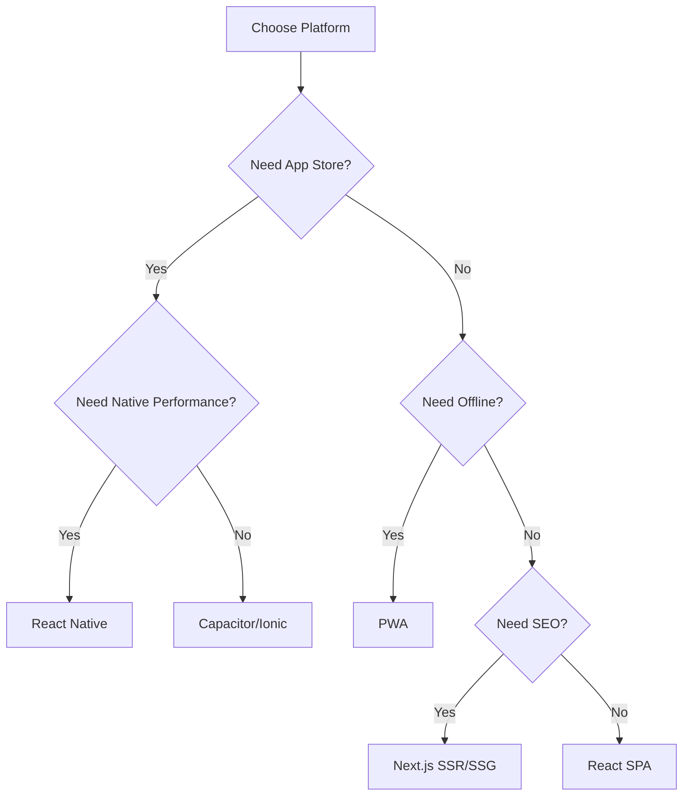

# Platform Support Specification

## Overview
The City App Framework supports Web, Native, and Hybrid platforms with a unified codebase approach. This document outlines the requirements, considerations, and implementation strategies for each platform.

## Platform Matrix

| Platform | Technology | Rendering | Performance | Offline | App Store |
|----------|------------|-----------|-------------|---------|-----------|
| Web SPA | React | CSR | Good | Limited | No |
| Web SSR | Next.js | SSR | Excellent | Limited | No |
| Web SSG | Next.js | SSG | Excellent | Good | No |
| PWA | React + SW | CSR | Good | Excellent | Partial |
| Native iOS | React Native | Native | Excellent | Excellent | Yes |
| Native Android | React Native | Native | Excellent | Excellent | Yes |
| Hybrid | Capacitor/Ionic | WebView | Good | Good | Yes |
| Desktop | Electron/Tauri | Web/Native | Good | Excellent | Yes |

## Web Platform

### Single Page Application (SPA)
```javascript
// Configuration
{
  platform: 'web',
  type: 'spa',
  framework: 'react',
  bundler: 'vite',
  routing: 'react-router-dom',
  deployment: ['vercel', 'netlify', 'aws-s3']
}
```

### Server-Side Rendering (SSR)
```javascript
{
  platform: 'web',
  type: 'ssr',
  framework: 'next',
  features: ['api-routes', 'middleware', 'streaming'],
  deployment: ['vercel', 'aws-lambda', 'docker']
}
```

### Static Site Generation (SSG)
```javascript
{
  platform: 'web',
  type: 'ssg',
  framework: 'next',
  features: ['incremental-regeneration', 'preview-mode'],
  deployment: ['vercel', 'netlify', 'github-pages']
}
```

### Progressive Web App (PWA)
```javascript
{
  platform: 'web',
  type: 'pwa',
  framework: 'react',
  features: ['service-worker', 'offline-first', 'push-notifications'],
  manifest: true,
  workbox: true
}
```

## Native Platform

### React Native Architecture
```
native-app/
├── index.js                 # Entry point
├── App.tsx                  # Root component
├── src/
│   ├── components/         # Shared components
│   │   ├── common/        # Cross-platform
│   │   ├── ios/          # iOS specific
│   │   └── android/      # Android specific
│   ├── navigation/        # React Navigation
│   ├── screens/          # Screen components
│   ├── services/         # Native modules
│   ├── audits/           # Commission on Audits (Performance monitoring)
│   │   ├── performance/  # App performance metrics
│   │   ├── memory/       # Memory usage tracking
│   │   ├── battery/      # Battery optimization reports
│   │   └── reports/      # Platform-specific audit reports
│   └── utils/            # Platform utilities
├── ios/                   # iOS project files
├── android/              # Android project files
└── .ai/
    └── native-context.md  # Native-specific AI context
```

### Native Features Support
- **Camera & Gallery**: react-native-camera, react-native-image-picker
- **Storage**: AsyncStorage, react-native-fs
- **Notifications**: react-native-push-notification
- **Geolocation**: react-native-geolocation
- **Biometrics**: react-native-touch-id, react-native-fingerprint
- **Payments**: react-native-payments, stripe-react-native
- **Maps**: react-native-maps
- **Sensors**: react-native-sensors

### Platform-Specific Code
```javascript
// Platform detection
import { Platform } from 'react-native';

const styles = StyleSheet.create({
  container: {
    paddingTop: Platform.select({
      ios: 20,
      android: 0,
      web: 10
    })
  }
});

// Platform-specific components
const Button = Platform.select({
  ios: () => require('./ButtonIOS'),
  android: () => require('./ButtonAndroid'),
  default: () => require('./ButtonWeb'),
})();
```

## Hybrid Platform

### Capacitor Configuration
```javascript
{
  platform: 'hybrid',
  type: 'capacitor',
  framework: 'react',
  plugins: [
    '@capacitor/app',
    '@capacitor/camera',
    '@capacitor/filesystem',
    '@capacitor/geolocation',
    '@capacitor/push-notifications'
  ],
  platforms: ['ios', 'android', 'web']
}
```

### Ionic React Integration
```javascript
{
  platform: 'hybrid',
  type: 'ionic',
  framework: 'react',
  ui: 'ionic-components',
  routing: 'ionic-routing',
  native: 'capacitor'
}
```

### Bridge Pattern for Native Features
```javascript
// Universal API interface
interface CameraAPI {
  takePicture(): Promise<string>;
  pickFromGallery(): Promise<string>;
}

// Web implementation
class WebCamera implements CameraAPI {
  async takePicture() {
    // Use WebRTC getUserMedia
  }
}

// Native implementation
class NativeCamera implements CameraAPI {
  async takePicture() {
    // Use Capacitor Camera plugin
  }
}

// Factory pattern
const Camera = PlatformFactory.create<CameraAPI>('camera');
```

## Code Sharing Strategy

### Shared Code Structure
```
src/
├── core/              # 100% shared
│   ├── models/       # Data models
│   ├── utils/        # Pure functions
│   └── constants/    # App constants
├── features/         # 90% shared
│   ├── auth/        # Authentication logic
│   ├── user/        # User management
│   └── data/        # Data management
├── ui/              # 70% shared
│   ├── components/  # UI components
│   ├── styles/      # Style system
│   └── themes/      # Theme definitions
└── platform/        # 0% shared
    ├── web/        # Web specific
    ├── native/     # Native specific
    └── hybrid/     # Hybrid specific
```

### Platform Abstraction Layer
```typescript
// Abstract platform service
abstract class PlatformService {
  abstract getName(): string;
  abstract getVersion(): string;
  abstract hasFeature(feature: string): boolean;
  abstract requestPermission(permission: string): Promise<boolean>;
}

// Implementations
class WebPlatform extends PlatformService { }
class NativePlatform extends PlatformService { }
class HybridPlatform extends PlatformService { }
```

## AI Considerations for Platforms

### Platform-Specific AI Context
```markdown
# .ai/platform-context.md

## Current Platform: [web|native|hybrid]

### Platform Constraints
- Performance budget: [metrics]
- Bundle size limit: [size]
- API limitations: [list]
- UI conventions: [platform-specific]

### Platform Features
- Available APIs: [list]
- Native modules: [if applicable]
- Browser support: [if web]
- OS versions: [if native]

### AI Instructions
- Use platform-specific components when available
- Optimize for platform performance characteristics
- Follow platform UI/UX guidelines
- Handle platform-specific edge cases
```

### AI Platform Detection
```javascript
/**
 * @ai-context
 * Platform: ${detectPlatform()}
 * Capabilities: ${getPlatformCapabilities()}
 * Constraints: ${getPlatformConstraints()}
 * 
 * AI-Instructions:
 * - Generate platform-optimized code
 * - Use appropriate styling solution
 * - Include platform-specific error handling
 */
```

## Platform Migration Paths

### Web to Native
1. Identify web-specific dependencies
2. Replace with React Native equivalents
3. Adapt styling to StyleSheet
4. Implement native navigation
5. Add platform-specific features

### Native to Web
1. Replace React Native components with React DOM
2. Convert StyleSheet to CSS/styled-components
3. Implement web routing
4. Add web-specific optimizations
5. Configure bundler for web

### Monorepo Structure (Advanced)
```
city-app-monorepo/
├── packages/
│   ├── core/          # Shared business logic
│   ├── ui-web/        # Web components
│   ├── ui-native/     # Native components
│   └── ui-shared/     # Shared components
├── apps/
│   ├── web/          # Web application
│   ├── mobile/       # Native application
│   └── desktop/      # Desktop application
└── .ai/
    └── monorepo-context.md
```

## Platform Testing Strategy

### Web Testing
- Unit: Jest + React Testing Library
- Integration: Cypress/Playwright
- Visual: Storybook + Chromatic
- Performance: Lighthouse CI

### Native Testing
- Unit: Jest + React Native Testing Library
- Integration: Detox
- Device: AWS Device Farm / BrowserStack
- Performance: Flipper

### Hybrid Testing
- Unit: Jest
- Integration: Appium
- Cross-platform: Selenium Grid
- Real device: Cloud testing services

## Deployment Strategies

### Web Deployment
```yaml
# .ai/deploy/web.yaml
platforms:
  - vercel:
      framework: nextjs
      regions: ['us-east-1', 'eu-west-1']
  - netlify:
      framework: react
      plugins: ['lighthouse', 'sitemap']
  - aws:
      service: amplify
      environment: production
```

### Native Deployment
```yaml
# .ai/deploy/native.yaml
platforms:
  - ios:
      store: app-store
      testflight: true
      certificates: automatic
  - android:
      store: google-play
      tracks: ['internal', 'beta', 'production']
      signing: gradle
```

### Hybrid Deployment
```yaml
# .ai/deploy/hybrid.yaml
platforms:
  - capacitor:
      web: netlify
      ios: app-store
      android: google-play
  - electron:
      targets: ['mac', 'windows', 'linux']
      auto-update: true
```

## Platform Decision Tree



## Conclusion
The City App Framework's platform support enables developers to target any platform from a single codebase while maintaining platform-specific optimizations. The AI-first approach ensures that platform considerations are automatically handled during development, reducing the complexity of multi-platform development.