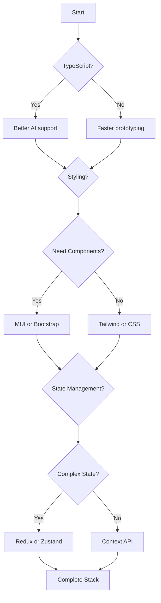

# Technology Stack Options

## Overview
This document defines all technology choices available in the City App Framework. Each option is evaluated for AI compatibility, developer experience, and platform support.

## Core Technologies

### Language Options

#### JavaScript (Default)
```javascript
{
  language: 'javascript',
  version: 'ES2022+',
  pros: [
    'No compilation step',
    'Faster initial development',
    'Lower barrier to entry',
    'Smaller toolchain'
  ],
  cons: [
    'No type safety',
    'More runtime errors',
    'Less IDE support',
    'Harder for AI to validate'
  ],
  aiContext: 'Flexible but requires more runtime validation'
}
```

#### TypeScript (Recommended)
```javascript
{
  language: 'typescript',
  version: '5.0+',
  config: 'strict',
  pros: [
    'Type safety',
    'Better IDE support',
    'Self-documenting code',
    'AI agents work better with types'
  ],
  cons: [
    'Compilation required',
    'Learning curve',
    'More verbose'
  ],
  aiContext: 'Provides strong guarantees for AI-generated code'
}
```

### UI Framework

#### React (Core)
```javascript
{
  framework: 'react',
  version: '18+',
  features: [
    'Server Components',
    'Suspense',
    'Concurrent Features',
    'Hooks'
  ],
  aiOptimized: true
}
```

## Styling Options

### 1. Tailwind CSS (Recommended for AI)
```javascript
{
  styling: 'tailwind',
  version: '3.0+',
  config: {
    content: ['./src/**/*.{js,jsx,ts,tsx}'],
    theme: {
      extend: {
        colors: { /* city theme colors */ },
        spacing: { /* city spacing system */ }
      }
    }
  },
  pros: [
    'Utility-first',
    'No context switching',
    'Excellent AI generation',
    'Built-in responsive',
    'Small bundle size'
  ],
  cons: [
    'HTML can get verbose',
    'Learning curve for classes'
  ],
  aiContext: 'AI excels at generating Tailwind classes'
}
```

### 2. Bootstrap
```javascript
{
  styling: 'bootstrap',
  version: '5.3+',
  implementation: 'react-bootstrap',
  pros: [
    'Component library included',
    'Well-documented',
    'Consistent design',
    'Quick prototyping'
  ],
  cons: [
    'Generic look',
    'Larger bundle',
    'Customization complexity',
    'Bootstrap-specific markup'
  ],
  aiContext: 'Good for rapid prototyping with AI'
}
```

### 3. Material-UI (MUI)
```javascript
{
  styling: 'mui',
  version: '5.0+',
  theme: 'custom',
  pros: [
    'Complete component library',
    'Material Design principles',
    'Excellent theming',
    'Built-in accessibility'
  ],
  cons: [
    'Large bundle size',
    'Opinionated design',
    'Complex customization',
    'Performance overhead'
  ],
  aiContext: 'AI can leverage pre-built components'
}
```

### 4. CSS Modules + SASS
```javascript
{
  styling: 'css-modules',
  preprocessor: 'sass',
  pros: [
    'Component scoping',
    'SASS features',
    'No runtime overhead',
    'Traditional CSS'
  ],
  cons: [
    'More files to manage',
    'No utility classes',
    'Manual responsive design'
  ],
  aiContext: 'Requires AI to manage multiple files'
}
```

### Styling Comparison Matrix

| Feature | Tailwind | Bootstrap | MUI | CSS/SASS |
|---------|----------|-----------|-----|----------|
| AI Generation | Excellent | Good | Good | Fair |
| Bundle Size | Small | Medium | Large | Small |
| Customization | Easy | Medium | Complex | Full |
| Learning Curve | Medium | Low | High | Low |
| Component Library | No | Yes | Yes | No |
| Design System | Manual | Built-in | Built-in | Manual |

## Routing Options

### Web Routing

#### 1. React Router (SPA)
```javascript
{
  routing: 'react-router-dom',
  version: '6+',
  features: [
    'Nested routing',
    'Data loading',
    'Code splitting',
    'Type safe'
  ],
  use: 'Single Page Applications'
}
```

#### 2. Next.js App Router
```javascript
{
  routing: 'next-app-router',
  version: '14+',
  features: [
    'File-based routing',
    'Server Components',
    'Layouts',
    'Parallel routes'
  ],
  use: 'Full-stack applications'
}
```

#### 3. Next.js Pages Router
```javascript
{
  routing: 'next-pages-router',
  version: '14+',
  features: [
    'File-based routing',
    'API routes',
    'SSR/SSG',
    'Stable API'
  ],
  use: 'Traditional Next.js apps'
}
```

### Backend Routing

#### Express.js
```javascript
{
  routing: 'express',
  version: '4.18+',
  features: [
    'Middleware',
    'RESTful APIs',
    'WebSocket support',
    'Extensive ecosystem'
  ],
  use: 'API servers'
}
```

## State Management Options

### 1. Context API (Built-in)
```javascript
{
  state: 'context',
  complexity: 'simple',
  pros: [
    'No dependencies',
    'React built-in',
    'Simple API',
    'Good for small-medium apps'
  ],
  cons: [
    'Re-render issues',
    'No DevTools',
    'Boilerplate for complex state'
  ],
  aiContext: 'AI easily understands Context patterns'
}
```

### 2. Redux Toolkit
```javascript
{
  state: 'redux',
  version: '@reduxjs/toolkit',
  pros: [
    'Predictable state',
    'DevTools',
    'Time travel',
    'Large ecosystem'
  ],
  cons: [
    'Learning curve',
    'Boilerplate',
    'Complexity for simple apps'
  ],
  aiContext: 'Well-documented patterns for AI'
}
```

### 3. Zustand
```javascript
{
  state: 'zustand',
  version: '4+',
  pros: [
    'Simple API',
    'TypeScript first',
    'No providers',
    'Small bundle'
  ],
  cons: [
    'Less ecosystem',
    'Fewer patterns',
    'Less documentation'
  ],
  aiContext: 'Clean API for AI generation'
}
```

### 4. Hybrid Approach
```javascript
{
  state: 'hybrid',
  combination: [
    'context: UI state, theme, user',
    'zustand: global app state',
    'localStorage: persistence',
    'sessionStorage: temporary data'
  ],
  aiContext: 'AI selects appropriate solution per use case'
}
```

### Storage Options

#### localStorage
```javascript
{
  storage: 'localStorage',
  use: [
    'User preferences',
    'Theme settings',
    'Feature flags',
    'Non-sensitive data'
  ],
  limit: '5-10MB',
  persistence: 'Permanent'
}
```

#### sessionStorage
```javascript
{
  storage: 'sessionStorage',
  use: [
    'Form data',
    'Temporary state',
    'Navigation state',
    'Session-specific data'
  ],
  limit: '5-10MB',
  persistence: 'Session only'
}
```

## Build Tools

### Vite (Recommended)
```javascript
{
  bundler: 'vite',
  pros: [
    'Fast HMR',
    'ESM native',
    'Zero config',
    'Optimized builds'
  ],
  use: 'Modern web apps'
}
```

### Webpack
```javascript
{
  bundler: 'webpack',
  pros: [
    'Mature ecosystem',
    'Maximum flexibility',
    'Plugin system'
  ],
  use: 'Complex configurations'
}
```

### Next.js (Built-in)
```javascript
{
  bundler: 'next',
  pros: [
    'Zero config',
    'Optimized for Next',
    'Turbopack option'
  ],
  use: 'Next.js apps only'
}
```

## Testing Stack

### Unit Testing Frameworks

#### 1. Vitest (Recommended for AI)
```javascript
{
  testing: 'vitest',
  version: '1.0+',
  pros: [
    'Fast HMR for tests',
    'Vite integration',
    'Jest compatible API',
    'ESM native',
    'Excellent AI generation'
  ],
  cons: [
    'Newer ecosystem',
    'Less plugins than Jest'
  ],
  aiContext: 'AI excels at generating Vitest tests with clear expectations'
}
```

#### 2. Jest
```javascript
{
  testing: 'jest',
  version: '29+',
  pros: [
    'Mature ecosystem',
    'Snapshot testing',
    'Mocking utilities',
    'Wide adoption'
  ],
  cons: [
    'Slower than Vitest',
    'ESM complications',
    'Configuration complexity'
  ],
  aiContext: 'Well-documented patterns for AI test generation'
}
```

#### 3. Mocha + Chai
```javascript
{
  testing: 'mocha',
  assertion: 'chai',
  pros: [
    'Flexible test structure',
    'Plugin ecosystem',
    'BDD/TDD support',
    'Custom reporters'
  ],
  cons: [
    'Requires more setup',
    'No built-in assertions',
    'More configuration'
  ],
  aiContext: 'Flexible but requires more AI context for patterns'
}
```

### Testing Libraries

#### React Testing Library (Recommended)
```javascript
{
  library: '@testing-library/react',
  philosophy: 'testing-behavior-not-implementation',
  pros: [
    'User-focused tests',
    'Accessible queries',
    'Encourages best practices',
    'Great AI generation'
  ],
  aiContext: 'AI generates user-centric tests naturally'
}
```

#### Enzyme (Legacy)
```javascript
{
  library: 'enzyme',
  status: 'deprecated',
  use: 'legacy-projects-only',
  recommendation: 'migrate-to-testing-library'
}
```

### E2E Testing Frameworks

#### 1. Playwright (Recommended)
```javascript
{
  e2e: 'playwright',
  version: '1.40+',
  pros: [
    'Multi-browser support',
    'Fast execution',
    'Auto-wait mechanisms',
    'Network interception',
    'Mobile testing',
    'Excellent AI test generation'
  ],
  cons: [
    'Newer ecosystem',
    'Learning curve'
  ],
  browsers: ['chromium', 'firefox', 'webkit'],
  aiContext: 'AI generates robust selectors and flows'
}
```

#### 2. Cypress
```javascript
{
  e2e: 'cypress',
  version: '13+',
  pros: [
    'Developer experience',
    'Real-time debugging',
    'Time travel',
    'Dashboard service'
  ],
  cons: [
    'Chrome-focused',
    'Slower than Playwright',
    'Network limitations'
  ],
  aiContext: 'Good for AI-generated user journey tests'
}
```

#### 3. Selenium WebDriver
```javascript
{
  e2e: 'selenium',
  pros: [
    'Multi-language support',
    'Mature ecosystem',
    'Grid support',
    'Mobile testing'
  ],
  cons: [
    'Complex setup',
    'Flaky tests',
    'Slower execution'
  ],
  use: 'legacy-systems-or-specific-requirements'
}
```

### Snapshot Testing
```javascript
{
  snapshots: {
    enabled: true,
    framework: 'jest', // or vitest
    options: [
      'component-snapshots',
      'visual-regression',
      'serialized-values',
      'html-output'
    ],
    pros: [
      'Catch unintended changes',
      'Fast regression testing',
      'Easy to maintain',
      'Great for AI validation'
    ],
    cons: [
      'Brittle with frequent changes',
      'Large snapshot files',
      'False positives'
    ],
    aiContext: 'AI can generate and update snapshots automatically'
  }
}
```

### Development Process Options

#### 1. Test-Driven Development (TDD)
```javascript
{
  process: 'tdd',
  cycle: ['red', 'green', 'refactor'],
  pros: [
    'Better design',
    'Higher coverage',
    'Fewer bugs',
    'AI writes tests first'
  ],
  cons: [
    'Slower initial development',
    'Learning curve',
    'Over-testing risk'
  ],
  aiContext: 'AI excels at generating failing tests from requirements'
}
```

#### 2. Behavior-Driven Development (BDD)
```javascript
{
  process: 'bdd',
  format: 'given-when-then',
  tools: ['cucumber', 'jest-cucumber'],
  pros: [
    'Business-readable tests',
    'Clear requirements',
    'Stakeholder collaboration',
    'Natural language for AI'
  ],
  cons: [
    'Additional overhead',
    'Tool complexity',
    'Maintenance burden'
  ],
  aiContext: 'AI translates user stories to executable tests'
}
```

#### 3. Component-Driven Development (CDD)
```javascript
{
  process: 'cdd',
  workflow: ['isolate', 'develop', 'compose'],
  tools: ['storybook', 'testing-library'],
  pros: [
    'Reusable components',
    'Isolated testing',
    'Design system alignment',
    'AI component generation'
  ],
  cons: [
    'Requires discipline',
    'Initial setup overhead'
  ],
  aiContext: 'AI builds components in isolation with stories'
}
```

#### 4. Acceptance Test-Driven Development (ATDD)
```javascript
{
  process: 'atdd',
  stakeholders: ['developers', 'testers', 'business'],
  pros: [
    'Shared understanding',
    'Requirements clarity',
    'Reduced rework'
  ],
  cons: [
    'Communication overhead',
    'Meeting requirements'
  ]
}
```

#### 5. Domain-Driven Design (DDD) Testing
```javascript
{
  process: 'ddd-testing',
  focus: ['domain-logic', 'bounded-contexts'],
  pros: [
    'Business-aligned tests',
    'Domain expertise capture',
    'Architecture validation'
  ],
  cons: [
    'Complexity',
    'Domain knowledge required'
  ]
}
```

### Style Guides & Documentation

#### 1. Storybook (Recommended)
```javascript
{
  styleguide: 'storybook',
  version: '7.0+',
  pros: [
    'Component isolation',
    'Interactive documentation',
    'Design system integration',
    'Visual testing',
    'AI story generation'
  ],
  cons: [
    'Bundle size overhead',
    'Maintenance required'
  ],
  addons: [
    'docs',
    'controls',
    'actions',
    'viewport',
    'a11y',
    'design-tokens'
  ],
  aiContext: 'AI generates comprehensive component stories'
}
```

#### 2. React Styleguidist
```javascript
{
  styleguide: 'react-styleguidist',
  pros: [
    'Documentation from PropTypes',
    'Live editing',
    'Smaller than Storybook'
  ],
  cons: [
    'Less ecosystem',
    'Limited features',
    'Maintenance mode'
  ],
  status: 'declining'
}
```

#### 3. Docusaurus
```javascript
{
  styleguide: 'docusaurus',
  version: '3.0+',
  pros: [
    'Full documentation site',
    'MDX support',
    'Versioning',
    'Search',
    'React component playground'
  ],
  cons: [
    'Overkill for simple projects',
    'Not component-focused'
  ],
  use: 'comprehensive-documentation'
}
```

#### 4. Chromatic (Visual Testing)
```javascript
{
  styleguide: 'chromatic',
  integration: 'storybook',
  pros: [
    'Visual regression testing',
    'Review workflows',
    'Cross-browser testing',
    'Automated snapshots'
  ],
  cons: [
    'Paid service',
    'Storybook dependency'
  ]
}
```

### Testing Integration Matrix

| Feature | Vitest | Jest | Mocha | Playwright | Cypress |
|---------|--------|------|-------|------------|---------|
| AI Generation | Excellent | Good | Fair | Excellent | Good |
| Speed | Fast | Medium | Fast | Fast | Slow |
| DX | Excellent | Good | Good | Excellent | Excellent |
| Setup | Easy | Medium | Complex | Easy | Easy |
| Ecosystem | Growing | Mature | Mature | Growing | Mature |

### Testing + Storybook Integration

#### Component Testing in Storybook
```javascript
{
  integration: 'storybook-test-runner',
  capabilities: [
    'smoke-tests-from-stories',
    'accessibility-testing',
    'visual-regression',
    'interaction-testing'
  ],
  benefits: [
    'Single source of truth',
    'Isolated component testing',
    'Visual validation',
    'AI generates tests from stories'
  ]
}
```

#### Playwright + Storybook
```javascript
{
  integration: 'playwright-storybook',
  workflow: [
    'Generate stories (AI)',
    'Run component tests',
    'Visual regression tests',
    'Accessibility audits'
  ],
  aiContext: 'AI creates comprehensive test coverage from component stories'
}
```

### Snapshot Testing Integration

#### Component Snapshots
```javascript
{
  snapshots: {
    component: 'jest-snapshot',
    visual: 'chromatic',
    storybook: 'storybook-addon-snapshot',
    integration: [
      'Unit tests save component output',
      'Storybook saves visual appearance', 
      'E2E saves full page state',
      'AI validates snapshot changes'
    ]
  }
}
```
```

## Package Managers

### npm (Default)
```javascript
{
  packageManager: 'npm',
  lockfile: 'package-lock.json',
  workspaces: true
}
```

### Yarn
```javascript
{
  packageManager: 'yarn',
  version: 'berry',
  lockfile: 'yarn.lock',
  pnp: optional
}
```

### pnpm
```javascript
{
  packageManager: 'pnpm',
  lockfile: 'pnpm-lock.yaml',
  benefits: ['disk space', 'speed']
}
```

## AI Technology Preferences

### Recommended Stack for AI Development
```javascript
{
  language: 'typescript', // Type safety for AI
  ui: 'react',
  styling: 'tailwind', // Utility classes work great with AI
  routing: 'react-router-dom', // or Next.js
  state: 'zustand', // Simple API for AI
  storage: 'hybrid', // localStorage + sessionStorage
  bundler: 'vite',
  testing: 'vitest + playwright',
  packageManager: 'npm' // Most universal
}
```

### AI Context for Tech Choices
```markdown
# .ai/tech-stack.md

## Selected Technologies
- Language: ${language}
- Styling: ${styling}
- State: ${stateManagement}
- Routing: ${routing}

## AI Instructions
- Generate code using selected technologies only
- Follow framework-specific best practices
- Use TypeScript types when available
- Prefer composition over inheritance
- Keep components pure when possible
```

## Decision Flowchart



## Migration Paths

### From JavaScript to TypeScript
1. Rename `.js` to `.ts`/`.tsx`
2. Add type definitions
3. Configure tsconfig.json
4. Fix type errors
5. Add strict mode gradually

### From CSS to Tailwind
1. Install Tailwind
2. Keep existing CSS
3. Gradually convert components
4. Remove unused CSS
5. Optimize bundle

### From Context to Zustand
1. Install Zustand
2. Create stores
3. Migrate context providers
4. Update components
5. Remove old contexts

## Conclusion
The City App Framework provides flexibility in technology choices while maintaining AI-first principles. The recommended stack optimizes for AI agent productivity while ensuring code quality and maintainability.