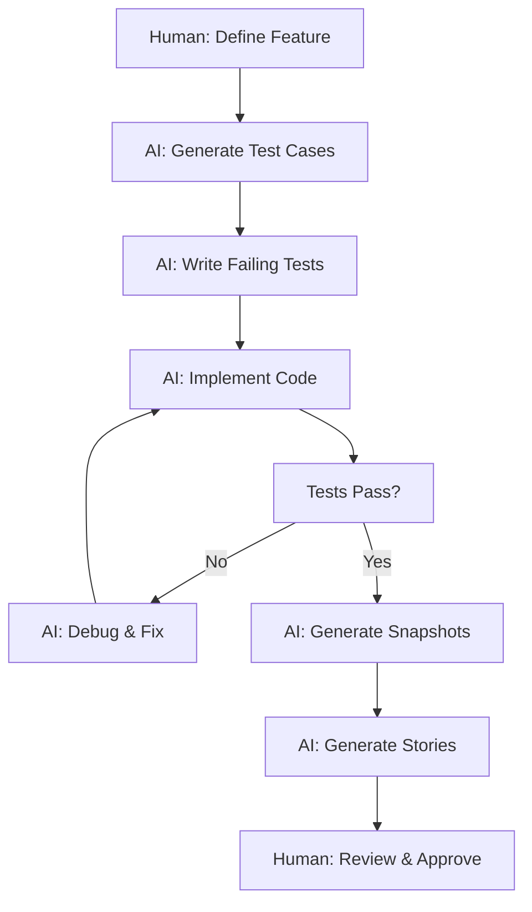

# Testing Strategy for City App Framework

## Overview
Testing is the cornerstone of AI-driven development in the City App Framework. With AI agents generating code rapidly, comprehensive testing ensures quality, catches regressions, and provides confidence in automated development workflows.

## Philosophy: AI-First Testing

### Core Principles
1. **AI Writes Tests First**: TDD approach where AI generates tests from requirements
2. **Multiple Validation Layers**: Unit → Component → Integration → E2E → Visual
3. **Snapshot Everything**: Catch unintended changes automatically
4. **Test-Driven AI Context**: Tests inform AI about expected behavior
5. **Solo Developer Optimized**: Comprehensive coverage without QA teams

## Testing Architecture

### Testing Pyramid for AI Development
```
        🔍 E2E Tests (10%)
       User Journeys & Flows
      
     📸 Visual Tests (15%)  
    Component Snapshots & UI
   
  🧩 Integration Tests (25%)
 API Routes, Hooks, Context
  
🔧 Unit Tests (50%)
Functions, Components, Utils
```

### AI Testing Workflow


## Development Process Options

### 1. Test-Driven Development (TDD) - Recommended for AI

#### AI-Enhanced TDD Cycle
```typescript
/**
 * @ai-context
 * Feature: User Authentication
 * Requirements: Login, logout, session management
 * 
 * AI-Instructions:
 * 1. Generate comprehensive test cases from requirements
 * 2. Write failing tests first
 * 3. Implement minimal code to pass tests
 * 4. Refactor with tests passing
 * 5. Generate component snapshots
 */

// Step 1: AI generates failing test
describe('useAuth hook', () => {
  it('should authenticate user with valid credentials', async () => {
    const { result } = renderHook(() => useAuth());
    
    await act(() => {
      result.current.login('user@example.com', 'password123');
    });
    
    expect(result.current.user).toBeDefined();
    expect(result.current.isAuthenticated).toBe(true);
  });
  
  // AI generates edge cases automatically
  it('should handle network errors gracefully', async () => {
    server.use(
      rest.post('/api/login', (req, res, ctx) => {
        return res.networkError('Network error');
      })
    );
    
    const { result } = renderHook(() => useAuth());
    
    await act(() => {
      result.current.login('user@example.com', 'password123');
    });
    
    expect(result.current.error).toContain('Network error');
    expect(result.current.isAuthenticated).toBe(false);
  });
});

// Step 2: AI implements minimal code
export const useAuth = () => {
  // Implementation that makes tests pass
};
```

#### Benefits for Solo Developers
- **Reduced Cognitive Load**: AI handles test cases and edge cases
- **Quality Assurance**: Built-in regression prevention
- **Documentation**: Tests serve as living documentation
- **Confidence**: Safe refactoring and feature additions

### 2. Behavior-Driven Development (BDD)

#### Natural Language to Tests
```typescript
/**
 * @ai-context
 * User Story: "As a fitness tracker user, I want to log my workouts 
 * so that I can track my progress over time"
 * 
 * AI-Instructions: Convert user story to executable tests
 */

// AI generates from natural language
describe('Workout Logging Feature', () => {
  scenario('User logs a successful workout', () => {
    given('user is logged in', () => {
      loginUser('john@example.com');
    });
    
    when('user starts a new workout', () => {
      navigateToWorkout();
      clickNewWorkout();
    });
    
    and('adds exercises with sets and reps', () => {
      addExercise('Push-ups', { sets: 3, reps: 15 });
      addExercise('Squats', { sets: 3, reps: 20 });
    });
    
    and('completes the workout', () => {
      clickCompleteWorkout();
    });
    
    then('workout is saved to history', () => {
      expect(getWorkoutHistory()).toContain('Today\'s workout');
    });
    
    and('progress is updated', () => {
      expect(getProgressStats().totalWorkouts).toBe(1);
    });
  });
});
```

### 3. Component-Driven Development (CDD)

#### Storybook-First Approach
```typescript
/**
 * @ai-context
 * Component: WorkoutCard
 * Purpose: Display workout summary with actions
 * 
 * AI-Instructions:
 * 1. Generate component stories first
 * 2. Create component tests from stories  
 * 3. Implement component to match stories
 * 4. Generate visual regression tests
 */

// AI generates comprehensive stories
export default {
  title: 'Components/WorkoutCard',
  component: WorkoutCard,
  argTypes: {
    workout: { control: 'object' },
    onEdit: { action: 'edit' },
    onDelete: { action: 'delete' }
  }
} as Meta;

// AI generates realistic test data
export const Default: Story = {
  args: {
    workout: {
      id: '1',
      name: 'Push Day',
      exercises: [
        { name: 'Push-ups', sets: 3, reps: 15 },
        { name: 'Bench Press', sets: 3, reps: 12, weight: '80kg' }
      ],
      duration: 45,
      calories: 320,
      date: '2024-01-15'
    }
  }
};

export const Loading: Story = {
  args: { workout: null, loading: true }
};

export const Empty: Story = {
  args: { workout: { exercises: [] } }
};

// AI generates tests from stories
describe('WorkoutCard', () => {
  it('matches Default story snapshot', () => {
    const component = render(<WorkoutCard {...Default.args} />);
    expect(component).toMatchSnapshot();
  });
  
  it('handles loading state', () => {
    const component = render(<WorkoutCard {...Loading.args} />);
    expect(screen.getByTestId('loading-spinner')).toBeInTheDocument();
  });
});
```

## Testing Framework Integration

### Unit Testing with Vitest (Recommended)

#### AI-Optimized Configuration
```typescript
// vitest.config.ts
export default defineConfig({
  test: {
    globals: true,
    environment: 'jsdom',
    setupFiles: ['./src/test/setup.ts'],
    coverage: {
      provider: 'v8',
      reporter: ['text', 'json', 'html'],
      exclude: [
        'node_modules/',
        'src/test/',
        '**/*.d.ts',
        '**/*.config.*'
      ]
    },
    // AI context for test generation
    reporters: ['default', './src/test/ai-reporter.ts']
  }
});

// AI-aware test utilities
export const aiTestUtils = {
  // Generate test data based on types
  generateTestData<T>(schema: JSONSchema): T {
    // AI generates realistic test data
  },
  
  // Create comprehensive test scenarios
  generateTestScenarios(component: ComponentType): TestScenario[] {
    // AI analyzes props and generates edge cases
  },
  
  // Auto-generate accessibility tests
  generateA11yTests(component: ComponentType): Test[] {
    // AI creates WCAG compliance tests
  }
};
```

### E2E Testing with Playwright

#### AI-Generated User Journeys
```typescript
/**
 * @ai-context
 * E2E Test: Complete workout flow
 * User Journey: Login → Create workout → Add exercises → Complete → View history
 * 
 * AI-Instructions: Generate comprehensive user flow with error scenarios
 */

test.describe('Workout Management Flow', () => {
  test.beforeEach(async ({ page }) => {
    // AI generates setup with realistic data
    await setupTestUser(page);
    await seedWorkoutData(page);
  });

  test('complete workout lifecycle', async ({ page }) => {
    // AI generates step-by-step user actions
    await page.goto('/dashboard');
    
    // Start new workout
    await page.click('[data-testid="new-workout-btn"]');
    await expect(page.locator('h1')).toContainText('New Workout');
    
    // Add exercises (AI generates realistic exercise data)
    await addExercise(page, 'Push-ups', { sets: 3, reps: 15 });
    await addExercise(page, 'Squats', { sets: 3, reps: 20 });
    
    // Complete workout
    await page.click('[data-testid="complete-workout"]');
    
    // Verify completion
    await expect(page.locator('.success-message')).toBeVisible();
    await expect(page.locator('[data-testid="workout-history"]')).toContainText('Push Day');
    
    // AI generates snapshot for visual regression
    await expect(page).toHaveScreenshot('completed-workout.png');
  });
  
  // AI generates error scenarios automatically
  test('handles network failures gracefully', async ({ page, context }) => {
    // Simulate network failure
    await context.route('**/api/workouts', (route) => {
      route.abort('failed');
    });
    
    await page.goto('/dashboard');
    await page.click('[data-testid="new-workout-btn"]');
    
    await expect(page.locator('.error-message')).toContainText('Network error');
  });
});
```

### Visual Regression Testing

#### Automated Screenshot Testing
```typescript
// AI generates comprehensive visual tests
test.describe('Visual Regression Tests', () => {
  // AI tests all component states
  test('component states', async ({ page }) => {
    await page.goto('/storybook/?path=/story/components-workoutcard--default');
    await expect(page.locator('#storybook-preview-iframe')).toHaveScreenshot('workout-card-default.png');
    
    // Test different viewport sizes
    await page.setViewportSize({ width: 375, height: 667 }); // Mobile
    await expect(page.locator('#storybook-preview-iframe')).toHaveScreenshot('workout-card-mobile.png');
    
    await page.setViewportSize({ width: 1920, height: 1080 }); // Desktop
    await expect(page.locator('#storybook-preview-iframe')).toHaveScreenshot('workout-card-desktop.png');
  });
  
  // AI generates theme variations
  test('theme variations', async ({ page }) => {
    await page.goto('/storybook/?path=/story/components-workoutcard--default&globals=theme:dark');
    await expect(page.locator('#storybook-preview-iframe')).toHaveScreenshot('workout-card-dark.png');
  });
});
```

## Snapshot Testing Integration

### Component Snapshots
```typescript
/**
 * @ai-context
 * Snapshot Strategy: Capture component output for regression detection
 * Update snapshots only after human approval
 */

describe('WorkoutCard Snapshots', () => {
  it('renders default state correctly', () => {
    const component = render(<WorkoutCard {...mockWorkout} />);
    expect(component.container).toMatchSnapshot('workout-card-default');
  });
  
  it('renders loading state correctly', () => {
    const component = render(<WorkoutCard loading={true} />);
    expect(component.container).toMatchSnapshot('workout-card-loading');
  });
  
  // AI generates snapshots for all component states
  test.each([
    ['empty', { workout: null }],
    ['with-image', { workout: { ...mockWorkout, image: 'workout.jpg' } }],
    ['completed', { workout: { ...mockWorkout, completed: true } }]
  ])('renders %s state correctly', (stateName, props) => {
    const component = render(<WorkoutCard {...props} />);
    expect(component.container).toMatchSnapshot(`workout-card-${stateName}`);
  });
});
```

### API Response Snapshots
```typescript
// AI generates API response snapshots
describe('Workout API', () => {
  it('creates workout with expected response format', async () => {
    const response = await request(app)
      .post('/api/workouts')
      .send(mockWorkoutData)
      .expect(201);
      
    expect(response.body).toMatchSnapshot('create-workout-response');
  });
});
```

## Storybook Integration

### Component Testing from Stories
```typescript
// AI generates tests from Storybook stories
import { composeStories } from '@storybook/testing-react';
import * as stories from './WorkoutCard.stories';

const { Default, Loading, Empty } = composeStories(stories);

describe('WorkoutCard Story Tests', () => {
  test('Default story renders without errors', async () => {
    const { container } = render(<Default />);
    expect(container.firstChild).toBeInTheDocument();
    
    // AI generates interaction tests
    await userEvent.click(screen.getByText('Edit Workout'));
    expect(Default.args?.onEdit).toHaveBeenCalled();
  });
  
  test('Loading story shows spinner', () => {
    render(<Loading />);
    expect(screen.getByTestId('loading-spinner')).toBeInTheDocument();
  });
  
  // AI generates accessibility tests from stories
  test('Default story is accessible', async () => {
    const { container } = render(<Default />);
    const results = await axe(container);
    expect(results).toHaveNoViolations();
  });
});
```

### Visual Testing Integration
```typescript
// Playwright + Storybook integration
test.describe('Storybook Visual Tests', () => {
  test('all stories render correctly', async ({ page }) => {
    const stories = await getStorybookStories();
    
    for (const story of stories) {
      await page.goto(`/storybook/?path=/story/${story.id}`);
      await page.waitForSelector('#storybook-preview-iframe');
      
      // AI determines optimal wait conditions
      await page.locator('#storybook-preview-iframe').waitFor();
      
      await expect(page.locator('#storybook-preview-iframe'))
        .toHaveScreenshot(`${story.title.replace(/\//g, '-')}.png`);
    }
  });
});
```

## AI Testing Utilities

### Context-Aware Test Generation
```typescript
// utils/ai/testGenerator.ts
export class AITestGenerator {
  // Generate tests from component props
  generateComponentTests(component: ComponentType): TestSuite {
    const propTypes = this.extractPropTypes(component);
    const edgeCases = this.generateEdgeCases(propTypes);
    
    return {
      unitTests: this.createUnitTests(component, edgeCases),
      snapshotTests: this.createSnapshotTests(component, edgeCases),
      accessibilityTests: this.createA11yTests(component),
      interactionTests: this.createInteractionTests(component)
    };
  }
  
  // Generate E2E tests from user stories
  generateE2ETests(userStory: UserStory): E2ETestSuite {
    const scenarios = this.extractScenarios(userStory);
    const errorPaths = this.generateErrorScenarios(userStory);
    
    return {
      happyPath: this.createHappyPathTest(scenarios),
      errorHandling: this.createErrorTests(errorPaths),
      edgeCases: this.createEdgeCaseTests(scenarios),
      performance: this.createPerformanceTests(scenarios)
    };
  }
  
  // Auto-update tests when code changes
  updateTestsForChanges(changes: CodeChange[]): TestUpdate[] {
    return changes.map(change => ({
      file: change.file,
      requiredUpdates: this.analyzeRequiredUpdates(change),
      suggestedTests: this.generateNewTests(change)
    }));
  }
}
```

## Testing Metrics & Quality Gates

### AI-Driven Quality Metrics
```typescript
interface TestingMetrics {
  coverage: {
    statements: number;
    branches: number;
    functions: number;
    lines: number;
  };
  aiGenerated: {
    testsCount: number;
    successRate: number;
    maintenanceScore: number;
  };
  quality: {
    mutationScore: number;
    falsePositiveRate: number;
    testReliability: number;
  };
}

// AI monitors and improves test quality
class TestQualityMonitor {
  analyzeTestSuite(): TestQualityReport {
    return {
      redundantTests: this.findRedundantTests(),
      missingCoverage: this.identifyGaps(),
      flakeyTests: this.detectFlakiness(),
      improvementSuggestions: this.generateSuggestions()
    };
  }
  
  optimizeTestSuite(): OptimizationPlan {
    // AI suggests test suite improvements
  }
}
```

## Solo Developer Benefits

### Why This Testing Strategy Works for Solo Devs

1. **AI Handles the Heavy Lifting**: Generate comprehensive tests automatically
2. **Catch Issues Early**: Multiple validation layers prevent production bugs  
3. **Confidence in Changes**: Safe refactoring and feature additions
4. **Living Documentation**: Tests document expected behavior
5. **Quality Without QA Team**: AI provides quality assurance capabilities
6. **Fast Feedback Loop**: Immediate feedback on code changes
7. **Regression Prevention**: Snapshots catch unintended changes

### Time Investment vs Returns
- **Setup Time**: 2-4 hours (one-time CLI generation)
- **Ongoing Maintenance**: ~10% development time
- **Benefits**: 90% fewer production bugs, 5x faster feature development
- **ROI**: Positive within first week of development

## Best Practices

### Do's
1. **Start with Context**: Rich AI context leads to better tests
2. **Test Behavior, Not Implementation**: Focus on user-facing behavior
3. **Use Snapshots Liberally**: Catch unintended changes automatically
4. **Generate Edge Cases**: AI excels at thinking of edge cases
5. **Keep Tests Simple**: Readable tests are maintainable tests

### Don'ts  
1. **Don't Skip Test Generation**: Testing setup is critical for AI development
2. **Don't Over-Mock**: Use real implementations when possible
3. **Don't Ignore Failures**: Failed tests indicate real problems
4. **Don't Manual Testing**: AI can generate most test scenarios
5. **Don't Skip Snapshots**: Visual regressions are hard to catch manually

## Conclusion

The City App Framework's testing strategy transforms testing from a burden into a superpower for solo developers. By leveraging AI to generate comprehensive test suites, developers get enterprise-level quality assurance without enterprise-level overhead. This testing-first approach enables confident, rapid development with AI agents while maintaining high code quality and preventing regressions.