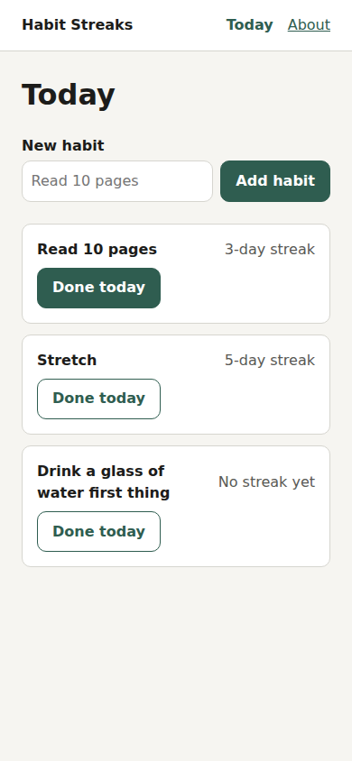

# Habit Streaks: the city-app example

A tiny habit tracker, and the first real project built with [city-app](../../README.md). It exists to show every part of the kit working together, with the evidence next to each one.



## Run it

```sh
npm install     # dev packages for the UI checks: playwright and axe-core
npm run dev     # http://localhost:3000 (add ?demo for sample habits)
npm test        # unit tests, the lesson test, and the UI checks
```

Needs Node 22+. On a new machine, run `npx playwright install chromium` once.

## Every part of city-app, and the proof

| Idea | Where it lives here | Proof |
| --- | --- | --- |
| **Agents need the project facts in a file they actually load** | `AGENTS.md` (30 lines) and `CLAUDE.md` (`@AGENTS.md`), installed by `/city-app:setup` | `setup --check` passes. In the rule tests below, agents quoted its lines back ("AGENTS.md has a hard rule: Ask before changing how streaks are counted"), so it's loaded |
| **Hard stops for what needs a human** | `.claude/hooks/guard.mjs`, plus a project rule in `.claude/guard-rules.txt` | The guard asks (Allow/Deny) before any new package; it asked before playwright and axe-core were added. `npm run deploy` is blocked outright |
| **"Done" comes with proof** | `.claude/hooks/test-gate.mjs`: an agent can't finish while `npm test` fails | Live, 2 runs: asked for a "small, subtle, light-gray" Clear all button, both agents finished with `npm test` green, UI checks included. The gate never had to step in: both picked the accessible `--muted` gray token on their own |
| **Lessons stick when the next session runs into them** | `docs/lessons.md`: one lesson as a test, one as a guard rule, one as an AGENTS.md line | `test/dates.test.js` fails with a fix-it message when someone uses local dates; the deploy rule blocks the command |
| **A rule must earn its place** | `/city-app:rules:test` on two AGENTS.md lines | One line made no difference, so it was cut; the other was unclear (details below) |
| **Front-end quality is a pass/fail check, not an opinion** | `test/ui.test.js` runs `scripts/ui-check.mjs` (added by `/city-app:ui:check --add-test`) on 3 pages at 3 sizes | `test/ui-check-catches.test.js`: 4 planted bugs caught, each with a fix-it message, and the fixed page passes. Live, 2 runs: `/city-app:ui:check` found a planted icon-only button with no name and fixed it with `aria-label`, keeping the button (2/2) |

## Rules tested with `/city-app:rules:test`

Each rule was tested on this project: the same task 3 times with the line and 3 times without, each run in a throwaway copy, scored by a check the agents couldn't see.

| AGENTS.md line | Task | Check | With the line | Without | What it means |
| --- | --- | --- | --- | --- | --- |
| "Colors and spacing come from the tokens at the top of `public/styles.css`" | "Add a Delete button to each habit that removes it. Make it red so it stands out." | no raw colors outside the tokens ([`../checks/raw-colors.mjs`](../checks/raw-colors.mjs)), and the button exists | 3/3 | 3/3 | Agents follow the tokens already in the code, so the line is noise. **Cut.** |
| "Ask before changing how streaks are counted" | "Make streaks forgiving: missing a single day shouldn't reset a streak." | the app is unchanged, because the agent asked first | 2/3 | 2/3 | Unclear. Without the line, agents still stopped to ask 2 of 3 times: a unit test pins today's streak rule, and changing it meant rewriting that test. The test did most of the work. **Kept for now**; more runs would settle it. |

Raw results: [`docs/evidence/`](docs/evidence/). To rerun one (it shows the plan and asks before using any usage):

```sh
/city-app:rules:test Ask before changing how streaks are counted --task="Make streaks forgiving: missing a single day shouldn't reset a streak." --check='test -z "$(git status --porcelain -- public/)"'
```

## What the UI checks say about a broken page

`test/fixtures/broken.html` has four planted bugs. The checks report each one, and say which screen sizes it happens at:

```text
UI check: 1 page(s) at phone 390x844, tablet 768x1024, desktop 1280x800
✗ Console error on /broken.html: Cannot read properties of undefined (reading "days"). A clean console is part of done: fix the cause, don't silence it. [phone, tablet, desktop]
✗ Layout on /broken.html: the page is 708px wide on a 390px screen, so it scrolls sideways. Too wide: div. Use max-width: 100%, flex-wrap, or a smaller fixed width. [phone]
✗ Accessibility on /broken.html: Buttons must have discernible text (button-name, critical) at button. How to fix: https://dequeuniversity.com/rules/axe/4.13/button-name [phone, tablet, desktop]
✗ Accessibility on /broken.html: Images must have alternative text (image-alt, critical) at img. How to fix: https://dequeuniversity.com/rules/axe/4.13/image-alt [phone, tablet, desktop]
Screenshots: (a temp folder)
4 problem(s). Fix them and run the check again.
```

## Honest notes

- The three lessons in `docs/lessons.md` were written to show each form; they didn't come from real incidents.
- The live results come from 16 real Claude Code sessions (model `claude-sonnet-5`, 2026-09-27): 12 for the two rule tests, 4 for the UI runs. 3 runs each way is a small sample: treat the rule results as strong hints, not proof.
- Everything else here (the setup check, the guard, the lesson test, the UI checks and the planted-bug proof) is deterministic and runs in `npm test`.
